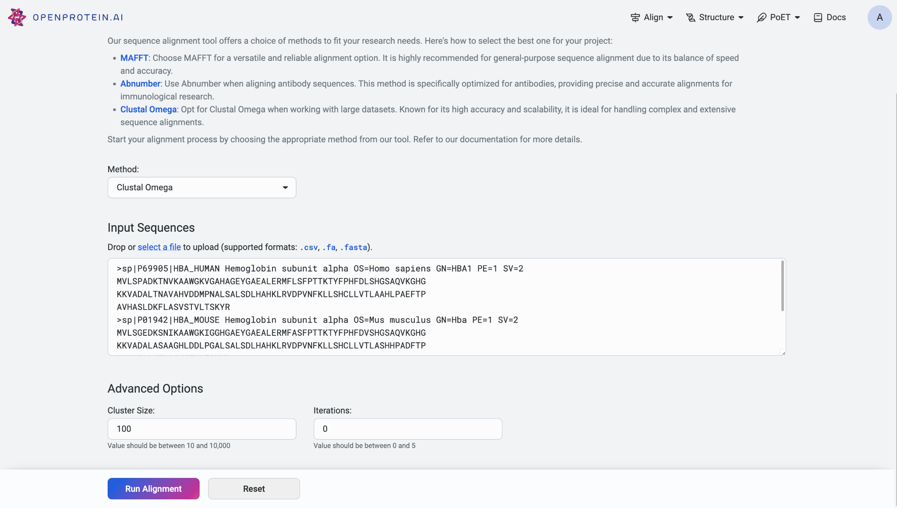

Aligning sequences
==================

Accessing the alignment tool 
-----------------------------

To access the alignment tool, start by navigating to the global
navigation located at the top right corner of the application. Select
‘Align Sequences’ to be redirected to the main alignment page, where you
can perform sequence alignment tasks.

If you need to view past alignment jobs, select ‘History’ to access the
history page displaying your previous alignments.

Uploading your sequences
------------------------

On the alignment page, you have the option to upload your sequence data
in various formats, including .csv, .fasta, and .txt. You can either
select the upload option to browse and upload a file from your computer
or directly copy and paste a list of sequences into the provided input
field.

Sequence alignment algorithms
-----------------------------

When preparing to align your sequences, you can choose from different
alignment models to suit your needs, including AbNumber, Clustal Omega,
and MAFFT. AbNumber works best with antibody sequences, while Clustal
Omega is a fast and accurate sequence aligner ideal for large datasets,
though it is not suitable for aligning sequences with large internal
indels. MAFFT is also a fast and accurate progressive-iterative aligner.
MAFFT is the default model.

Customizing your alignment
--------------------------

Each model offers specific advanced settings to further customize your
alignment process. Customizing the parameters can enhance the results,
but it is optional; we recommend using the default settings for your
first attempt.

For the AbNumber model, you can select the numbering scheme from the
options provided: IMGT (default), Kabat, Chothia, and Aho.

When using Clustal Omega, you can specify the cluster size, with the
default set at 100. Sequences are grouped into clusters, and full
distance matrices are calculated to construct guide-trees. Additionally,
you can define the number of iterations for the fine-tuning process,
with a default value of 0.

If you opt for the MAFFT model, you can set the alignment strategy to
either Auto or Custom. If you select 'Custom' as your alignment
strategy, you can adjust the offset value, which functions similarly to
a gap extension penalty for group-to-group alignment. Additionally, you
can set the gap opening penalty, with higher gap penalties useful for
closely related matches and lower penalties for identifying more distant
matches.

Viewing alignments
------------------

Once the alignment job is completed, the results will be displayed in a
table format for easy visualization. You can export the alignment
results for further analysis.

To review the original input sequences and understand the alignment
model used, switch to the ‘Input’ tab. To start a new alignment job,
click on ‘New Sequence Alignment’.

