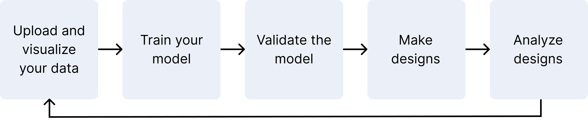

Optimization and Prediction Models for custom sequence design
=============================================================

Our Optimization and Prediction Models (OP Models) learn and predict sequence-to-function relationships from your experimental data. Use your experimental data to train protein language models then use these custom models to visualize and design sequences to meet your specifications.

**Quantitative insights**.
Our models provide a quantitative score that a given sequence will achieve your design objective. They also output a mean expected value of the property and a standard deviation value to indicate the confidence in that prediction. This lets you make data-driven decisions about your library selection and optimize for performance despite cost and workflow constraints.

**Iterative optimization**.
You can optimize for multiple properties in a single design cycle, as well as train models iteratively across multiple experimental cycles. Add more data at any time to further optimize your designs. After you have designed libraries that meet your criteria, refine your variants by predicting the effect of mutating each site in your experimental context.

Learn more and get started with our tutorials
---------------------------------------------

- `Creating a project <./creating-project.rst>`_
- `Uploading your data <./uploading-your-data.rst>`_
- `OP Models scoring and log-likelihood <./scoring-log-likelihood.rst>`_
- `Using reference sequences <./reference-sequence.rst>`_
- `Navigating your projects <./navigating-your-projects.rst>`_
- `Visualizing your data <./visualization.rst>`_
- `Model training and evaluation <./model-train-evaluate.rst>`_
- `Substitution analysis with OP Models <./sub-analysis.rst>`_
- `Designing sequences <./design.rst>`_

.. toctree::
  :maxdepth: 0
  :hidden:

  Creating a project <creating-project>
  Uploading your data <uploading-your-data>
  OP Models scoring and log-likelihood <scoring-log-likelihood>
  reference-sequence
  navigating-your-projects
  Visualization <visualization>
  Model training and evaluation <model-train-evaluate>
  Substitution analysis with OP Models <sub-analysis>
  Design <design>
  Aligning sequences <aligning-sequences>

