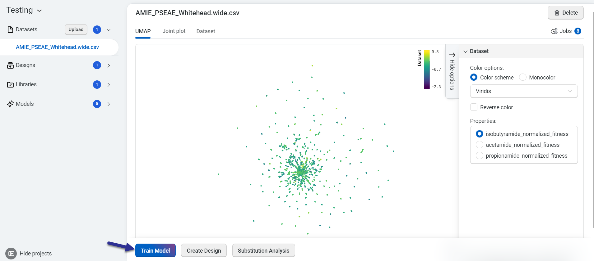
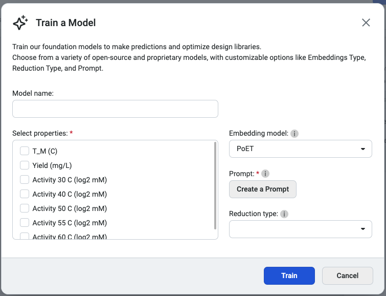
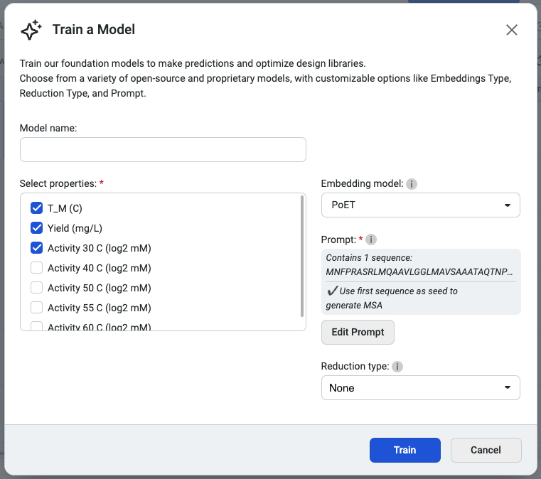
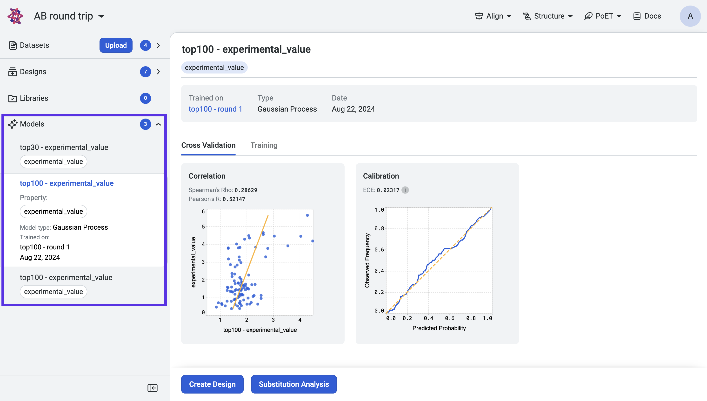
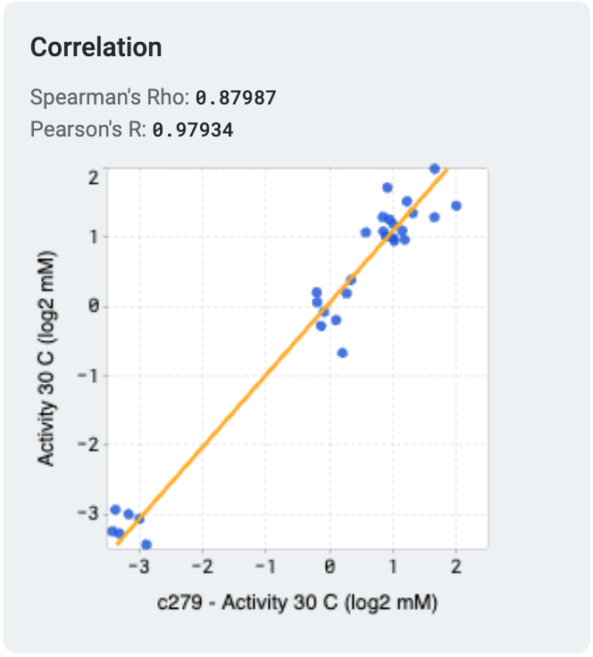
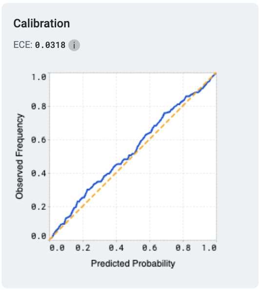
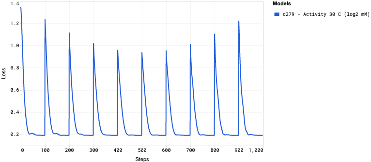

======================
Training custom models
======================

This tutorial teaches you how to train and compare custom sequence-to-function prediction models to predict your desired property or properties. These models can be used to make predictions for new sequence variants and to design libraries of optimized sequences.

What you need before starting
==============================

Please note that this tool requires experimental data. If you don't yet have experimental data, use `PoET <../poet/index.md>`_ to generate sequences from a seed, rank sequences against a prompt, or evaluate single substitution variants.

Understanding model options
---------------------------

Embeddings
^^^^^^^^^^

Embeddings capture essential patterns and relationships between protein sequences, shaping how the model interprets their properties. The recommended option is PoET, which generates embeddings tailored to specific fitness landscapes.

1. **PoET (Recommended)**

- Conditional protein language model that enables embedding, scoring, and generating sequences conditioned on an input protein family of interest.
- You will be required to input a `prompt </web-app/poet/prompts.html>`_ if this option is selected. The prompt is used to guide the model predictions based on your family of interest that you have indicated in your prompt.
- Reduction type will be set to "None" as the default.

2. **Prot Seq**

- Masked protein language model (~300M parameters) trained on UniRef50 with contact and secondary structure prediction as secondary objectives. Use random Fourier position embeddings and FlashAttention to enable fast inference.

3. **Rotaprot Large UniRef50w**

- Masked protein language model (~900M parameters) trained on UniRef100 with sequences weighted inversely proportional to the number of UniRef50 homologs. Uses rotary relative position embeddings and FlashAttention to enable fast inference.

4. **Rotaprot Large UniRef90 Finetuned**

- Rotaprot Large UniRef50W finetuned on UniRef100 with sequences weighted inversely proportional to the number of UniRef90 cluster members.

5. **ESM1**

- Community-based ESM1 models, with different versions having different model parameters and training data. Models include:

  - esm1b_t33_650M_UR50S
  - esm1v_t33_650M_UR90S_1
  - esm1v_t33_650M_UR90S_2
  - esm1v_t33_650M_UR90S_3
  - esm1v_t33_650M_UR90S_4
  - esm1v_t33_650M_UR90S_5

6. **ESM2**

- Community-based ESM2 models, with different versions having different model parameters and training data. Models include:

  - esm2_t8_50M_UR50D
  - esm2_t12_35M_UR50D
  - esm2_t30_150M_UR50D
  - esm2_t33_650M_UR50D
  - esm2_t36_3B_UR50D

7. **ProtTrans**

- Community-based ProtTrans models. Models include:

  - prott5-xl

Reduction type
^^^^^^^^^^^^^^
The reduction type determines how the output embeddings are summarized into a more manageable form. This option helps control how the model compresses information, enabling the capture of relevant features from your protein sequences while reducing dimensionality.

1. **Mean**

Creates a sequence embedding by averaging the per-residue embeddings over the length dimension. Useful for working with variable length sequences, but loses specific position information in the embedding compared with the full LxN embedding or SVD reduction thereof.

*When to use:*

- Variable length sequence datasets when alignment is not a good option.
- Sometimes outperforms full embeddings on small or highly diverse datasets.

2. **Sum**

The same as the mean embedding except that per-residues embeddings are summed over the length dimension rather than averaged. This can better preserve length and domain multiplicity information but tends to underperform mean embeddings for most use cases.

*When to use:*

- Variable length sequence datasets as an alternative to mean embeddings. Mean embeddings should generally be preferred, but they can be compared on a case-by-case basis.

3. **None**

Retains the full embeddings without any dimensionality reduction. This option captures the complete relationships between features, offering the most detailed representation at the cost of larger file sizes. Note that this differs from the web app where None refers to using SVDs instead.

*When to use:*

- Most substitution-only design projects should prefer this option. Tends to outperform mean embeddings when sequences are fixed length or can be aligned.
- Use when you require the full feature set for detailed analysis or downstream processing.

Note: Using full-sized embeddings may be unstable on the platform at this stage.

If you run into any challenges or have questions while getting started, please contact `OpenProtein.AI support <https://www.openprotein.ai/contact>`_.

Training your models
====================

OpenProtein.AI's OP models tools use Gaussian process (GP) models. The foundational models are trained on public protein databases, and then specialize the model to the user's dataset during model evaluation.

Train your custom models using a dataset you upload. On the dataset page, select **Train Model**.

This opens the **Train a Model** popup, where you can configure your model settings. Begin by entering a model name, then select the properties you want the model to predict. Choose an `embedding type and a reduction type </web-app/opmodels/model-train-evaluate.html#understanding-model-options>`_ to tailor the model's behavior.

We recommend selecting PoET as the embedding type, as it generates embeddings optimized for specific fitness landscapes. Please note that PoET requires a `prompt </web-app/poet/prompts.html>`_ to guide predictions based on your specified protein family of interest.

You're ready to train your custom model! Select **Start training** to initiate the job.

After training a model, OpenProtein.AI automatically evaluates the predictive performance using cross-validation.

Once training is complete, access your models from the **Models** section of your project navigation bar.

View the cross-validation, model calibration results and training curves by selecting a model from the project navigation menu.

Now that you have trained models, use **Substitution analysis** to screen variants and predict the strength of protein activity. You can also use the **Design** tool to design combinatorial libraries or select which sites to modify.

About model evaluation
======================

Cross validation
----------------

OpenProtein.AI uses k-fold cross validation. It splits variants into 5 folds, trains the model on four folds, and predicts the held-out fold. The cross-validation plots display the predicted properties compared to the actual measured properties for each held-out variant.

A high correlation between the predicted and ground truth values suggests that the models can accurately predict the substrate activity for new sequence variants.

Model calibration
-----------------

Model calibration measures how well a model's predicted probabilities align with the actual outcomes, providing insights into the reliability of its predictions. A perfectly calibrated model outputs probabilities that match the true likelihood of an event; for example, if it predicts an outcome with 70% confidence, that outcome should occur 70% of the time.

One common metric used to evaluate calibration is the Expected Calibration Error (ECE). ECE quantifies the difference between predicted probabilities and observed frequencies by grouping predictions into bins and calculating the weighted average of the absolute calibration error across these bins. Lower ECE values indicate better calibration.

Training curves
---------------

Training curves display how the model's loss changes during the training process, providing insights into its learning progress. The loss measures how far the model's predictions are from the actual values, with lower values indicating better performance. A steadily decreasing loss curve suggests that the model is learning effectively, while a flattening or rising curve could indicate issues such as underfitting or overfitting.

Fine-tuning your model
======================

Several factors affect your model's correlation and may result in a lower-than-desired correlation.

- Measurement noise is a fundamental limitation, so even a perfect model will not have a correlation of 1.0. Working with limited data will also introduce uncertainty into the sequence-function relationship, which limits the predictive power of the model.

- Our models are uncertainty-aware: they output a standard deviation indicating confidence in the prediction. More data will generally lead to a better model with higher confidences, but a model with high uncertainty can still guide designs towards sequence variants that are most likely to have the best properties. In this case, more sequences likely need to be tested because the sequence-function relationship isn't fully understood. This will reflect in the success probabilities of variants and libraries.

- The model may be mis-specified and therefore regularized away from the correct solution. Model mis-specification is a fundamental problem that may limit generalizability. OpenProtein.AI uses protein sequence features that capture functional relationships better than 1-hot encodings or other conventional biophysical property-based featurizations but cannot guarantee they will work well for every problem.

We recommend using large datasets, as given enough data, the model will learn the true sequence-function relationship despite data noise. You can also use replicate measurements to get a sense for the upper limit of correlation.

Using your models
=================

Now that you have a trained model:

- Use the `Design <./design.md>`_ tool to create customized protein sequences.
- Use the `Substitution Analysis <./sub-analysis.md>`_ tool to evaluate single substitution variants of a sequence.
