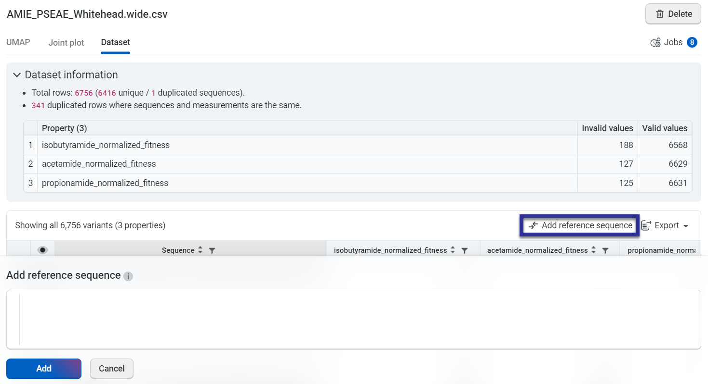
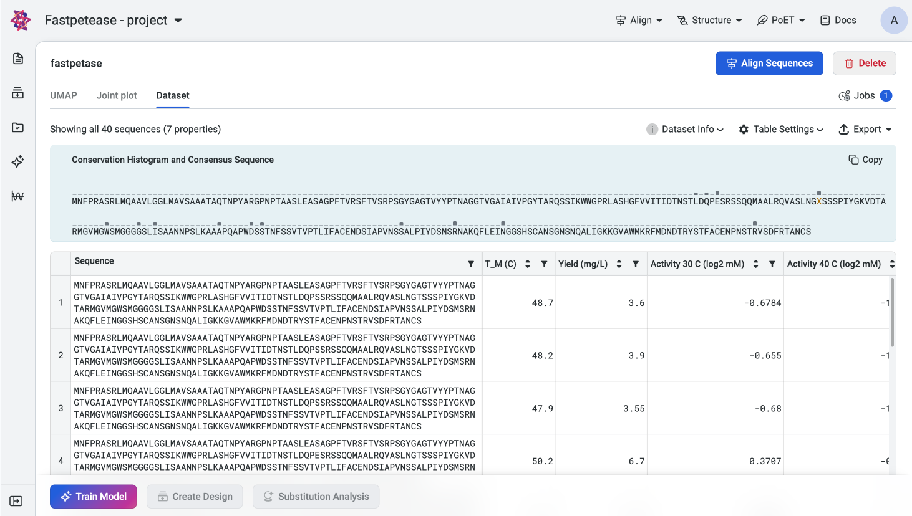
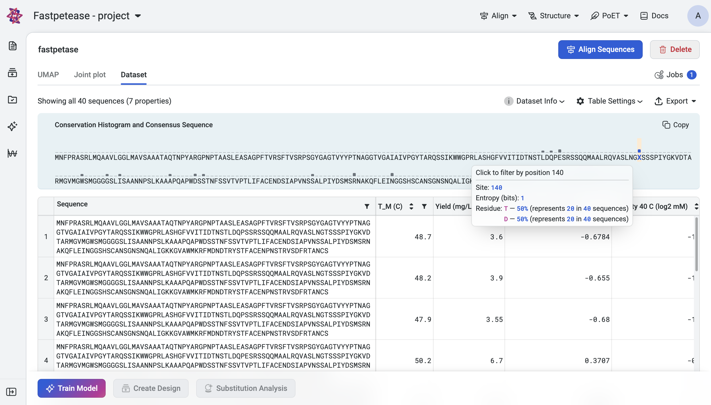

Using reference sequence and consensus histogram
================================================

A reference sequence serves as a benchmark against which you can compare your generated results. It can either be your parent sequence or any sequence of interest. By comparing a generated sequence against your reference sequence, you can view mutation sites to better understand specific variants present in your sequence libraries and designs. The option to add a reference sequence is available in:

- the **Design result table** in your **Designs** component.
- the **Dataset** tab of each uploaded dataset.

Inserting your reference sequence
---------------------------------

To incorporate a reference sequence into the table, select **Add reference sequence** and paste your sequence into the **Add reference sequence** field, then select **Add**.

Your chosen sequence will be populated in the first row of the table, while the remaining sequences will be displayed as sites where mutations have been introduced in comparison to the reference sequence. To view the full amino acid sequence, select **Hide mutations**.

Editing your reference sequence
-------------------------------

Select **Edit reference sequence** and make your desired changes, then select **Update** to save the changes.

Deleting your reference sequence
--------------------------------

To remove your reference sequence from the table, select **X** in the top right corner of the table. Alternatively, you can also select **Edit reference sequence** and then select **Delete**.

.. raw:: html
   
    
   

Conservation Histogram
----------------------

Conservation Histogram displays the consensus sequence and entropy at each site in your dataset. The consensus sequence serves as a reference to assess variability and conservation, while entropy provides a quantitative measure of diversity at each site. This information helps you identify conserved regions and mutational hotspots in your sequence libraries and designs.

Consensus Sequence
---------------------------------

The consensus sequence is determined by selecting the most frequent residue at each position in the alignment of sequences in the dataset. If no single residue occurs more frequently than others at a site, or if multiple residues occur with equal frequency, the position will be denoted as **'X'**. 

Exploring Site Details
---------------------------------

Hover over a position in the histogram to view a tooltip with the following information:

- **Site:** The position index of the site in the sequence.
- **Entropy (bits):** The entropy value for the site, indicating its variability.
   - Low Entropy: Indicates that one residue dominates the site (e.g., highly conserved position).
   - High Entropy: Indicates a more even distribution of amino acid at the site. Multiple residues occur with varying frequencies.
- **Residues and Frequencies:** A breakdown of each amino acid at the site and its corresponding frequency (e.g., A: 40%, T: 30%, C: 20%, G: 10%).

Filtering by Mutations
---------------------------------

To focus on a specific site, click on that position in the histogram. The dataset table will update to display sequences with mutations introduced at that site. Each sequence is shown with the mutations highlighted, enabling detailed analysis of variants at the selected position.
To reset the filter, deselect the site or clear the filter in the dataset table.

