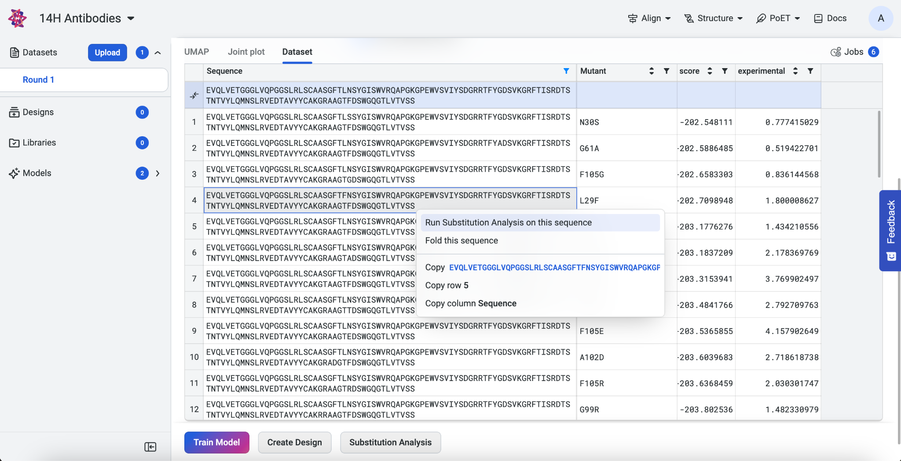
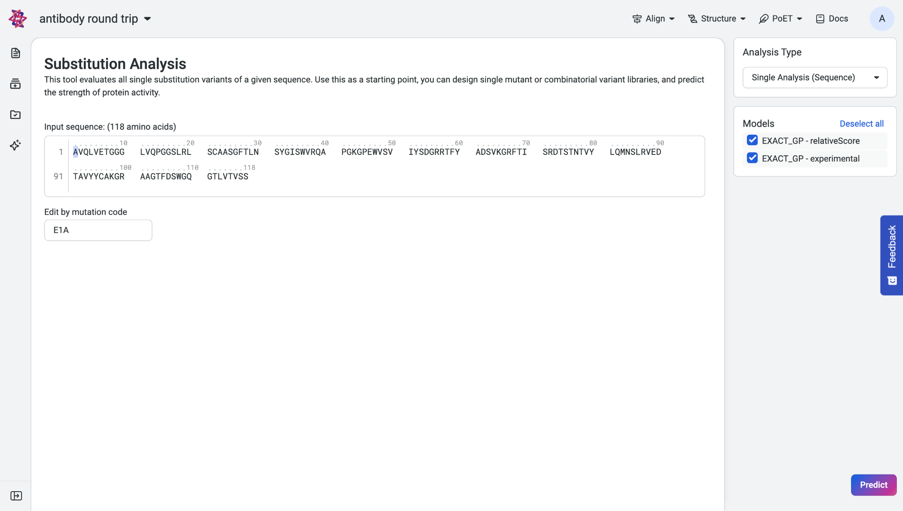
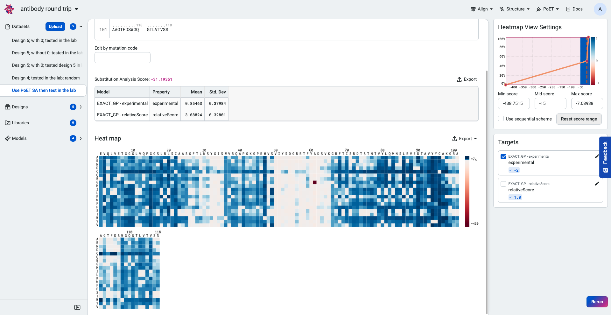
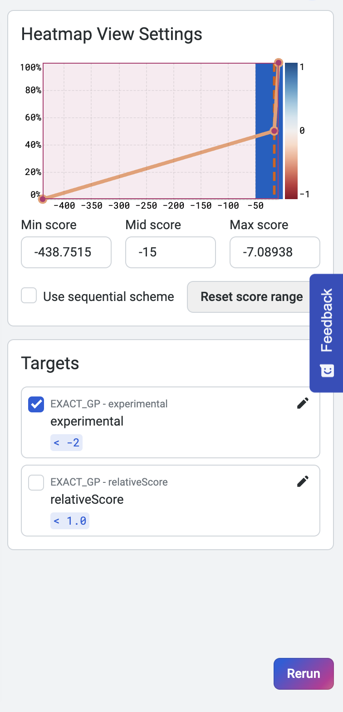
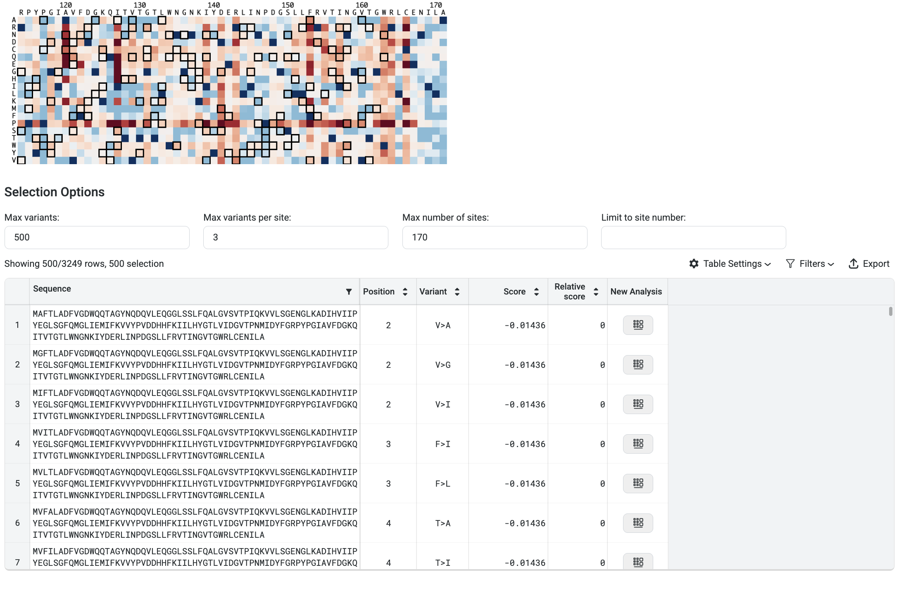
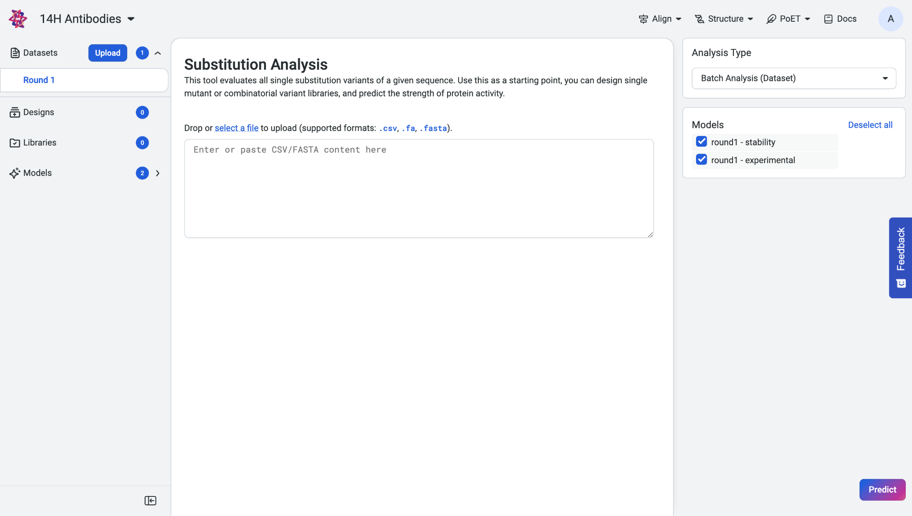
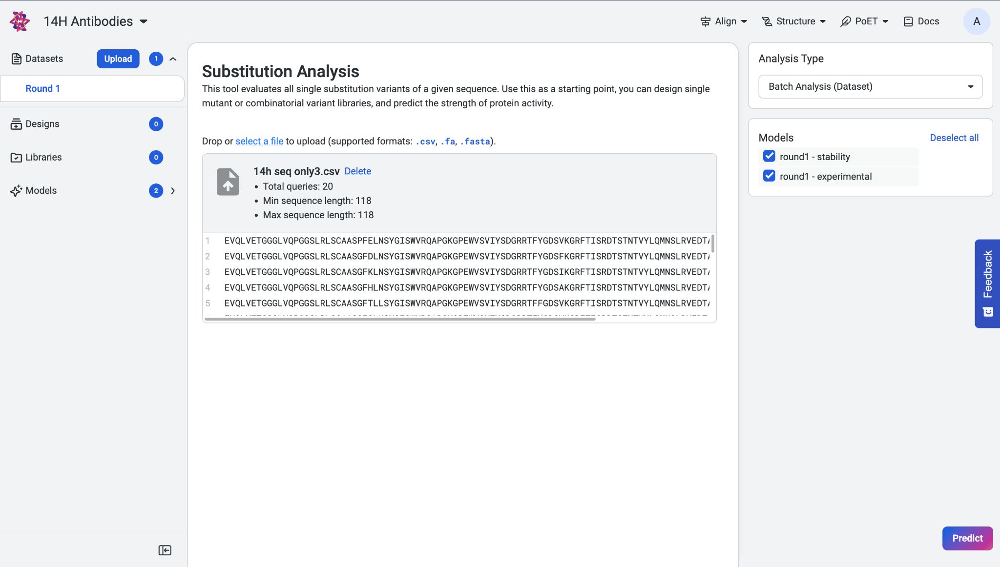
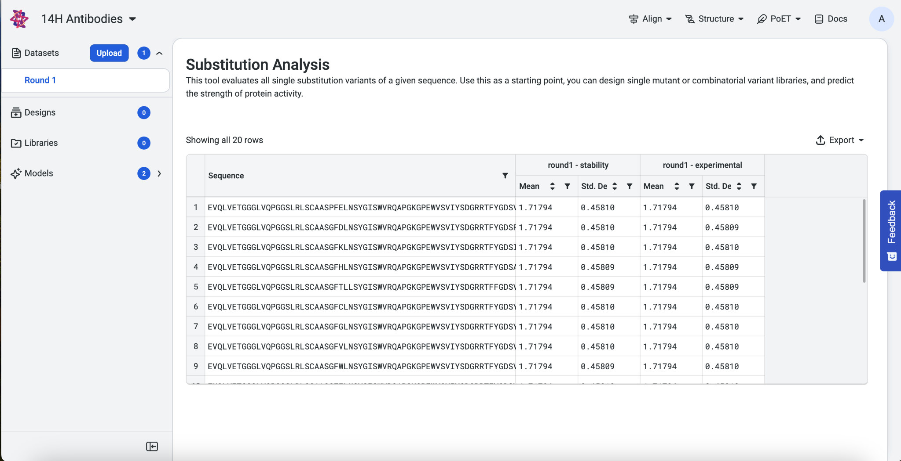

Substitution Analysis with OP Models
====================================

About substitution analysis
---------------------------

This tutorial teaches you how to use OpenProtein.AI’s OP Model’s
Substitution Analysis tool to evaluate all single substitution variants
of a given sequence as well as sequences which you have uploaded. Use
this as a starting point to design single mutant or combinatorial
variant libraries, and predict the strength of protein activity.

What you need before starting
-----------------------------

This tool requires experimental data. If you don’t yet have experimental data, use `PoET’s Substitution Analysis <../poet/substitution-analysis.rst>`_ tool. For help with uploading your data, see `Uploading Your Data <./uploading-your-data.rst>`__.
Visit `OP Models Scoring and Log-likelihood <./scoring-log-likelihood.rst>`_ to learn about the scoring system. You will also need a model that has been trained on this dataset. Read about `Model Training and Evaluation <./model-train-evaluate.rst>`__ for information on training your model.

If you have an uploaded dataset or trained model, navigate to your
project’s **Dataset** or **Models** tab, then select **Substitution
Analysis**. The first sequence of your dataset automatically appears in
the input box. If you start a substitution analysis by right-clicking on
a sequence, that sequence auto-populates.

If you run into any challenges or have questions while getting started, please contact `OpenProtein.AI support <https://www.openprotein.ai/contact>`__.

Scoring single sequences
------------------------

Paste your sequence into the input box. To edit your sequence, enter
your desired substitutions in the **Edits by mutation codes** section
under the input box. Separate your substitutions with commas. The
sequence in the sequence box automatically updates and highlights the
edited sites.

The **Analysis Type** menu is set to **Single Analysis (Sequence)** by
default.

In the **Models** section, select at least one trained model to run the
prediction, then select **Run**.

Interpreting your results
~~~~~~~~~~~~~~~~~~~~~~~~~

The **Input** section is collapsed by default and contains information
about your input including sequence, number of amino acids, and the
associated dataset.

Your prediction results are displayed as a prediction score, a table,
and a heatmap. The table shows the predicted property values and
standard deviations of each selected property and model.

Hover over points on the heatmap to view the log-likelihood score for
each substitution variant.

The higher or less negative the log-likelihood score, the more fit the
variant.

Use the heatmap to view the highest ranking sequences. The heatmap
colors indicate how a mutation at that site would impact the fitness of
a variant compared to the input sequence:

-  Blue indicates improved fitness.

-  Red indicates reduced fitness.

A site which is all white indicates that a mutation at that site would
not impact fitness.

Heatmap view settings and property targets are displayed in the panel to
the right. Adjust the minimum and maximum scores on the histogram to
fine-tune the heatmap colors. You can also adjust the target values to
dynamically update the heatmap and highlight substitutions that achieve
or surpass targets.

You can filter your results using the following options:

- **Max Variants**: Limits the total number of variants displayed in the results table.
- **Max Variants per Site**: Shows only the top *n* substitutions at each amino acid position.
- **Max Number of Sites**: Displays only the top *n* positions recommended for substitution.
- **Limit to Site Number**: Restricts results to specific positions. You can input discrete values (e.g., ``1; 3; 5; 7``) or a range (e.g., ``21 - 65``).

In the image above, the filters are set to display the top 3 variants at the top 170 sites, and then select the best 500 sequences from that pool.

Scoring multiple sequences
--------------------------

Upload a dataset with multiple sequences as a .fasta or .CSV file. Your
dataset is displayed as a table. Select **Batch Analysis (Dataset)** in
the **Analysis Type** menu.

In the **Models** section, select at least one trained model to run the
prediction, then select **Run**.

.. _interpreting-your-results-1:

Interpreting your results
~~~~~~~~~~~~~~~~~~~~~~~~~

Your results display as a table showing the predicted score, mean, and
standard deviation of each model and property. To download your results
as a .CSV file, select **Export as CSV**.

Using your sequences
--------------------

Once you’re finished evaluating single substitution variants, use the `Structure Prediction <../structure-prediction/using-structure-prediction.rst>`__ tool to visualize and explore your sequence of interest!
