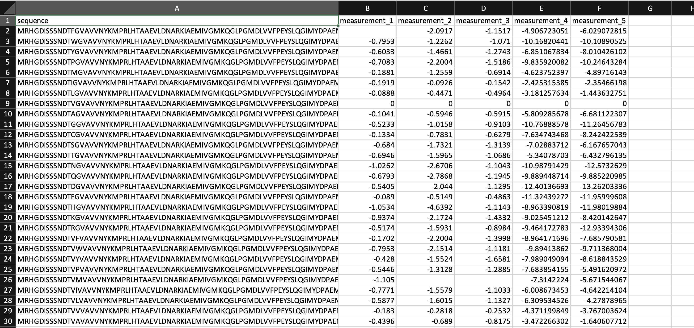

Uploading your data
===================

This tutorial teaches you how to format and upload a dataset. With an uploaded dataset, OpenProtein.AI can visualize your data and train models to optimize your designs.

What you need before getting started
------------------------------------

Format your dataset as a CSV table with columns containing:

- the full sequence or mutation code of each variant.
- measurement values.

Mutation codes denote the specific substitutions that occur at a site. For example, A20T would indicate that alanine at site 20 is substituted with threonine. You can specify multiple mutation codes per sequence by using commas between mutations.

Use a hyphen (-) to indicate each gap in your sequence. Missing measurements are acceptable.

Creating a project and uploading your data
------------------------------------------

If you are signing in for the first time, create a project by following the prompt on your screen. You can also select **New Project** on the main project page. Create a separate project for each parent sequence you use.

Start by naming your project and including an optional description.

Select **Upload dataset** and navigate to your CSV file in the file explorer. You can enter a new name for the dataset, or use the default file name. You can also include a description of the dataset, or select a different file using the **Change** button.

After selecting **Open**, the application automatically detects your sequence's columns based on the column name.

If the column types are not automatically filled, you can input them manually using the dropdown **Column type** menu options:

- **Identifier**: user assigned names for each sequence (this is subjective, and dependent on what the user decides to name the sequence).
- **Property**: measurements corresponding to the property that user wish to optimize. 1 property should be 1 column.
- **Sequence**: the sequences of your variants
- **Mutant**: mutation codes. If you use mutation codes, you will be required to input the parent sequence.
- **Ignored**: sequences will not be uploaded.

For datasets containing sequences with mutation codes, enter the wild-type sequence of your protein in the **Parent sequence** field, then select **mutant** in the **Column type** dropdown menu. The platform will process and display the full sequence of each variant specified by your mutation codes.

Select **Upload** when you are ready to upload your dataset.

.. image:: ../../_static/opmodels/uploading-your-data/core-dataset-upload.gif

Uploading replicates
---------------------

If your dataset includes replicates, add them as additional columns using the format in your CSV file:
``PropertyName_1``, ``PropertyName_2``, ``PropertyName_3``, etc.  
Make sure the property names match exactly for the system to recognize them as replicates of the same measurement.

Alternatively, you can assign replicates after uploading your CSV file:

- Set the **Column type** of each replicate column to ``Property``.
- Assign the same **Property name** to columns that represent replicates of the same measurement.
  For example, to group ``Luminosity (Rep 1)`` and ``Luminosity (Rep 2)``, assign both the property name ``Replicate Luminosity``.
  

You can create a new property by typing a name directly into the **Property name** field.

To rename a property group, edit the header of any column within that group.

Once your replicates have been uploaded, you can choose how they are displayed in the dataset table.  
Go to ``Table Settings``, open the **Property replicate** menu, and select **Show mean and standard deviation** to display the mean and standard deviation of replicates instead of the individual replicate values.

.. image:: ../../_static/opmodels/uploading-your-data/replicate-tablesettings.png

Visualizing your data
---------------------

Your dataset is displayed as a UMAP, joint plot, and data table. 

UMAP
^^^^

Each point in the **UMAP** visualization represents a single sequence variant.

Joint plot
^^^^^^^^^^

The **joint plot** displays the pairwise relationships between properties from your dataset. You can visually explore your data by selecting properties and viewing the distribution of individuals of each variable.

Data table
^^^^^^^^^^

Your **Dataset** page shows the properties of your dataset, along with a table that you can filter and sort. Select **Dataset Info** to view a list of your dataset’s properties along with their valid and invalid values. 

Select **Table Settings** to adjust your table organization and contents. Under **Table View**, select **Wrap Sequence column** to display the entire sequence wrapped in the sequence column. Uncheck this option to unwrap the sequence column and enable horizontal scrolling. 

If your dataset contains duplicate sequences, you have the option to select **Show unique sequences** and view a unique sequence where the displayed value is the mean and standard deviation of all of the duplicates. If this is unchecked, all replicates with their raw uploaded values are shown.

You can also set, edit, or delete a reference sequence using the **Edit Reference Sequence** button, or delete a reference sequence by selecting **X**. If you have a reference sequence, use **Sequence View Options** to display either the full sequence or only the mutation sites relative to the reference sequence. You can also select **Show mutation codes** to add mutation codes as an additional table column. 

Replicates
^^^^^^^^^^
The **replicate joint plot** can also display the pairwise relationships between replicates in your dataset. You can explore the distribution of values across replicates by selecting properties, allowing you to compare individual replicates visually.

Find more information about OpenProtein.AI's visualization options in `Visualizing your data <./visualization.md>`__.
