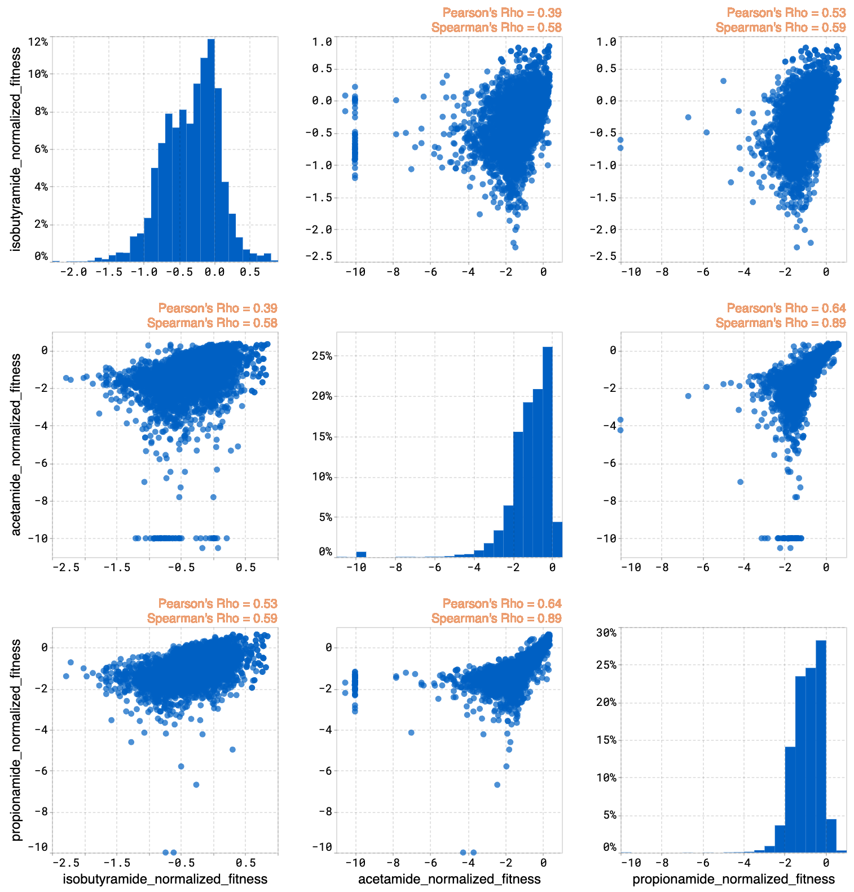
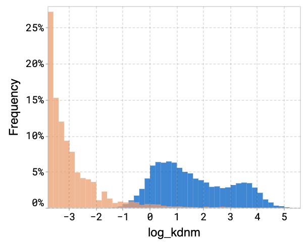
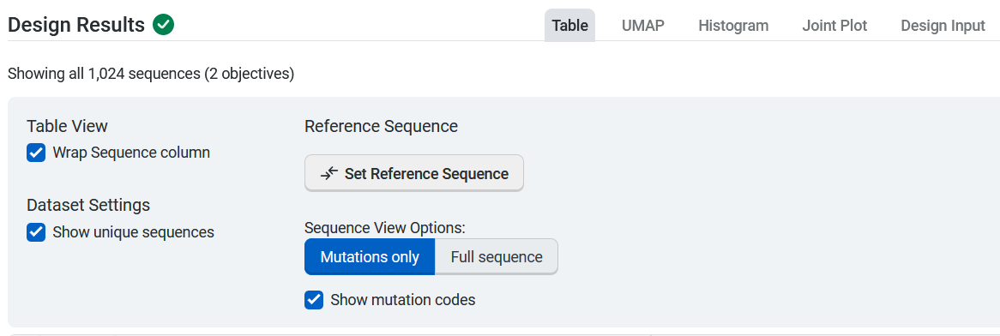
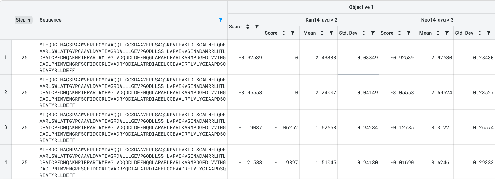

Visualizing your data
=====================

OpenProtein.AI visualizes your results using a series of tools:

- Uniform Manifold Approximation and Projection (UMAP)
- Joint plots
- Histograms
- Result tables

UMAP
----

OpenProtein.AI uses UMAP to visualize sequence datasets and reveal clusters in selected and sequenced screening or mutagenesis libraries. The UMAP creates a 2D visualization of the manifold of your sequence variants, using a low-dimensional embedding technique to represent each variant sequence in two dimensions based on their similarities in the high-dimensional feature space. Each point in the visualization represents a single sequence variant. It can also color by property to visualize relationships between sequence clusters and properties.

The UMAP options allow you to adjust color options and properties.

.. image:: ../../_static/opmodels/visualizing-your-data/core-umap-color.gif

Drag your cursor across an area to select a cluster. The corresponding sequences will be highlighted in your dataset table.

.. image:: ../../_static/opmodels/visualizing-your-data/core-umap-selection.gif

Why use UMAP over PCA
^^^^^^^^^^^^^^^^^^^^^

PCA is a linear mapping used to capture global structure. UMAP is a non-linear method that balances preserving local and global structure, and allows for general dimensionality reduction and exploration based on similarities.

Joint plots
------------------

The joint plot displays the pairwise relationships between properties and shows the distribution of each individual property from your dataset. You can visually explore your data by selecting properties and viewing the distribution of individuals of each variable.

Histograms
----------------

The histogram compares the expected property distributions for the designs against your original library and joint plots for all of the properties.

Design result tables
--------------------------

The design result table displays all input and generated sequences. Select **Table Settings** to adjust your table organization and contents. Under **Table View**, select **Wrap Sequence column** to display the entire sequence wrapped in the sequence column. Uncheck this option to unwrap the sequence column and enable horizontal scrolling. 

If your dataset contains duplicate sequences, you have the option to select **Show unique sequences** and view a unique sequence where the displayed value is the mean and standard deviation of all of the duplicates. If this is unchecked, all replicates with their raw uploaded values are shown.

You can set, edit, or delete a reference sequence using the **Edit Reference Sequence** button, or delete a reference sequence by selecting **X**. If you have a reference sequence, use **Sequence View Options** to display either the full sequence or only the mutation sites relative to the reference sequence. You can also select **Show mutation codes** to add mutation codes as an additional table column. 

If your design used objectives with multiple properties, the design results table will show you two scores:

- an overall score for the objective
- a score for each property

The mean and standard deviation for each property are also included. 

