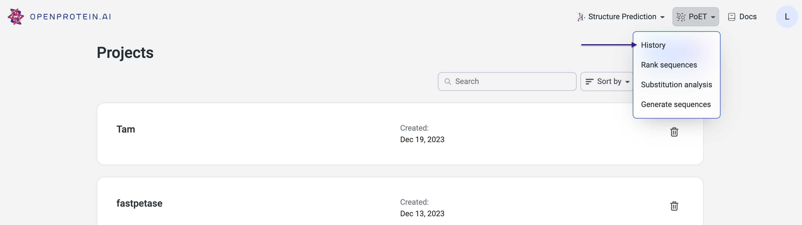
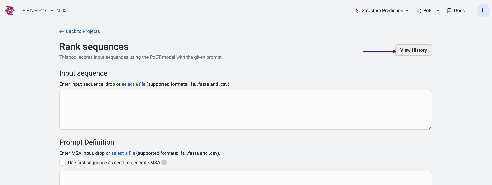

PoET history
=============

Access details of PoET's past jobs by selecting **History** from the PoET dropdown menu, or by selecting the **View History** button at the top right of each PoET tool.

The History page allows you to view past jobs and sort by:

- Job ID
- Status
- Job type
- Date created

You can also filter by job status and job type.

To export your history, select **Export** and then select either **All rows to CSV file** or **Only the filtered rows to CSV file**.
