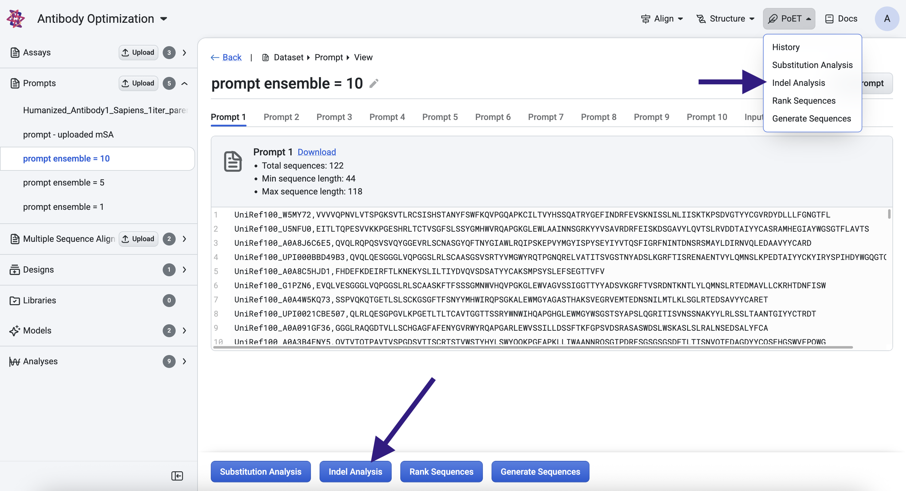
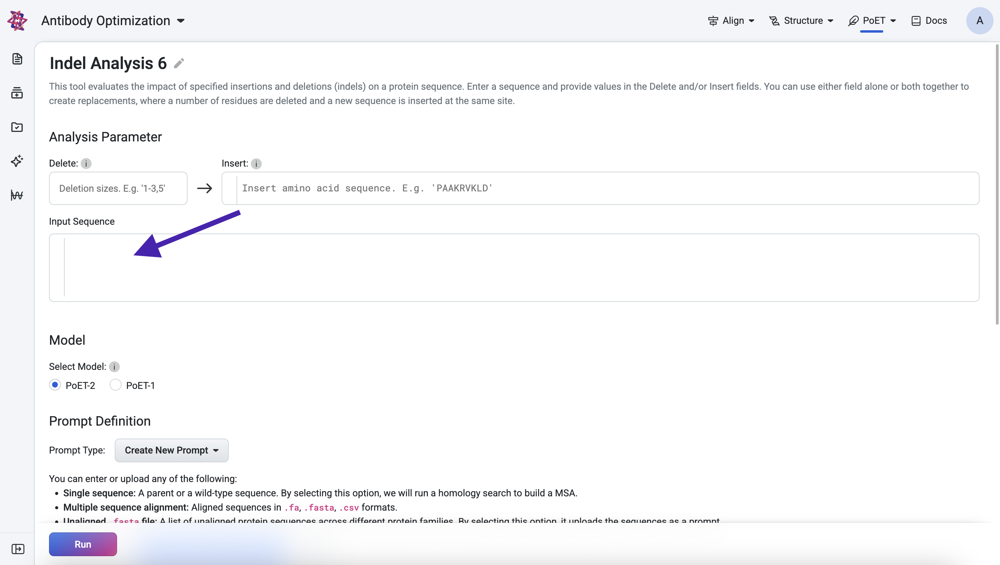

Using the Indel Analysis tool
==================================

The Indel Analysis tool enables you to evaluate the impact of insertions and deletions (indels) at any position within your input sequence on protein fitness. Use this tool to predict how these modifications might affect the protein’s function or stability.

If you run into any challenges or have questions while getting started, please contact `OpenProtein.AI support <https://www.openprotein.ai/contact>`_.

What you need before starting
------------------------------

This tool requires a multiple sequence alignment (MSA), from which it builds a prompt. You can choose an existing prompt, upload your own MSA or have the OpenProtein.AI model generate one for you. If you aren't already familiar with prompts, we recommend learning more about OpenProtein.AI's `prompts and prompt sampling methods <./prompts.rst>`_ before diving in.

You’ll also need:

- An input sequence—the sequence you wish to modify

- The amino acid fragment to insert, and/or

- The length of the region you wish to delete 

Accessing the tool
------------------------------
You can access the Indel Analysis tool by selecting Indel Analysis from the top navigation bar, or on the prompt page. 

Specifying indels and input sequence
---------------------
Use the **Delete** and **Insert** fields to define the indels you want to evaluate:

- **Delete** specifies the number of residues to remove at every position in your input sequence.

- **Insert** allows you to add a custom amino acid fragment at every position.

If both **Delete** and **Insert** are specified, the tool performs a replacement: at each position, the defined number of residues are deleted and replaced with the insertion fragment.

For example, given an input sequence of "MNFPRASR" with a deletion length of 3 and an insertion fragment "AAAAA", the resulting sequences scored will be:

- AAAAAPRASR

- MAAAAARASR

- MNAAAAAASR

- MNFAAAAASR

- MNFPAAAAAR

- MNFPRAAAAA

Next, you can enter the sequence you wish to make insertions and deletions of in the **Input Sequence** box.  

After which, you will be required to specify your prompt.

If you have an existing prompt, you may select it. Alternatively, add your custom MSA to the **Prompt Definition** field. You can input the sequence(s) directly, or upload an existing .fa, .fasta, or .csv file.

If you do not have an existing MSA, input your target protein and select **Single Sequence**. OpenProtein will generate an MSA using a homology search against Uniref using mmseqs2 with default settings from ColabFold, then use the MSA to create a prompt. Please note that if you select **Single Sequence** when multiple sequences are entered, sequences after the first are ignored.

Select **Run.** The job may take a few minutes depending on how busy the service is, how long your sequences are, and how many sequences you want to score.

Interpreting your results
-------------------------

Results are displayed as both a table and a scatter plot. Each generated sequence is assigned a log-likelihood score, which reflects its predicted fitness relative to the prompt. Higher scores indicate greater compatibility with the prompt context.

The following scores are provided:

- Log-likelihood score: Measures the fitness of the generated sequence compared to the prompt.

- Relative log-likelihood score: Measures the log-likelihood scores relative to the input sequence.

- Adjusted log-likelihood score: Normalizes the log-likelihood score based on sequence length.

- Relative adjusted log-likelihood score: Measures the normalized fitness change relative to the input sequence.

You may select points in the scatter plot and it will be highlighted in the table. 

You can sort your results and download them using the **Export** button.

Next steps
----------

Now that you can generate custom sequences, use the `Structure Prediction <../structure-prediction/using-structure-prediction.rst>`_ tool on high scoring sequences to visualize their structural implication or use `Substitution Analysis <./substitution-analysis.rst>`_ to view possible improvements to a sequence.
