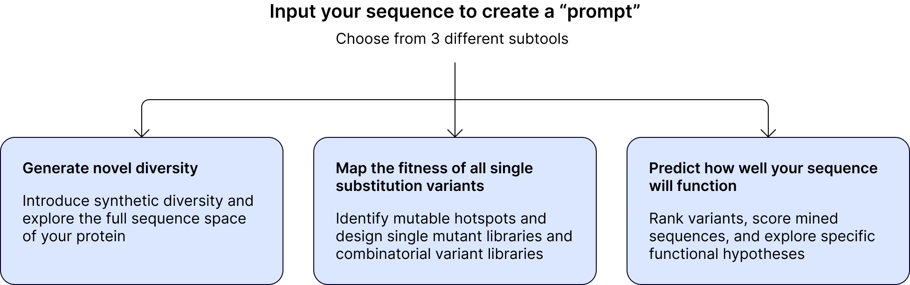
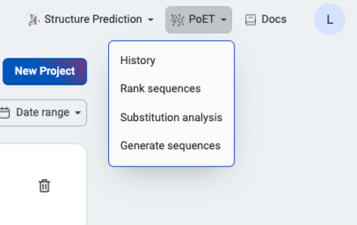

Use PoET to predict high quality sequences without data
=======================================================

Protein Evolutionary Transformer (PoET) allows you to design or score sequences and predict variant effects without any starting data or structural information. PoET is a generative protein language model and learns to predict and generate sets of related proteins using evolutionary patterns from natural sequence databases.

In the same way that large language models (LLMs) make high quality predictions for natural language processing based on a user prompt, protein LLMs can predict amino acid sequence information. Here, a prompt is a set of sequences capturing insights about the local fitness landscape and co-evolutionary patterns for your protein. PoET uses this information to predict the local fitness landscape and calculate the likelihood of observing a specific sequence based on the inferred evolutionary process. You can make your own prompts or PoET can do this for you using multiple sequence alignment.

Accessing PoET
---------------

PoET tools can be found in the **PoET** dropdown menu in the header bar of the OpenProtein.AI web app.

Learn more and get started with our tutorials
---------------------------------------------

- `PoET prompts and prompt sampling methods <./prompts.rst>`_
- `Scoring system and log probability <./scoring-log-likelihood.rst>`_
- `Ensembling <./ensembling.rst>`_
- `PoET history <./history.rst>`_
- `Using the Rank Sequences tool <./rank-sequences.rst>`_
- `Using the Generate Sequences tool <./generate-sequences.rst>`_
- `Using the PoET Substitution Analysis tool <./substitution-analysis.rst>`_

Learn more about what makes PoET state of the art in machine learning for protein engineering in `our blog post <https://www.openprotein.ai/poet-a-high-performing-protein-language-model-for-zero-shot-prediction>`_ and our `NeurIPS 2023 paper <https://proceedings.neurips.cc/paper_files/paper/2023/hash/f4366126eba252699b280e8f93c0ab2f-Abstract-Conference.html>`__:

* PoET can be used as a retrieval-augmented protein language model by conditioning the model on sequences from any family of interest. This also allows PoET to be used with any sequence database and to incorporate new sequence information without retraining.
* PoET is a fully autoregressive generative model, able to generate and score novel indels in addition to substitutions, and does not depend on MSAs of the input family, removing problems caused by long insertions, gappy regions, and alignment errors.
* By learning across protein families, PoET is able to extrapolate from short context lengths allowing it to generalize well even for small protein families.
* PoET can be sampled from and can be used to calculate the likelihood of any sequence efficiently.

.. raw:: html

  <a href="https://proceedings.neurips.cc/paper_files/paper/2023/hash/f4366126eba252699b280e8f93c0ab2f-Abstract-Conference.html" class="card-publication" target="_blank" style="margin-top: 2rem">
    

      
    

    

      <b>PoET: A generative model of protein families as sequences-of-sequences</b>
      

        Timothy F. Truong Jr, Tristan Bepler  
        NeurIPS 2023
      

    

  </a>

.. toctree::
  :hidden:
  :maxdepth: 2

  Prompt and prompt sampling methods <prompts>
  PoET scoring and log-likelihood <scoring-log-likelihood>
  Ensembling <ensembling>
  PoET history <history>
  Rank sequences <rank-sequences>
  Generate sequences <generate-sequences>
  Substitution analysis with PoET <substitution-analysis>
  Indel Analysis <indel-analysis>

