Prompt and prompt sampling methods
===================================

What is a prompt?
-----------------

A prompt is an input that instructs a Generative AI model to generate the desired response. PoET uses a prompt made up of a set of related sequences. These sequences may be homologs, family members, or some other grouping that represents your protein of interest.

The prompt can be:

- uploaded directly as a ``.fasta`` or ``.csv`` file
- a multiple sequence alignment (MSA) uploaded by the user, or
- created by the PoET model doing a homology search based on a seed sequence provided by the user.

Uploading a Prompt
-----------------

Without a Project
~~~~~~~~~~~~~~~~~~~~~~~~~~~~~~~~~~~
On the **Projects** page, select a PoET tool from the navigation bar. Under **Prompt Definition**, click **Select a file** and choose a ``.fasta`` or ``.csv`` file. Ensure **Prompt** is selected before uploading.

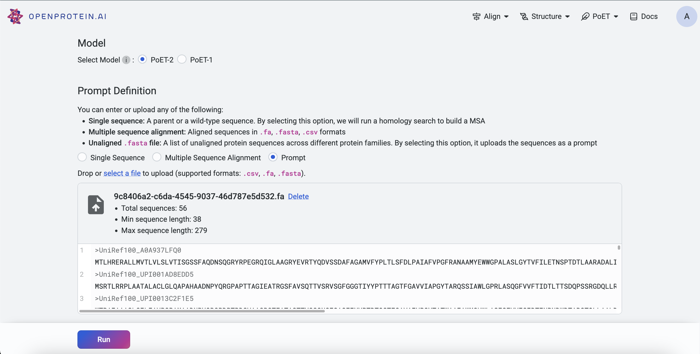

Within a Project
~~~~~~~~~~~~~~~~~~~~~~~~~~~~~~~~~~~
Prompts can be uploaded via:

- **Project Page**: Click **Upload**, select **Prompt**, and upload your ``.fasta`` or ``.csv`` file.

- **Left Sidebar**: Click the **Upload** button under the **Prompt** section and select your file.

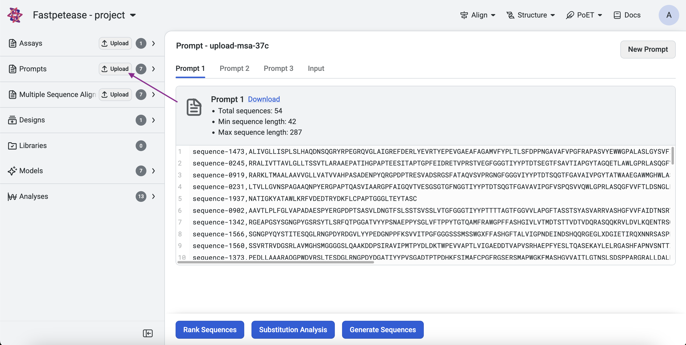
  
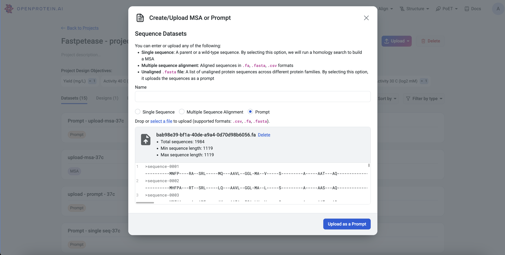
  
- **From a MSA**: On an existing MSA page, click on **Create Prompt**.

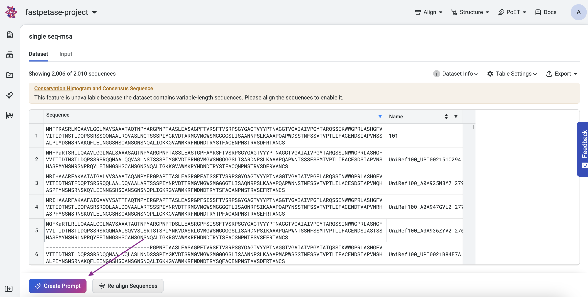

What is a Multiple Sequence Alignment?
--------------------------------------

Multiple sequence alignment (MSA) is a technique for biological sequence analysis. It consists of a sequence alignment of three or more biological sequences that usually have an evolutionary relationship.

Why is MSA useful?
------------------

The resulting MSA can be used to infer sequence homology and conduct phylogenetic analysis to assess the sequences’ shared evolutionary origins. Biologically sound and accurate alignments show homology and relationships, allowing for new member identification and the comparison of similar sequences. Because subsequent analysis depends on the results of an MSA, accuracy is vital.

When building a prompt from a MSA, you should include sequences you want to optimize for. The model learns the patterns of the proteins and predicts sequences that best fit that list. Since the model views proteins in their entirety, you cannot optimize for a specific property or activity.

Creating a Prompt using a MSA
---------------------------

Without a Project
~~~~~~~~~~~~~~~~~~~~~

Navigate to any PoET tool under **Prompt Definition**. You can either input the MSA directly or upload an existing ``.fa``, ``.fasta``, or ``.csv`` file.

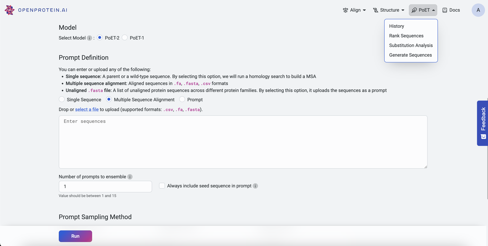

Within a Project
~~~~~~~~~~~~~~~~~~~~~
MSAs can be uploaded via:

- **Project Page**: Click **Upload**, select **MSA**, and input or upload a ``.fa``, ``.fasta``, or ``.csv`` file.

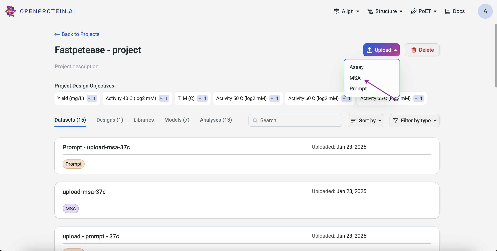

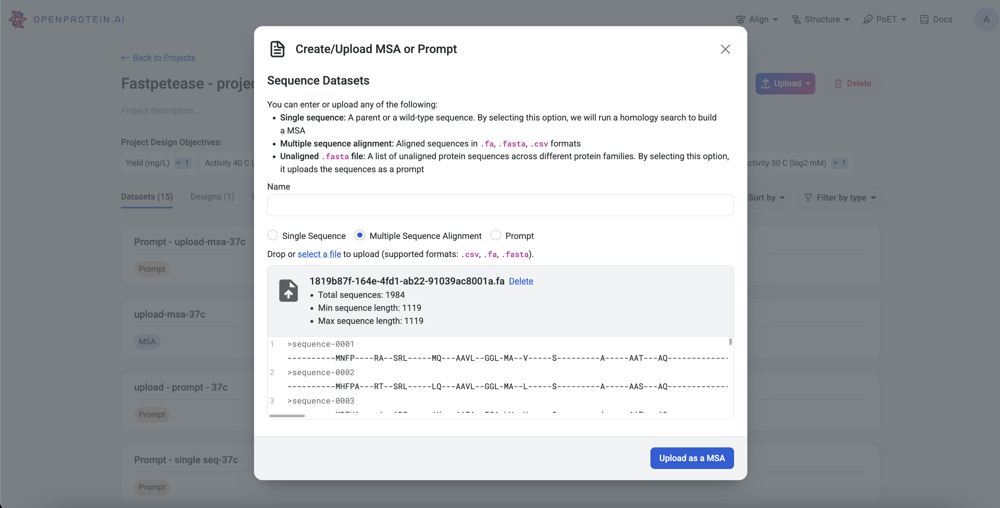

- **Left Sidebar**: Click the **Upload** button under the **MSA** section and input or upload a file.

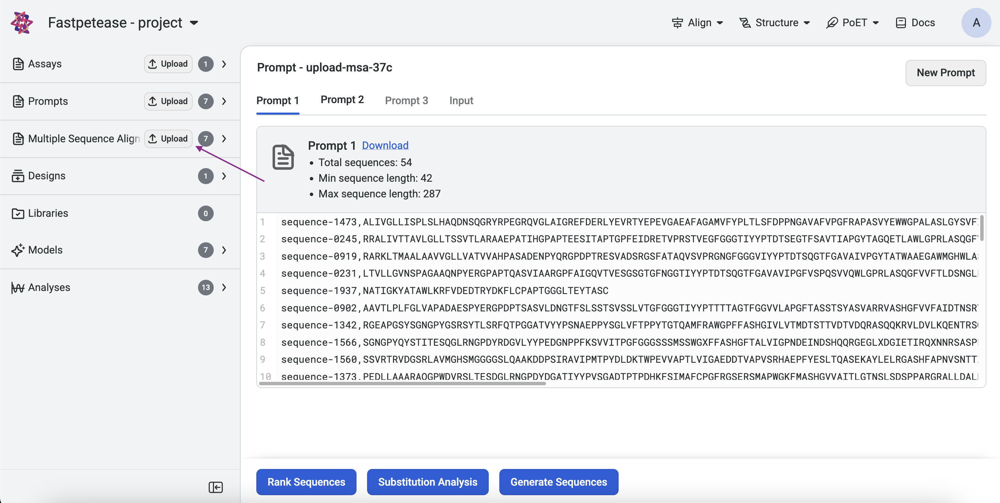

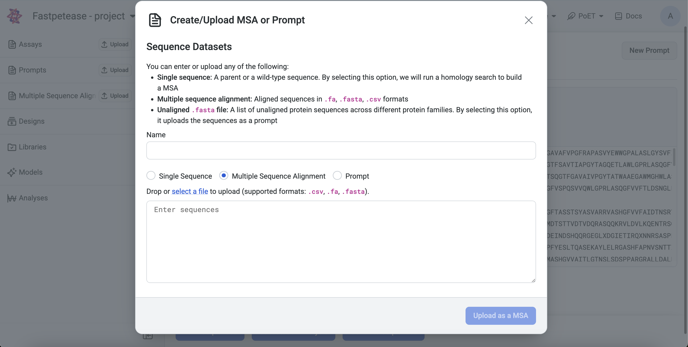

What is a Seed Sequence?
---------------------------
A seed sequence is a single protein sequence provided by the user to initiate a homology search. PoET does a homology search using public databases like uniprot to build an MSA from the seed sequence. PoET then creates a prompt by randomly selecting sequences from the MSA.

Creating a Prompt via Homology Search based on a Seed Sequence
----------------------------------------------------------------

Without a Project
~~~~~~~~~~~~~~~~~~~~~

Navigate to any PoET tool under **Prompt Definition**, input a seed sequence, and select **Single Sequence**.

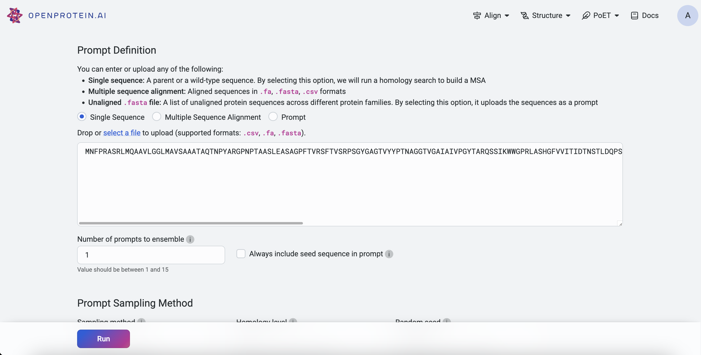

Within a Project
~~~~~~~~~~~~~~~~~~~~~

Homology search from a seed sequence can be initiated via:

- **Project Page**: Click **Upload**, select **MSA**, input a single sequence, and click **Search for homologs to build MSA**.

  
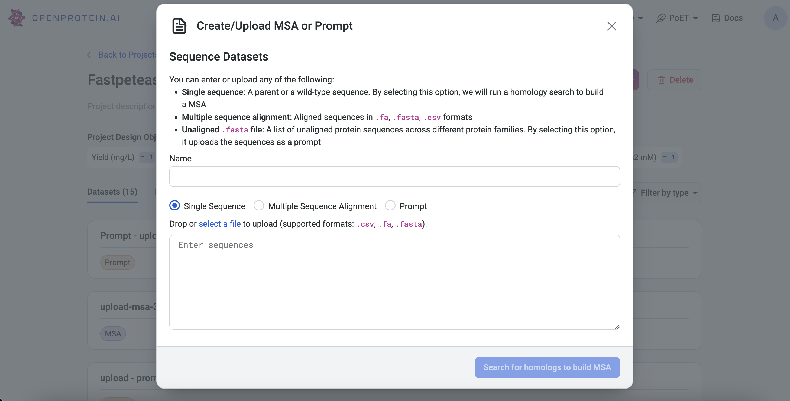
  
  
- **Left Sidebar**: Click the **Upload** button under the **MSA** section, input a sequence, and click **Search for homologs to build MSA**.

Prompt sampling parameters
--------------------------

Prompt sampling definitions
~~~~~~~~~~~~~~~~~~~~~~~~~~~

- **Sampling method**: defines the sampling strategy used for selecting prompt sequences from the homologs found by homology search, or from the provided MSA. The following strategies are available:
   - **Top**: Select sequences based on the order in which they occur in the MSA
   - **Random**: Select sequences randomly without replacement in the MSA
   - **Neighbors**: Sample more diverse, less redundant sequences from the MSA by sampling each sequence with weight inversely proportional to its number of homologs in the MSA.
- **Homology level**: This parameter controls the identity level at which two sequences are considered “neighbors” - that is, redundant - in the MSA. This is equivalent to the homology level used to calculate the number of effective sequences in protein families.
- **Random seed**: The seed for the random number generator used to sample from the MSA. Using the same seed with the same MSA and sampling parameters will guarantee that the same results are generated each time. Different seeds will produce different prompt samples.
- **Maximum similarity to seed sequence**: The maximum similarity to the seed sequence allowed when selecting sequences for the prompt. No sequence with identity greater than this to the seed will be included.
- **Minimum similarity to seed sequence**: The minimum similarity to the seed sequence allowed when selecting sequences for the prompt. No sequence with identity less than this to the seed will be included. This is useful for creating prompts that are highly focused on the local sequence space around the seed.
- **Maximum number of sequences**: The number of sequences sampled from the MSA to form the prompt. The same sequence will not be sampled from the MSA more than once, so the number of sequences in the prompt will never be greater than the number of sequences in the MSA.
- **Maximum total number of residues**: The maximum total number of residues in all sequences sampled from the MSA to form the prompt. For example, if this is set to 1000, sequences will be sampled from the MSA up to a maximum cumulative length of 1000 residues.

Prompt sampling explained
-------------------------

The selection of prompt sequences from the MSA is controlled by several prompt sampling parameters.

The **sampling method** field defines the sampling strategy used for selecting prompt sequences from the homologs found by homology search, or from the provided MSA. We recommend using the default **Neighbors** method. The other options are **Top** and **Random**.

The **homology level** field allows you to generate more or less diverse prompt sequences.
- If your protein comes from a highly diverse family or you wish to explore a large and diverse set of variants, adjusting the homology level to be lower will select higher diversity prompt sequences and generate higher diversity sequence distributions.
- If you need more focused generation, use a higher homology level and set a minimum similarity threshold to ensure the prompt focuses on the local sequence landscape around your seed.

The default **maximum** and **minimum similarity parameters** are set to values which perform well across a wide range of protein families. These can be tuned to adjust the diversity of sequences that will be modeled by PoET.
