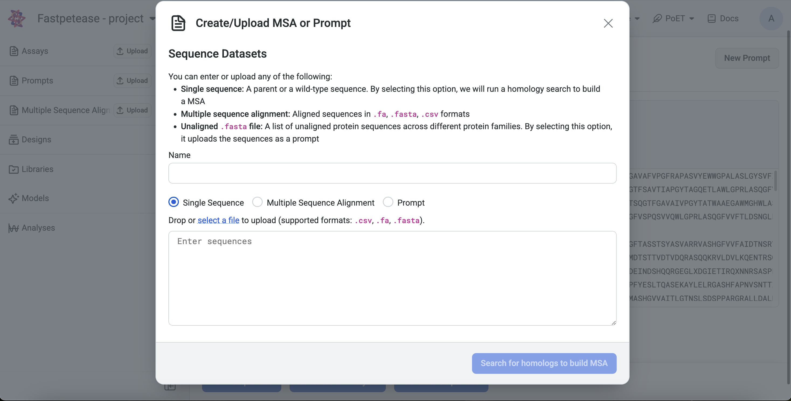

Prompt and prompt sampling methods
===================================

What is a prompt?
-----------------

A prompt is an input that directs a generative AI model to produce the desired protein sequences. For PoET-2, a prompt can include sequences and/or structures that define the target protein subspace. In contrast, PoET-1 uses a prompt composed of a set of related sequences. These sequences can be homologs, family members, or other groupings that capture the characteristics of the protein of interest.

A PoET-2 prompt is made up of two components, either of which can be included or omitted depending on your use case.

- Context: Sequences and/or structures that guide PoET-2’s output distribution and enable in-context learning.
- Query: Specific constraints, such as sequence length, motifs, or active site residues, allowing precise control over the generated sequence.

**Note:** PoET-1 is still available for some use cases and legacy workflows, but we recommend PoET-2 for most scenarios.

Creating a query
-----------------
A query allows you to specify precise constraints for PoET-2 to follow during sequence generation. 

## Query components

- **Reference sequence:** Baseline sequence for comparison and edits.  
- **Query sequence:** User-defined sequence for masking sites (valid amino acids and gap tokens only).  
- **Structure:** Defines structural positions to mask (`X` for masked, `S` for unmasked).

The query enables targeted generation tasks such as sequence in-filling, inverse folding, or motif scaffolding. Only **one** sequence or structure can be entered per query.

## Uploading a query

You can enter into the sequence editor or upload a query in the following formats:

- **Sequence-only files (`.fasta` or `.csv`):**  
  Uploading a sequence file displays both the reference sequence and the query sequence. You can indicate masked positions in the query sequence using the `X` token. The reference sequence serves as a guide to identify positions for masking and to compare edits against the original sequence.

- **Structure files (`.pdb`):**  
  Uploading a structure file allows you to indicate masked positions in the structure track:  
  - `X` — mask this position  
  - `S` — keep the structure corresponding to the amino acid

You also have the option to skip entering a query by toggling the disable query switch.

## Sequence Editor Tools

The sequence editor provides buttons at the top for efficient query editing:

- **Undo / Redo** — revert or restore changes  
- **Mask Sequence** — mask all positions using the `X` token  
- **Unmask Sequence** — restore all positions to match the reference sequence  
- **Mask Selected Residues** — mask only the highlighted positions  
- **Mask Unselected Residues** — mask all positions except the highlighted ones

Additional keyboard shortcuts include:

- Copy and paste sequences  (Ctrl + C / V)
- Replace highlighted positions with a character (e.g., highlight positions 1–50 and press `X` to mask that region)

These tools allow precise control over the query, enabling you to define exactly which residues or structural positions should guide PoET-2’s generation.

## Creating a Context

Users can either upload a custom context or build one from a Multiple Sequence Alignment (MSA).

### Custom Context
- Users can upload `.fasta`, `.csv`, or `.pdb` files.
- Multiple files can be uploaded to a single prompt/context.

### Build from MSA
There are two ways to create a context from an MSA:

1. **Upload an existing MSA file:** Users can upload an MSA file directly.  
2. **Run a homology search using a seed sequence:** Users input a single seed sequence, and PoET builds an MSA by searching for homologs.

## Uploading and Saving a Sequence-Only Prompt

### Without a Project
On the **Projects** page, select a PoET tool from the navigation bar. Under **Prompt Definition**, click **Select a file** and choose a `.fasta` or `.csv` file. Ensure **Prompt** is selected before uploading.

### Within a Project
Prompts can be uploaded via:

- **Project Page:** Click **Upload**, select **Prompt**, and upload your `.fasta` or `.csv` file.

- **Left Sidebar:** Click the **Upload** button under the **Prompt** section and select your file.

- **From a MSA:** On an existing MSA page, click **Create Prompt**.

---

## What is a Multiple Sequence Alignment?

Multiple sequence alignment (MSA) is a technique for biological sequence analysis. It consists of a sequence alignment of three or more biological sequences that usually have an evolutionary relationship.

### Why is MSA Useful?

The resulting MSA can be used to infer sequence homology and conduct phylogenetic analysis to assess the sequences’ shared evolutionary origins. Biologically sound and accurate alignments show homology and relationships, allowing for new member identification and the comparison of similar sequences. Accuracy is vital because subsequent analyses depend on the MSA results.

When building a prompt from an MSA, include sequences you want to optimize. The model learns the patterns of the proteins and predicts sequences that best fit that list. Since the model views proteins in their entirety, you cannot optimize for a specific property or activity.

---

## Creating a Prompt Using a MSA

### Without a Project
Navigate to any PoET tool under **Prompt Definition**. You can either input the MSA directly or upload an existing `.fa`, `.fasta`, or `.csv` file.

### Within a Project
MSAs can be uploaded via:

- **Project Page:** Click **Upload**, select **MSA**, and input or upload a `.fa`, `.fasta`, or `.csv` file.

Uploading and saving a sequence only-prompt
-----------------

Without a Project
~~~~~~~~~~~~~~~~~~~~~~~~~~~~~~~~~~~
On the **Projects** page, select a PoET tool from the navigation bar. Under **Prompt Definition**, click **Select a file** and choose a ``.fasta`` or ``.csv`` file. Ensure **Prompt** is selected before uploading.

.. image:: ../../_static/tools/poet/prompt-1.png
  :alt: Uploading prompt without a project

Within a Project
~~~~~~~~~~~~~~~~~~~~~~~~~~~~~~~~~~~
Prompts can be uploaded via:

- **Project Page**: Click **Upload**, select **Prompt**, and upload your ``.fasta`` or ``.csv`` file.

- **Left Sidebar**: Click the **Upload** button under the **Prompt** section and select your file.

  

  
- **From a MSA**: On an existing MSA page, click on **Create Prompt**.

  

What is a Multiple Sequence Alignment?
--------------------------------------

Multiple sequence alignment (MSA) is a technique for biological sequence analysis. It consists of a sequence alignment of three or more biological sequences that usually have an evolutionary relationship.

Why is MSA useful?
------------------

The resulting MSA can be used to infer sequence homology and conduct phylogenetic analysis to assess the sequences’ shared evolutionary origins. Biologically sound and accurate alignments show homology and relationships, allowing for new member identification and the comparison of similar sequences. Because subsequent analysis depends on the results of an MSA, accuracy is vital.

When building a prompt from a MSA, you should include sequences you want to optimize for. The model learns the patterns of the proteins and predicts sequences that best fit that list. Since the model views proteins in their entirety, you cannot optimize for a specific property or activity.

Creating a Prompt using a MSA
---------------------------

Without a Project
~~~~~~~~~~~~~~~~~~~~~

Navigate to any PoET tool under **Prompt Definition**. You can either input the MSA directly or upload an existing ``.fa``, ``.fasta``, or ``.csv`` file.

.. image:: ../../_static/tools/poet/prompt-6.png
  :alt: Uploading MSA without a project

Within a Project
~~~~~~~~~~~~~~~~~~~~~
MSAs can be uploaded via:

- **Project Page**: Click **Upload**, select **MSA**, and input or upload a ``.fa``, ``.fasta``, or ``.csv`` file.

.. image:: ../../_static/tools/poet/prompt-7.png
  :alt: Uploading MSA on project page

- **Left Sidebar**: Click the **Upload** button under the **MSA** section and input or upload a file.

What is a Seed Sequence?
---------------------------
A seed sequence is a single protein sequence provided by the user to initiate a homology search. PoET does a homology search using public databases like uniprot to build an MSA from the seed sequence. PoET then creates a prompt by randomly selecting sequences from the MSA.

Creating a Prompt via Homology Search based on a Seed Sequence
----------------------------------------------------------------

Without a Project
~~~~~~~~~~~~~~~~~~~~~

Navigate to any PoET tool under **Prompt Definition**, input a seed sequence, and select **Single Sequence**.

Within a Project
~~~~~~~~~~~~~~~~~~~~~

Homology search from a seed sequence can be initiated via:

- **Project Page**: Click **Upload**, select **MSA**, input a single sequence, and click **Search for homologs to build MSA**.

.. image:: ../../_static/tools/poet/prompt-7.png
  :alt: Uploading MSA on project page
  
.. image:: ../../_static/tools/poet/prompt-12.png
  :alt: Uploading MSA on project page
  
  
- **Left Sidebar**: Click the **Upload** button under the **MSA** section, input a sequence, and click **Search for homologs to build MSA**.

Prompt sampling parameters
--------------------------

Prompt sampling definitions
~~~~~~~~~~~~~~~~~~~~~~~~~~~

- **Sampling method**: defines the sampling strategy used for selecting prompt sequences from the homologs found by homology search, or from the provided MSA. The following strategies are available:
   - **Top**: Select sequences based on the order in which they occur in the MSA
   - **Random**: Select sequences randomly without replacement in the MSA
   - **Neighbors**: Sample more diverse, less redundant sequences from the MSA by sampling each sequence with weight inversely proportional to its number of homologs in the MSA.
- **Homology level**: This parameter controls the identity level at which two sequences are considered “neighbors” - that is, redundant - in the MSA. This is equivalent to the homology level used to calculate the number of effective sequences in protein families.
- **Random seed**: The seed for the random number generator used to sample from the MSA. Using the same seed with the same MSA and sampling parameters will guarantee that the same results are generated each time. Different seeds will produce different prompt samples.
- **Maximum similarity to seed sequence**: The maximum similarity to the seed sequence allowed when selecting sequences for the prompt. No sequence with identity greater than this to the seed will be included.
- **Minimum similarity to seed sequence**: The minimum similarity to the seed sequence allowed when selecting sequences for the prompt. No sequence with identity less than this to the seed will be included. This is useful for creating prompts that are highly focused on the local sequence space around the seed.
- **Maximum number of sequences**: The number of sequences sampled from the MSA to form the prompt. The same sequence will not be sampled from the MSA more than once, so the number of sequences in the prompt will never be greater than the number of sequences in the MSA.
- **Maximum total number of residues**: The maximum total number of residues in all sequences sampled from the MSA to form the prompt. For example, if this is set to 1000, sequences will be sampled from the MSA up to a maximum cumulative length of 1000 residues.

Prompt sampling explained
-------------------------

The selection of prompt sequences from the MSA is controlled by several prompt sampling parameters.

The **sampling method** field defines the sampling strategy used for selecting prompt sequences from the homologs found by homology search, or from the provided MSA. We recommend using the default **Neighbors** method. The other options are **Top** and **Random**.

The **homology level** field allows you to generate more or less diverse prompt sequences.
- If your protein comes from a highly diverse family or you wish to explore a large and diverse set of variants, adjusting the homology level to be lower will select higher diversity prompt sequences and generate higher diversity sequence distributions.
- If you need more focused generation, use a higher homology level and set a minimum similarity threshold to ensure the prompt focuses on the local sequence landscape around your seed.

The default **maximum** and **minimum similarity parameters** are set to values which perform well across a wide range of protein families. These can be tuned to adjust the diversity of sequences that will be modeled by PoET.
