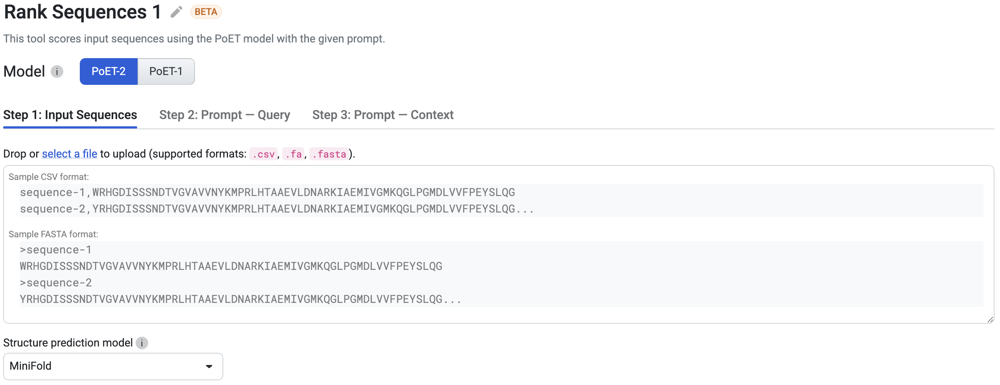

Using The Rank Sequences Tool
===============================

This tutorial teaches you how to assess protein fitness by using the Rank Sequences tool to score your input sequences relative to a prompt. Use this as a starting point for predicting the outcomes of a specific sequence or prioritizing variants for further analysis.

On this page, you will learn how to score sequences to predict fitness and rank variants, then interpret and fine-tune the results.

If you run into any challenges or have questions while getting started, please contact `OpenProtein.AI support <https://www.openprotein.ai/contact>`_.

What You Need Before Starting
------------------------------

This tool requires a multiple sequence alignment (MSA), from which it builds a prompt. You can upload your own MSA or have the OpenProtein model generate one for you. If you aren’t already familiar with prompts, we recommend learning more about OpenProtein.AI’s `prompts and prompt sampling methods <./prompts.rst>`_ before diving in.

You also need an input sequence, or list of sequences you want to score against the prompt.

Rank Your Sequences
-------------------

Navigate to the tool by opening the **PoET** dropdown menu, then selecting **Rank Sequences.** You can choose the model used to run the job. We recommend using PoET-2 for most use cases.

Step 1: Input Sequences
^^^^^^^^^^^^^^^^^^^^^^^^

You can upload a dataset containing multiple sequences in either .fasta or .csv format. Once uploaded,
your dataset will appear.

If you choose to upload a CSV file, please note the following requirements:

- The file must not include a header row.
- It can contain a maximum of 2 columns.
- If there are 2 columns, the first one must be the sequence names.

You can choose the default structure prediction model to generate the sequence structures after the job completes.

Step 2: Prompt Query
^^^^^^^^^^^^^^^^^^^^^

Refer to `Creating a Query <./prompts.rst#creating-a-query>`_ to learn about Prompt Query.

Step 3: Prompt Context
^^^^^^^^^^^^^^^^^^^^^^^

Refer to `Creating a Context <./prompts.rst#creating-a-context>`_ to learn about Prompt Context.

You're ready to rank your sequences! Click **Run.** The job may take a few minutes depending on how busy the service is, how long your sequences are, and how many sequences you want to score.

A 400 (Bad request) error code may be due to the following:

.. list-table::
   :header-rows: 1
   :widths: 20 20
   :align: left

   * - Issue description
     - Solution
   * - Invalid PoET Job or Parent
     - Re-enter prompt and try again.
   * - Invalid prompt in PoET service
     - Reupload prompt and try again. Refer to the article about `prompts <./prompts.rst>`_. Ensure minimum and maximum similarity parameters are not filtering out all sequences in prompt.
   * - Invalid user input in align service
     - Ensure you don't have

       - a top_p > 1
       - a non-valid amino acid
       - Maximum similarity < minimum similarity
       If necessary, refer to the article on `sampling parameters <./prompts.rst#prompt-sampling-definitions>`_.
   * - Invalid MSA (not aligned, etc)
     - - Make sure your MSAs are aligned and rebuild MSA if necessary.
       - If you have uploaded pre-computed MSA, confirm that formatting is correct and sequences are of equal length (use gap tokens “-”).
       - If you are building from a seed sequence, try rebuilding the MSA

Please contact `OpenProtein.AI support <https://www.openprotein.ai/contact>`_ if the suggested solutions don't resolve the issue.

Interpreting Your Results
-------------------------

Refer to `Interpreting PoET Results Table <./results-table.rst>`_.

Fine-tuning Your Results
------------------------

Improve your results by adding more sequences with your desired properties to your MSA, or by adjusting the **prompt sampling method**. You can also adjust the **Maximum similarity to seed sequence** and **Minimum similarity to seed sequence** fields.

To improve scores, increase the number of the **ensemble** setting. This will result in higher scoring sequences, but will take longer to complete.

Next Steps
----------

Now that you have a list of sequence variants of interest, you can use `Structure Prediction <../structure-prediction/using-structure-prediction.rst>`_ to visualize the 3D structures of a protein sequence. You can also use `Substitution Analysis <./substitution-analysis.rst>`_ to score all single substitution variants of your parent sequence conditioned on the prompt, and view the results in a heatmap.

