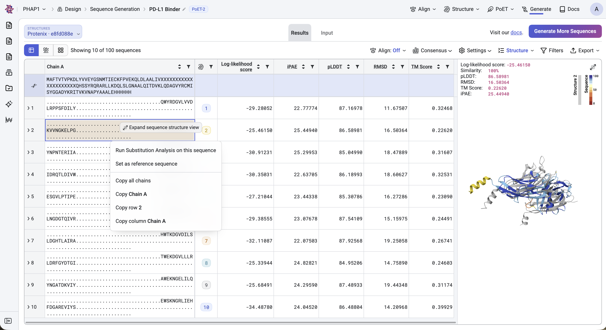
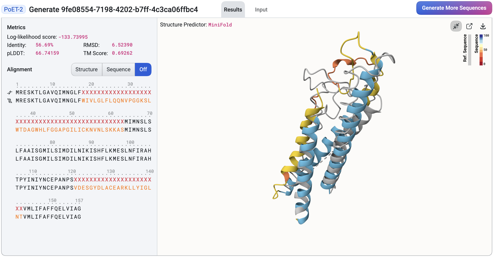
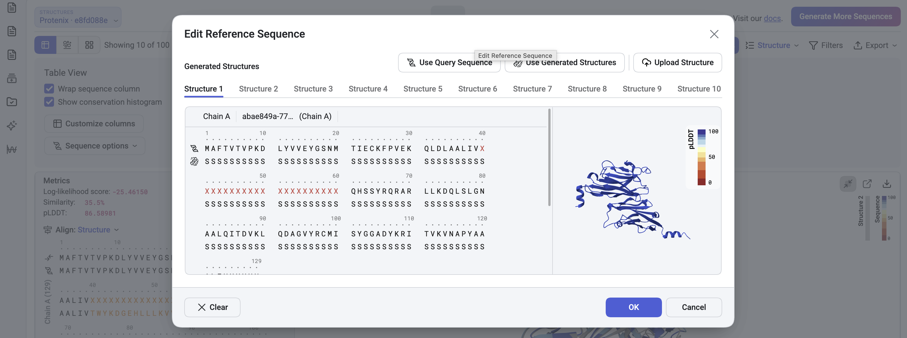

Interpreting PoET Results Table
================================

The PoET history page allows you to view and access past jobs, sorted by created date, job type, and status. Clicking the job ID will take you to the results page for that job.

This tutorial explains how to interpret the results generated by the PoET Generate Sequences and Rank Sequences tools.

Results Table
^^^^^^^^^^^^^^

Your results are presented in a table, with each generated sequence assigned a log-likelihood score. This score reflects how well the generated sequence fits the prompt: a higher score indicates a better fit.

Right-click any sequence to access local fitness landscapes through the **Run Substitution Analysis** menu. You can also sort your results and export them using the **Export** button.

Structure Prediction and Comparison
^^^^^^^^^^^^^^^^^^^^^^^^^^^^^^^^^^^^

Once the structure prediction job completes, the structure viewer will appear on the right side of the page. The prediction model can be changed via the **Structure Predictor** dropdown located above the viewer. Hover over a sequence in the results table to preview and compare its structure against the query structure. The viewer also displays key metrics, including:

- **pLDDT (predicted Local Distance Difference Test)**: A per-residue confidence score (commonly scaled from 0-100 or 0.0-1.0) indicating how reliable each residue's predicted position is.

- **RMSD (Root Mean Square Deviation)**: A measure of structural similarity between two molecules, typically comparing backbone atoms. Lower RMSD values indicate greater structural similarity.

Click a sequence to expand the structure viewer, which will overlay the results table. In this view, you can examine detailed metrics and sequence-to-prompt alignment for the selected sequence.

Change Reference Structure
^^^^^^^^^^^^^^^^^^^^^^^^^^^^^^^^^^^^

By default, the query structure is used as the reference structure for structural comparisons. You can change it by selecting an alternative structure via the **Edit Reference Sequence** button, accessible from the results table **Settings** in the results table.

