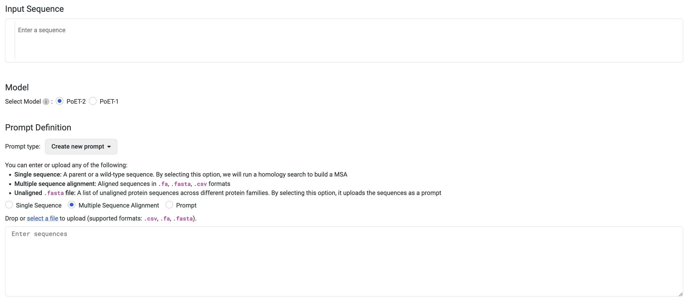
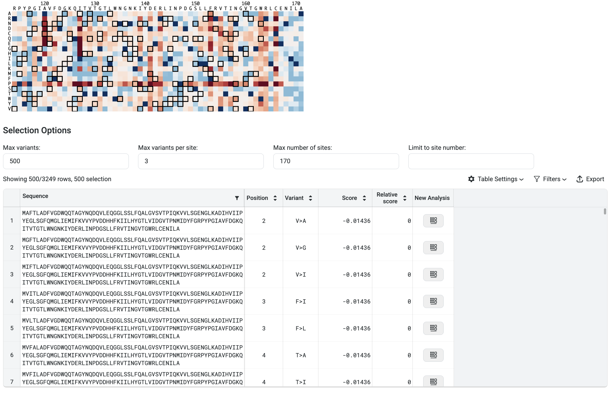
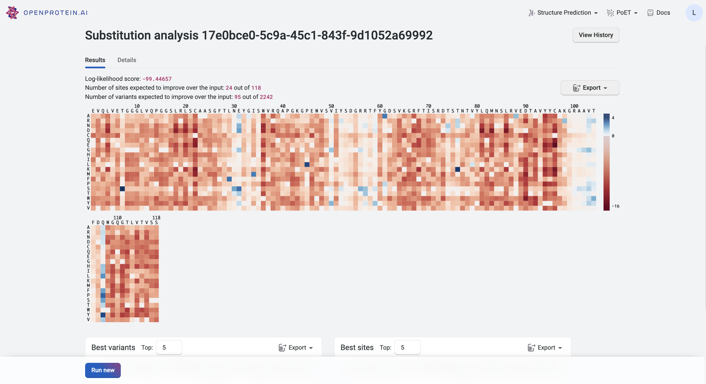

Using the PoET Substitution Analysis tool
============================================

This tutorial teaches you how to use PoET's Substitution Analysis tool to score all single substitution variants of an input sequence with the given prompt. Use this as a starting point to design single mutant or combinatorial variant libraries, and predict the strength of protein activity.

If you run into any challenges or have questions while getting started, please contact `OpenProtein.AI support <https://www.openprotein.ai/contact>`_.

What you need before starting
------------------------------

You need a sequence and/or a multiple sequence alignment, which OpenProtein.AI uses to build a prompt. Upload your own MSA or have the OpenProtein.AI model generate one for you. If you aren't already familiar with prompts, we recommend learning more about `prompts and prompt sampling methods <./prompts.rst>`_ before diving in.

Score single substitution variants
----------------------------------

Navigate to the tool by opening the **PoET** dropdown menu, then selecting **Substitution Analysis.**

In the first field, enter the sequence you would like to analyze.

Next, choose the model used to run the job. We recommend using PoET-2 for most use cases. 

Select an existing prompt or add your custom MSA to the **Prompt Definition** field. Enter the sequence(s) directly, upload an existing .fa, .fasta, or .csv file or select an existing prompt.

If you do not have an existing MSA, enter your target protein and select **Single Sequence.** OpenProtein will generate an MSA by doing a homology search against Uniref using mmseqs2 with default settings from ColabFold, then use the MSA to create a prompt. Please note that if you check **Single Sequence** when multiple sequences are entered, sequences after the first are ignored.

Choose the number of prompts to ensemble. Select 1 to sample a single prompt, or increase the diversity of generated outputs by ensembling over 2-15 prompts. We suggest using 3-5 prompts.

Set sampling method fields. We suggest starting with the default settings, then adjusting based on your results.

You're ready to analyze your variants! Select **Run.** The job may take a few minutes depending on how busy the service is, how long your sequences are, and how many sequences you want to score.

A 400 (Bad request) error code may be due to the following:

.. list-table::
   :header-rows: 1
   :widths: 20 20
   :align: left

   * - Issue description
     - Solution
   * - Invalid PoET Job or Parent
     - Re-enter prompt and try again.
   * - Invalid prompt in PoET service
     - Reupload prompt and try again. Refer to the article about `prompts <./prompts.rst>`_. Ensure minimum and maximum similarity parameters are not filtering out all sequences in prompt.
   * - Invalid user input in align service
     - Ensure you don’t have
       - a top_p>1
       - a non-valid amino acid
       - Maximum similarity < minimum similarity
       If necessary, refer to the article on `sampling parameters <./prompts.rst#prompt-sampling-definitions>`_.
   * - Invalid MSA (not aligned, etc)
     - - Make sure your MSAs are aligned and rebuild MSA if necessary.
       - If you have uploaded pre-computed MSA, confirm that formatting is correct and sequences are of equal length (use gap tokens “-”).
       - If you are building from a seed sequence, try rebuilding the MSA

Please contact `OpenProtein.AI support <https://www.openprotein.ai/contact>`_ if the suggested solutions don't resolve the issue.

Interpreting your results
-------------------------

Your results are presented as a heatmap in the Results tab, where each site has a relative log-likelihood score. This score indicates increased or decreased fitness relative to the sequence being analyzed. Hover over a site on the heatmap to view the relative log-likelihood score. A positive number indicates an improvement in fitness, a negative number indicates a reduction in fitness, and 0 indicates equivalent fitness.

The heatmap colors indicate how a mutation at that site would impact the fitness of a variant:

- Blue indicates improved fitness.
- Red indicates reduced fitness.

A site which is all white indicates that a mutation at that site would not impact fitness.

To run a Substitution Analysis using one of these variants to build a new prompt, click on the variant in the heatmap to open the **Create new Substitution Analysis** drawer, then select **Create**.

You can also enter an arbitrary sequence in the **Create new Substitution Analysis** drawer to run single site analysis for other sequences without respecifying the prompt.

You can filter your results using the following options:

- **Max Variants**: Limits the total number of variants displayed in the results table.
- **Max Variants per Site**: Shows only the top *n* substitutions at each amino acid position.
- **Max Number of Sites**: Displays only the top *n* positions recommended for substitution.
- **Limit to Site Number**: Restricts results to specific positions. You can input discrete values (e.g., ``1; 3; 5; 7``) or a range (e.g., ``21 - 65``).

In the image above, the filters are set to display the top 3 variants at the top 170 sites, and then select the best 500 sequences from that pool.

Your highest scoring variants and sites are also displayed in tables below the heatmap for quick reference. Download results as a table using the **Export** button.

Refer to the **Details** tab to see the parameters you used to run the Substitution Analysis.

Fine-tuning your results
------------------------

If your heatmap is inconclusive, meaning that the log-likelihood scores are very close, adjust your sampling methods or **Maximum similarity to seed sequence** and **Minimum similarity to seed sequence** fields.

You can also improve your prompt by adding sequences or constructing a better MSA.

Next steps
----------

Now that you have a list of promising variants, use `Structure Prediction <../structure-prediction/using-structure-prediction.rst>`_ to visualize their structural implications or start a project using our `OP models <../opmodels/index.rst>`_ after acquiring data from your designs.
