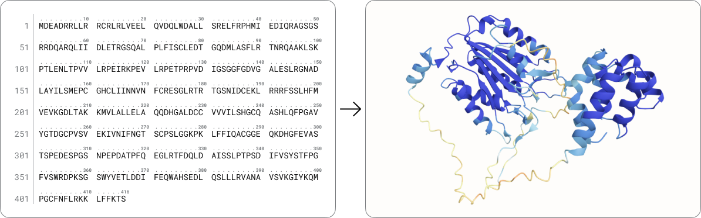

Predict your protein structure from sequence alone
==================================================

Our Structure Prediction tool allows you to visualize high-quality structural representations of your sequence via state-of-the-art open source models - including ESMFold, (`Lin et al., 2023 <https://www.science.org/doi/10.1126/science.ade2574>`_) and AlphaFold2 (`Jumper et al., 2021 <https://www.nature.com/articles/s41586-021-03819-2>`_).

Learn more and get started with our tutorials
---------------------------------------------

* `Using the Structure Prediction tool <./using-structure-prediction.md>`_

.. _Lin2023-cw: https://www.example.com/lin2023-cw

.. toctree::
  :hidden:

  using-structure-prediction
  API Tutorials <api/index>
