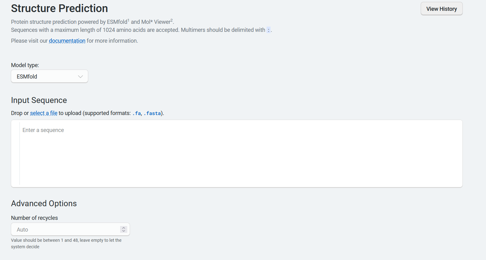
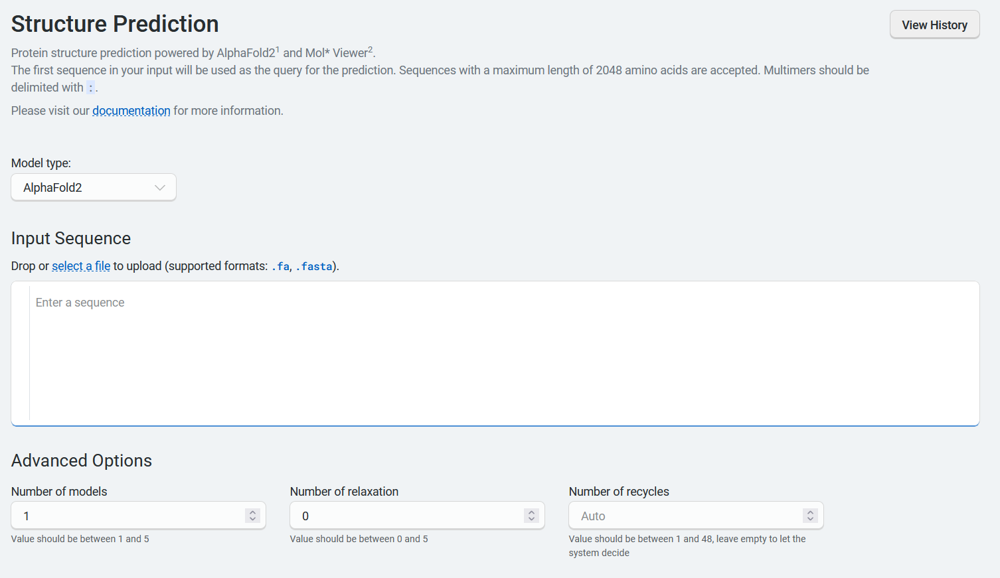
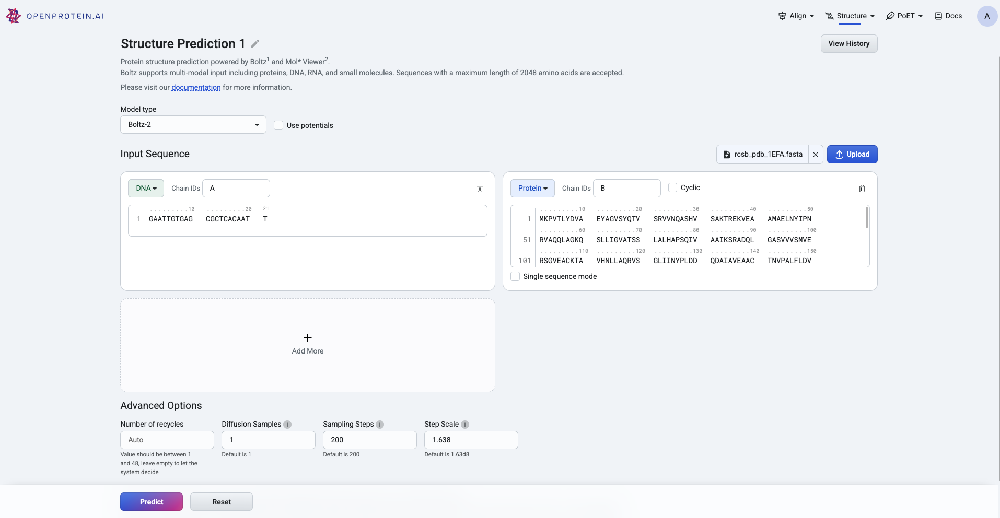
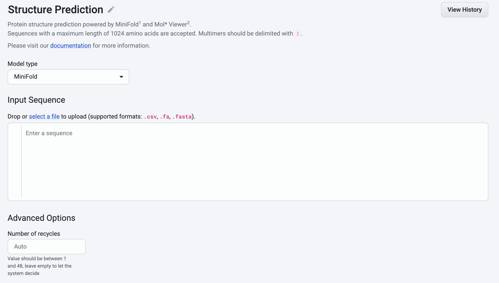
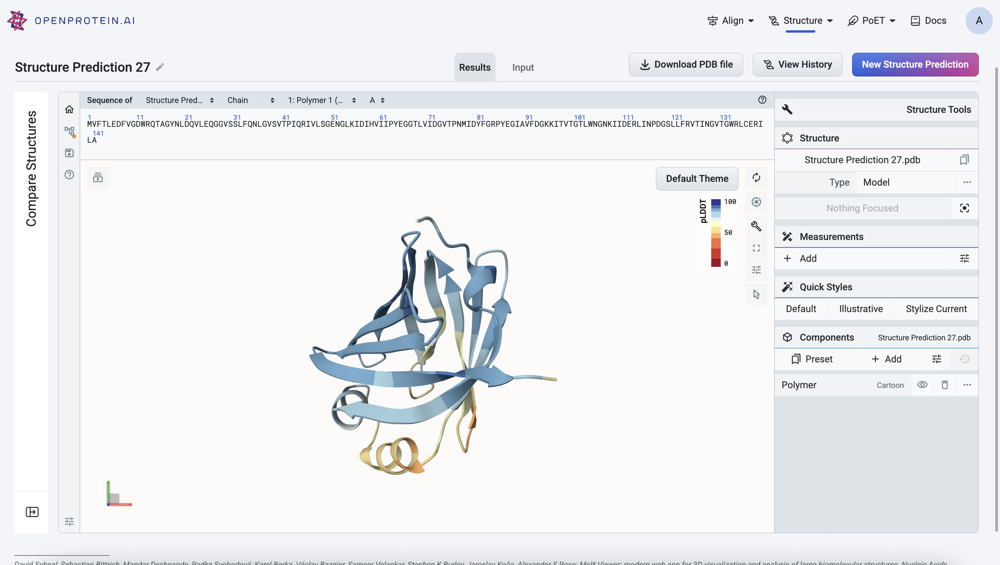
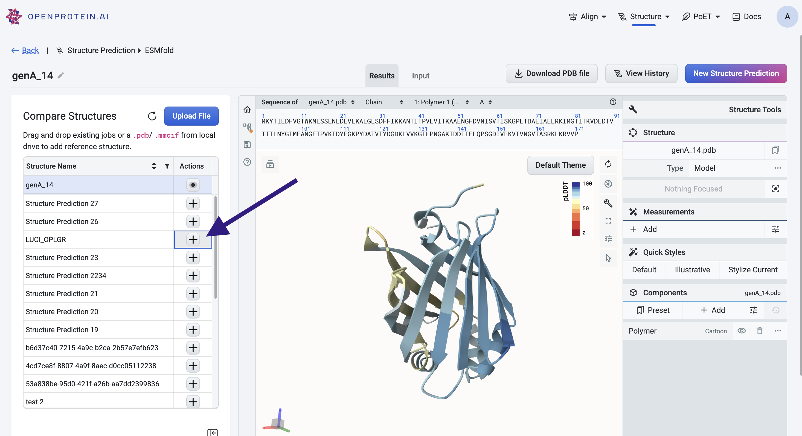
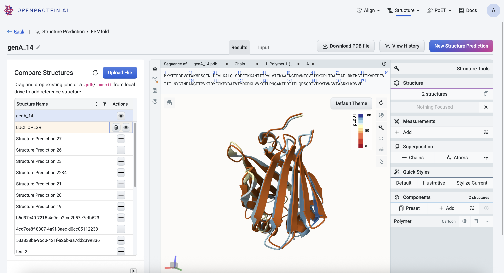

Using the Structure Prediction tool
====================================

This tutorial shows you how to use the Structure Prediction tool to visualize the 3D structures of your protein sequences using our web app.
Structure prediction can also be accessed via the `REST API
<../../rest-api/fold.rst>`_ or our `Python client <../../python-api/api-reference/fold.rst>`_.

What you need before getting started
-------------------------------------

You need a sequence of interest.

Selecting your model
--------------------

We recommend using:

- ESMFold for predictions that must be completed quickly. 
- AlphaFold2 for predictions where accuracy is more important than speed. AlphaFold2 creates and samples an MSA in order to perform structure predictions, which increases accuracy but is slower than ESMFold. 
- Boltz-1 focuses on high-accuracy modeling of biomolecular structures — including proteins, DNA, and RNA — and produces static 3D models of molecular complexes with structural accuracy comparable to AlphaFold3.
- Boltz-2 is the recommended model for proteins, RNA, DNA and ligands. It expands from Boltz-1 from static complexes to dynamic structural ensembles. This means Boltz‑2 can model how biomolecules move and interact over time.
- MiniFold is a fast single-sequence structure prediction model built on ESM-2, delivering accuracy comparable to ESMFold while reducing inference time by 10–20×. It is designed for rapid prediction of large numbers of protein structures and currently supports single-chain proteins

Accessing the Structure Prediction tool
---------------------------------------

You can access the Structure Prediction tool by selecting **Structure Prediction** from the top navigation bar, or right-clicking a sequence in your data table.

From the top navigation bar
^^^^^^^^^^^^^^^^^^^^^^^^^^^

Select **Structure Prediction** from the top navigation bar to open the **New Structure Prediction** page. The default model is ESMFold. To use AlphaFold2, select **AlphaFold2** in the **Model Type** dropdown menu.

Input your sequence into the sequence box:

- Type or paste the sequence.
- Select a file using the file explorer.

Link multimer sequences with a colon (:) or their amino acid linker sequence. 

From the data table
^^^^^^^^^^^^^^^^^^^

Right-click a sequence in your data table, then select **Fold sequence**. This
opens the **New Structure Prediction** page. The default model is ESMFold. To
use AlphaFold2, select **AlphaFold2** in the **Model type** dropdown menu. The
sequence you selected in the data table is auto-populated.

Using ESMFold
-------------

If you select **ESMFold**, the **Advanced Options** section allows you to set
the **Number of recycles**. This allows the network to further refine structures by using the previous cycle’s output as the new cycle’s input. This parameter is set to **auto** by default and accepts integers between 1 and 48.

Using AlphaFold2
----------------

If you select **AlphaFold2**, the **Advanced Options** section contains several
parameters:

- **Number of models** allows you to select the number of models to train. This parameter is set to 1 by default, and accepts integers between 1 and 5. If more than 1 model is available, the best model will be used.
- **Number of relaxation** specifies the number of top ranked structures to relax using AMBER. This parameter is set to 0 by default and accepts integers between 0 and 5. Relaxation is an optional final step in protein structure prediction. It can help resolve rare stereochemical violations and clashes by making small adjustments to the structure using gradient descent in the AMBER force field.
- **Number of recycles** allows the network to further refine structures using the previous cycle’s output as the new cycle’s input. This parameter is set to **auto** by default and accepts integers between 1 and 48.

Using Boltz-1 and Boltz-2
-------------------------

When using Boltz-1 or Boltz-2, you can enter or upload protein, ligand, DNA, or RNA sequences in the input fields provided. Be sure to select the correct sequence type from the dropdown menu.

The **Advanced Options** section contains several parameters:

- **Diffusion samples** This refers to the number of diffusion samples used and controls how many independent structure samples are generated per input
- **Sampling steps** This sets the number of steps in the diffusion process for each sample
- **Step scale** Adjusts the effective temperature or diversity of teh sampling process. The higher the values, the higher the diversity

   
Using MiniFold
-------------

If you select **MiniFold**, the **Advanced Options** let you set the **Number of recycles**, which controls how many times the network refines a structure by feeding the output of one cycle into the next. This parameter defaults to **auto** and accepts integers from **1 to 48**.  

**Additional notes:**  
- Supports only single-chain proteins  
- Maximum sequence length: **2048**  

Visualizing your sequence
--------------------------

When you're ready to visualize your sequence, select **Predict**.

After the model is finished training, it displays a 3D visualization of the protein structure. You can edit your sequence name by selecting the title box or the pencil icon, and use the available tools to zoom, rotate, and pan through the 3D structure.

A confidence indicator is included as a predicted local distance difference test (pLDDT) score, where a higher score indicates higher confidence in the prediction. Sections of the predicted structure are color coded to correspond with the pLDDT color legend to the right of the structure.

You can select **Input** to view your design input sequence, or select **New structure prediction** to start a new prediction.

Comparing structures
----------------------

After a 3D structure prediction is complete, you can add existing structures to compare against the predicted model using the Mol* viewer.

Adding structures
^^^^^^^^^^^^^^^^^

To add a structure to the viewer:

- Select the + icon in the left panel

- drag and drop a PDB file directly into the viewer

You can add multiple structures for comparison. Each structure appears as a separate entry in the left panel.

Managing structures
^^^^^^^^^^^^^^^^^^^

Use the eye icon next to each structure in the left panel to toggle its visibility. This can help isolate or focus on specific structures in the viewer.

To remove a structure from the viewer entirely, click the trash can icon next to the structure name.

Downloading your 3D structure
-----------------------------

For structure predictions using ESMFold, select **Download PDB file** to export the 3D structure as a .pdb file.

For structure predictions using AlphaFold2, select **Download .mmCIF file**.

Accessing previous predictions
------------------------------

View previously visualized structures by selecting **History** in the **Structure Prediction** tool menu.
The **History** tab also contains the following information about your past
structure predictions:

- job ID
- model type
- date created

