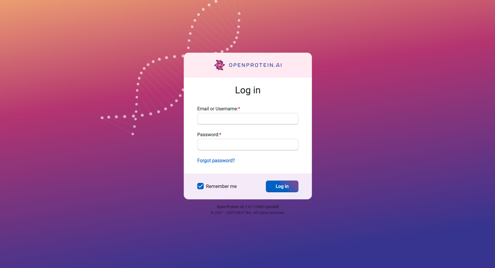
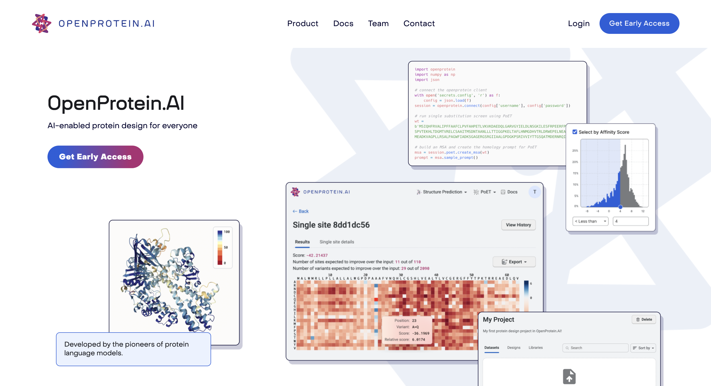
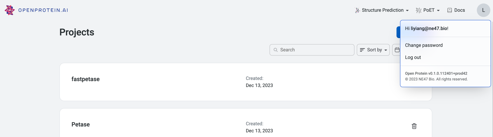

## Logging into your account

Log in to the [web platform](https://app.openprotein.ai){target="_blank"} with your
username and password.

  

You can also log in from our [home page](https://openprotein.ai){target="_blank"}.

  

::: {.callout-tip}
## Don’t have access yet?

Request [early access](https://openprotein-ai.webflow.io/early-access-form){target="_blank"}
:::

## Resetting your password

To change your password, navigate to the account icon on the top right
corner of the page, and click on 'Change password'.

  

