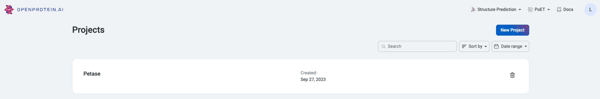
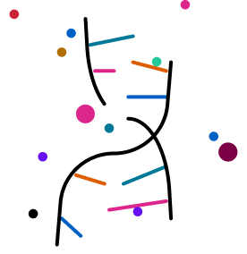

Step 1: Request [early access](https://openprotein-ai.webflow.io/early-access-form){target="_blank"}    
Step 2: [Log in](https://app.openprotein.ai){target="_blank"} to your account   
Step 3: Get started using [our tools](../tools/index.md) for your protein engineering goals   

::: {.callout-tip}
## Are you a developer?

Visit [Get started with our API](./get-started-with-our-API.md)
:::

### Quick start tips
Once you log in, you’ll see your home view and can navigate to get started with our tools.

  

Do you want to...  

:::: {.columns}

::: {.column width="10%"}

:::

::: {.column width="5%"}
<!-- empty column to create gap -->
:::

::: {.column width="85%"}
**Make sequence predictions or designs without using any data?**  
Get started with [PoET](../poet/index.md) which uses evolutionary information to generate protein sequences
:::

::::

:::: {.columns}

::: {.column width="10%"}

:::

::: {.column width="5%"}
<!-- empty column to create gap -->
:::

::: {.column width="85%"}
**Analyze your experimental data for library design?**  
Create your first project and deploy machine learning models trained on your data  
[Learn more about OP Models](../opmodels/index.md)&emsp;&emsp;&emsp;[Get started uploading your data](../opmodels/uploading-your-data.md)

:::

::::

:::: {.columns}

::: {.column width="10%"}

:::

::: {.column width="5%"}
<!-- empty column to create gap -->
:::

::: {.column width="85%"}
**Explore your protein's structure?**  
Use our [Structure Prediction tool](../structure-prediction/using-structure-prediction.md) to view and download high quality images
:::
::::