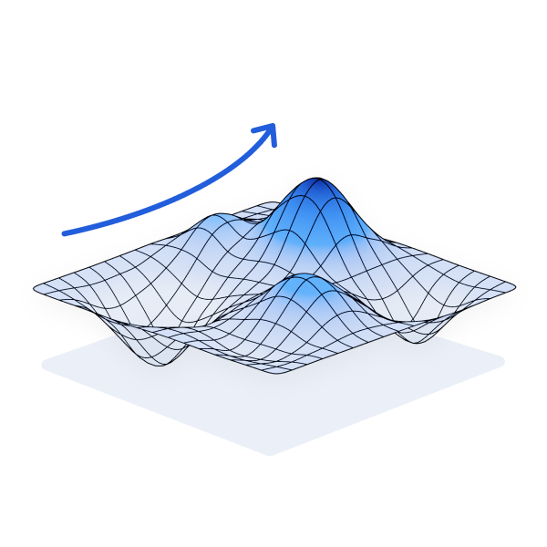
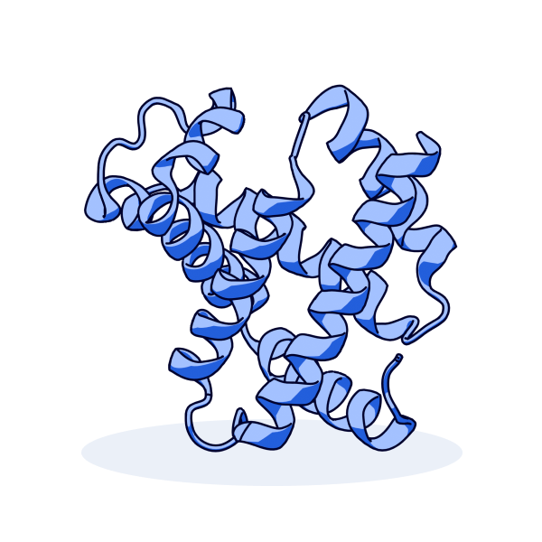
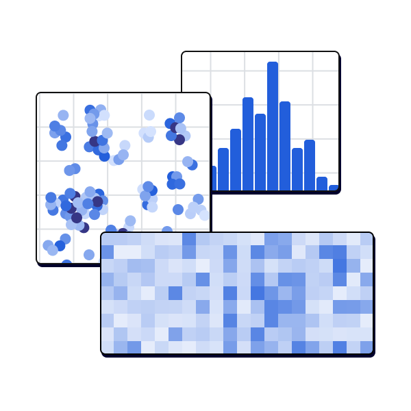
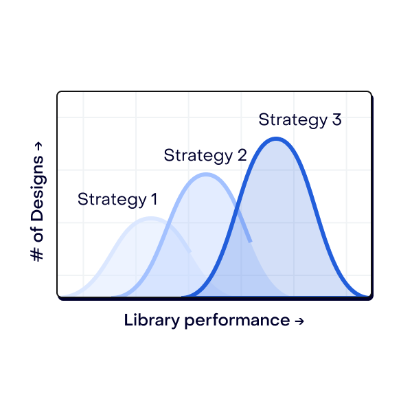
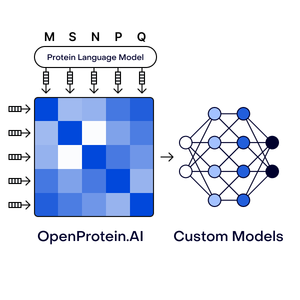

# Data-Driven Protein Engineering

OpenProtein.AI brings state-of-the-art machine learning and generative models to use in your protein engineering workflows. Our protein language models learn sequence-to-function relationships and allow you to build custom models for protein library design, variant effect prediction and your broader engineering objectives.

Get started with OpenProtein.AI and discover functional protein sequences optimized to your specifications
```{=html}
<script>
document.addEventListener('DOMContentLoaded', function() {
    const cards = document.querySelectorAll('#card');
    cards.forEach((card)=> {
        console.log(card);
        const exampleLink = card.querySelector('.example-link');
        const exampleIcon = card.querySelector('.arrow-icon-example');
        const toolsIcon = card.querySelector('.arrow-icon-tools');

        if (exampleLink === null) return;
      
        card.addEventListener('mouseenter', function() {
            exampleIcon.style.display = 'none';
            toolsIcon.style.display = 'inline';
        });

        card.addEventListener('mouseleave', function() {
            exampleIcon.style.display = 'none';
            toolsIcon.style.display = 'none';
        });

        exampleLink.addEventListener('mouseenter', function() {
            toolsIcon.style.display = 'none';
            exampleIcon.style.display = 'inline';
        });
   
        exampleLink.addEventListener('mouseleave', function() {
            toolsIcon.style.display = 'inline';
            exampleIcon.style.display = 'none';
        });

    });
});
</script>
<div class="card-container">
    <div class="card" id="card">
        
        <div class="card-body">
            <span>Enhance directed evolution with zero-shot protein design</span>
            <div style="margin-top: 1.5rem">
                <a href="./poet/index.md">Tools</a>
                
            </div>
            <div>
                <a href="https://docs.openprotein.ai/api-python/poet_workflow.html" target="_blank" class="example-link">Examples</a>
                
            </div>
        </div>      
    </div>
    <div class="card" id="card">
        
        <div class="card-body">
            <span>Design variants using large language models to traverse the protein evolutionary landscape</span>
            <div style="margin-top: 1rem">
                <a href="./opmodels/index.md">Tools</a>
                
            </div>
            <div>
                <a href="./tutorials/index.md#library-design-from-your-data" class="example-link">Examples</a>
                
            </div>
        </div>      
    </div>
    <div class="card" id="card">
        
        <div class="card-body">
            <span>Predict the structure of your designer proteins with deep learning</span>
            <div style="margin-top: 1.5rem">
                <a href="./structure-prediction/index.md">Tools</a>
                
            </div>
        </div>      
    </div>
    <div class="card" id="card">
        
        <div class="card-body">
            <span>Visualize your data to better understand and communicate your results</span>
            <div style="margin-top: 1.5rem">
                <a href="./opmodels/index.md">Tools</a>
                
            </div>
            <div>
                <a href="./tutorials/index.md#analyzing-your-data" class="example-link">Examples</a>
                
            </div>
        </div>      
    </div>
    <div class="card" id="card">
        
        <div class="card-body">
            <span>Design cost efficient libraries to maximize ROI with limited resourcing</span>
            <div style="margin-top: 1.5rem">
                <a href="./opmodels/index.md">Tools</a>
                
            </div>
            <div>
                <a href="./tutorials/index.md#library-design-from-your-data" class="example-link">Examples</a>
                
            </div>
        </div>      
    </div>
    <div class="card" id="card">
        
        <div class="card-body">
            <span>Get embeddings and attention maps for integration with your ML pipeline</span>
            <div style="margin-top: 1.5rem">
                <a href="./opmodels/index.md">Tools</a>
                
            </div>
            <div>
                <a href="https://docs.openprotein.ai/api-python/demos/embedding_demo.html" target="_blank" class="example-link">Examples</a>
                
            </div>
        </div>      
    </div>
</div>
```

```{=html}  
<div class="getting-started-container">
    <span class="getting-started-title">Getting started</span>
    <div class="learn-more">
        <span>Learn more about our tools →</span>
        <a href="./getting-started/get-started-with-no-code.md">With no code</a>
        <a href="./getting-started/get-started-with-our-API.md">For the API</a>
    </div>
</div>
```
# Solutions for your application


```{=html}  
<div class="card-container card-container-start">
    <a href="./walkthroughs/antibody-engineering.md" class="card clickable-card" style="margin-right: 3rem">
        
        <span class="title">Antibodies</span>
        <div>
            <span class="description">Optimize your antibody sequences for key properties</span>
            <ul>
                <li>Binding Affinity</li>
                <li>Activity</li>
                <li>Immunogenicity</li>
            </ul>
        </div>      
    </a>
    <!-- <a href="./walkthroughs/enzyme-engineering.md" class="card clickable-card">
        
        <span class="title">Enzymes</span>
        <div>
            <span class="description">Design novel variants with desired functionality</span>
            <ul>
                <li>Catalytic efficiency</li>
                <li>Thermostabilty</li>
                <li>Expression</li>
            </ul>
        </div>      
    </a> -->
    <a href="./structure-prediction/index.md" class="card clickable-card">
        
        <span class="title">Structural proteins</span>
        <div>
            <span class="description">Optimize fitness for your structural proteins of interest</span>
            <ul>
                <li>Stability</li>
                <li>Expression</li>
            </ul>
        </div>      
    </a>
</div>
```