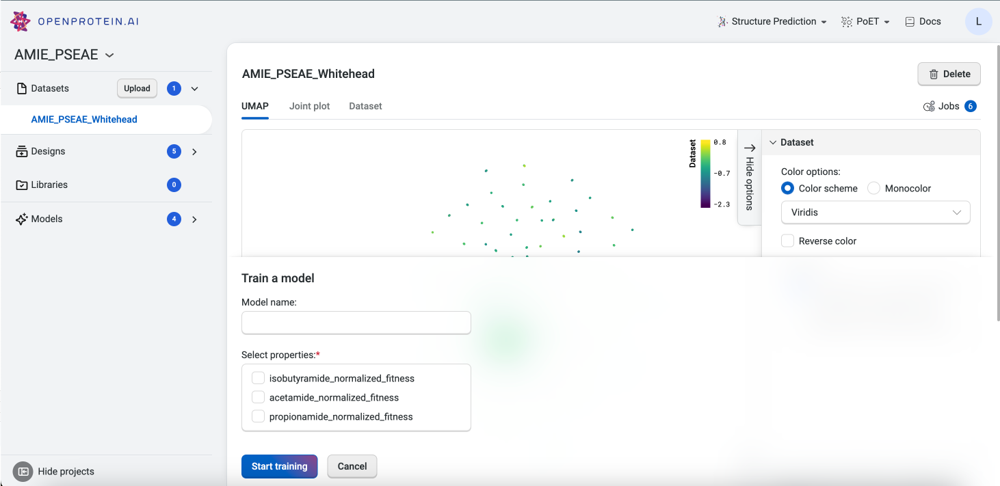
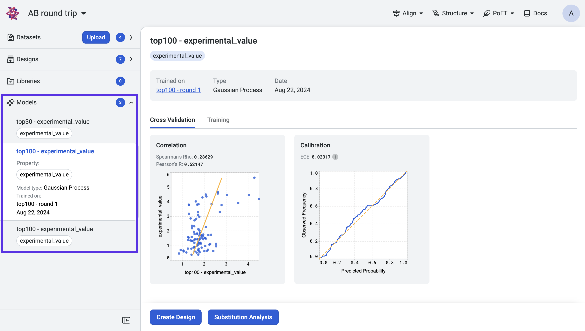
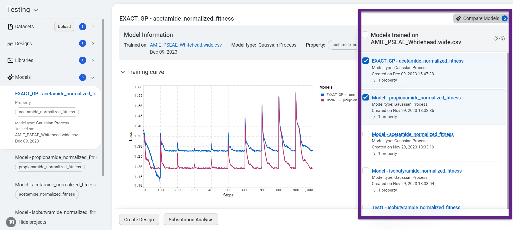

This tutorial teaches you how to train and compare custom sequence-to-function prediction models to predict your desired property or properties. These models can be used to make predictions for new sequence variants and to design libraries of optimized sequences.

## What you need before starting

Please note that this tool requires experimental data. If you don't yet have experimental data, use [PoET](../../poet/index.md) to generate sequences from a seed, rank sequences against a prompt, or evaluate single substitution variants.

If you run into any challenges or have questions while getting started, please contact [OpenProtein.AI support](https://www.openprotein.ai/contact){target="_blank"}.

## Training your models

OpenProtein.AI's OP models tools use Gaussian process (GP) models. The foundational models are trained on public protein databases, and then specialize the model to the user's dataset during model evaluation.

Train your custom models using a dataset you upload. On the dataset page, select **Train Model**.

This opens the **Train a model** drawer, where you can enter a model name and choose properties for the model to predict.

You're ready to train your custom model! Select **Start training** to initiate the job.

After training a model, OpenProtein.AI automatically evaluates the predictive performance using cross-validation.

Once training is complete, access your models from the **Models** section of your project navigation bar.

View the training curves and cross-validation results by selecting a model from the project navigation menu.

Now that you have trained models, use **Substitution analysis** to screen variants and predict the strength of protein activity. You can also use the **Design** tool to design combinatorial libraries or select which sites to modify.

## About Model Evaluation

OpenProtein.AI uses k-fold cross validation. It splits variants into 5-folds, trains the model on four folds, and predicts the held-out fold. The cross-validation plots display the predicted properties compared to the actual measured properties for each held-out variant.

A high correlation between the predicted and ground truth values suggests that the models can accurately predict the substrate activity for new sequence variants.

Each model you train is linked to a specific dataset. You can compare between multiple models trained on the same dataset by selecting **Compare models** , then checking the desired models in the right side panel. The **Training curve** and **Cross-validation** graphs update immediately.

## Fine-tuning your model

Several factors affect your model's correlation and may result in a lower than desired correlation.

- Measurement noise is a fundamental limitation, so even a perfect model will not have a correlation of 1.0. Working with limited data will also introduce uncertainty into the sequence-function relationship, which limits the predictive power of the model.

- Our models are uncertainty aware: they output a standard deviation indicating confidence in the prediction. More data will generally lead to a better model with higher confidences, but a model with high uncertainty can still guide designs towards sequence variants that are most likely to have the best properties. In this case, more sequences likely need to be tested because the sequence-function relationship isn't fully understood. This will reflect in the success probabilities of variants and libraries.

- The model may be mis-specified and therefore regularized away from the correct solution. Model mis-specification is a fundamental problem that may limit generalizability. OpenProtein.AI uses protein sequence features that capture functional relationships better than 1-hot encodings or other conventional biophysical property-based featurizations, but cannot guarantee they will work well for every problem.

We recommend using large datasets as given enough data, the model will learn the true sequence-function relationship despite data noise. You can also use replicate measurements to get a sense for the upper limit of correlation.

## Using your models

Now that you have a trained model:

- use the [Design](./design-sequence.md) tool to create customized protein sequences.
- use the [Substitution Analysis](./sub-analysis.md) tool to evaluate single substitution variants of a sequence.