This tutorial shows you how to design protein sequences based on your chosen objectives. Use this tool to customize design objectives for individual projects and design a variant library based on your data.

## What you need before getting started

Please note that this tool requires experimental data in the form of an uploaded
dataset. For instructions on how to upload your data, see [Uploading your
data](./uploading-your-data.md). You will also need a model that has been trained on this dataset. Visit [Model training and evaluation](./model-train-evaluate.md) for instructions on how to do this.

If you don't yet have experimental data, start with our [PoET tools](../poet/index.md).

If you run into any challenges or have questions while getting started, please contact [OpenProtein.AI support](https://www.openprotein.ai/contact){target="_blank"}.

## About design criteria

OpenProtein.AI uses Bayesian property predictors, which output a distribution over possible values of the property for a variant. Design goals are defined by a property's value being greater than or less than a target value.

The mean represents the output from a typical regression model and is the most likely value of the property for the sequence as predicted by the model. 

The models also output a standard deviation indicating their certainty in the value of that property. Based on this distribution, we can calculate the probability that a sequence variant meets a design criteria and express it as a log-likelihood score.

## Setting your design criteria

To design custom sequences, navigate to your dataset, then select **Create design**. This opens a new window where you can edit the design name and define your parameters and design objectives. 

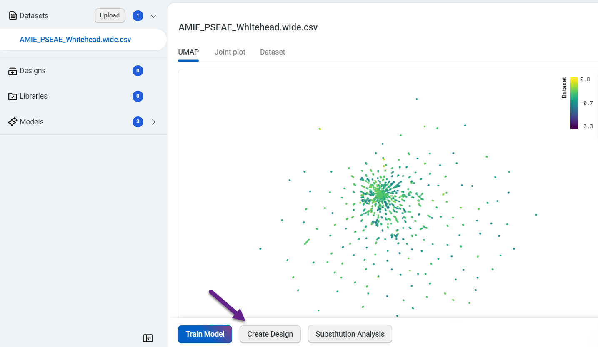

Set your criteria based on the experimental value you are trying to achieve. For example, if thermostability of at least 75C is important, enter >75C as one of your criteria. 

You can also base your criteria on the value of the best property in your
sequence. For example, if the thermostability of the best sequence in the
dataset is 60C, enter >60C as a criterion. 

Select **Use number of mutations criteria** to explore tradeoffs between the number of mutations in each variant and its predicted properties.

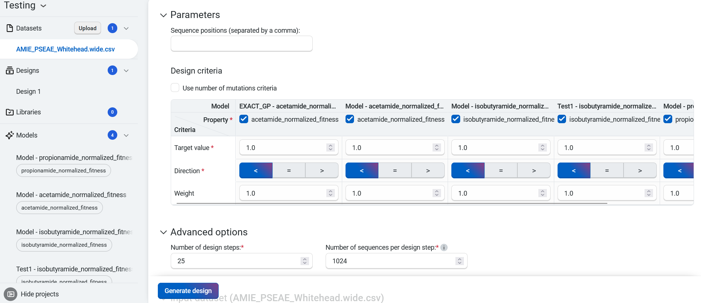

## Creating your custom designs

Navigate to your dataset, then select **Create design**. This opens a new window
where you can edit the design name and define your parameters and design
objectives.

### Design constraints

In the **Constraints** section, the default settings allow all amino acid
substitutions at all sites. Select **Enable custom design
constraints** to exclude undesirable mutations or restrict
positions to particular amino acids.

::: {.callout-caution collapse="true" icon=false}
## Instructions for using design constraints

If you have uploaded a parent sequence with your dataset, the parent sequence will auto-populate in the text box.

Specify constraints for each site by either editing sites in the sequence box or selecting **Add Rule**. 

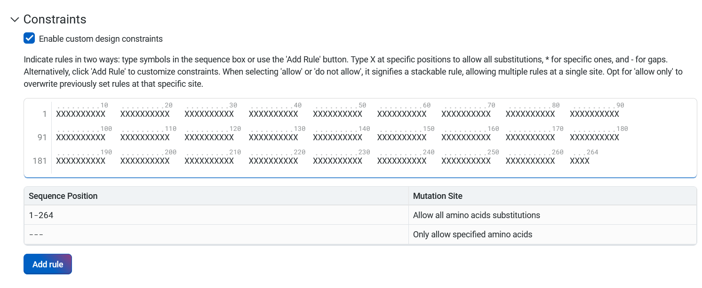

### Using the sequence box

Indicate specific instructions for each site in the sequence box by using
symbols and single letter amino acid codes:

* X allows all amino acid substitutions at a site. 
* An asterisk (*) indicates that the site has specific rules for substitution
  that will be set using the **Add Rule** button.
* An [individual amino acid code](#amino-acid-table) allows only corresponding amino acids at that
  site.
* A hyphen (-) indicates a gap. No amino acid will be substituted at this
  site. Gaps are only accepted at sites that correspond with an existing gap in
  your uploaded dataset.

Changes in the sequence box will also update the summary table. The sequence box
does not recognize invalid characters (B, J, O, U, Z). It will display the
error message **Invalid amino acid code. Please try again**.

Clicking out of the **Constraints** text box will apply all changes and update
the table to reflect the expected mutation.

### Using the Add Rule feature

Select **Add Rule**, then enter the position or positions where you want the
model to make mutations in the position field. You can enter positions as:

* individual numbers, separated by a comma when specifying multiple positions (2, 5, 78)
* a range of numbers, indicated by a dash (7-10)
* a combination of individual numbers and ranges (2, 5, 7-10)

Next, select one of **Allow**, **Do not allow**, or **Allow only** from the dropdown menu. This will dictate the rule applied to the amino acids you specify in the next field. Enter individual amino acids using:

* Single letter amino acid codes like C, H, or A
* Three letter codes like cys, his, or ala
* Full names like cysteine, histidine, or alanine
[View the full list of amino acids and their accepted codes](#amino-acid-table).

Alternatively, select a category of amino acids from the dropdown menu. The available options are:

* **Positively charged amino acids** (K, R, H)
* **Negatively charged amino acids** (D, E)
* **Polar amino acids** (S, T, Y, C, N, Q)
* **Non-polar amino acids** (G, A, V, L, I, M, W, F, P)
* **All amino acids** (A, R, N, D, C, Q, E, G, H, I, L, K, M, F, P, S, T, W, Y, V)

The **Allow** and **Do not allow** options are stackable. Multiple rules can apply to each site, and the rules will combine to only show amino acids that are accepted under all applicable rules. Rules directly contradicted by a subsequently added rule will be overwritten. 
Selecting **Allow only** will overwrite all previous rules for that site. 

### Viewing your rules

The sequence box and the summary table will automatically update when you
specify positions using either method. You can also hover over a site in the
sequence box to view the site number and the substitutions allowed at that site. 

### Amino acid table

| Amino acid    | Single letter code | Three letter code |
|---------------|--------------------|-------------------|
| Alanine       | A                  | ALA               |
| Arginine      | R                  | ARG               |
| Asparagine    | N                  | ASN               |
| Aspartic Acid | D                  | ASP               |
| Cysteine      | C                  | CYS               |
| Glutamic Acid | E                  | GLU               |
| Glutamine     | Q                  | GLN               |
| Glycine       | G                  | GLY               |
| Histidine     | H                  | HIS               |
| Isoleucine    | I                  | ILE               |
| Leucine       | L                  | LEU               |
| Lysine        | K                  | LYS               |
| Methionine    | M                  | MET               |
| Phenylalanine | F                  | PHE               |
| Proline       | P                  | PRO               |
| Serine        | S                  | SER               |
| Threonine     | T                  | THR               |
| Tryptophan    | W                  | TRP               |
| Tyrosine      | Y                  | TYR               |
| Valine        | V                  | VAL               |

:::

## Advanced options

We recommend using the default 25 step design algorithm in the **Number of design steps** field.

## Generating your designs

When your criteria are set, select **Generate design**. OpenProtein.AI generates a library of sequences and provides a variety of information and visualization options to help you interpret your results. The completed designs are accessible through the left hand navigation panel.

## Interpreting your results

Your design results page will display a section titled **Predicted Library Performance**, followed by a section titled **Design Results**. 

### Predicted library performance

Under **Predicted Library Performance**, the **Number of Successes** and
**Distribution of Outcomes** tabs contain two distinct analyses of the entire
library of predicted sequences. These analyses allow you to make informed
decisions about the composition and scale of the library you intend to
synthesize. To use this information effectively, it is important to keep in mind
that:

* Each plot reflects the sequences currently selected in the results table, and is updated as filters are applied.
* The number of expected successes should be considered in relation to total library size. 

The histograms in the **Number of Successes** tab illustrate the number of
successes against their corresponding probabilities for each model. Success is
defined as sequences predicted to meet the specified design criteria. These
plots help you:

* gauge the likelihood of success across the entire library synthesis
* quantify the expected number of sequences in your library that will meet design criteria
* gain a nuanced perspective on the probability distribution for success

Above each plot, you will find:

* the value for the **Mean** or the expected number of successes
* the value for the standard deviation (**Std Dev**) of the expected number of successes
* the 95% confidence interval (95% CI) of the number of successes

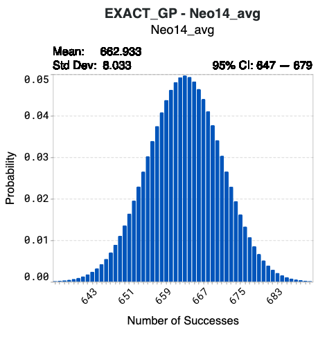

Hover over specific bins in the histogram to view detailed information on the number of successes and their corresponding probabilities. 

Using model Neo14-avg below as an example, synthesizing the complete library of 1024 designed sequences results in a 4.97% probability that 663 sequences will achieve the target values of your corresponding design criterion. The confidence interval indicates that there is a 95% probability that the number of successes from Neo14_avg of this library will be 647 to 679.

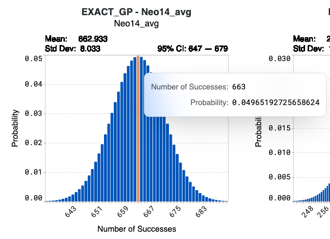

The histograms in the **Distribution of Outcomes** tab offer insights into the expected distribution of outcomes for the entire library. These plots help you determine:

- the expected range of sequence properties.
- the proportion of sequences predicted to be in a range of property values.

Your original dataset values are shown in blue. The expected distribution of outcomes of your designed library is shown in orange. 

When looking at the orange histogram:

* The x-axis represents the predicted values that the sequences may attain. 
* The y-axis denotes the proportion of sequences within the library that will reach the corresponding values. 

Hover over bins on the histogram to view: 

* **Binned value**, which represents the predicted range of values that the sequences are expected to achieve
* **Proportion**, which is the proportion of sequences that will attain the binned value

The values for the **Mean** and standard deviation (**Std Dev**) for each model
are indicated above the plot.

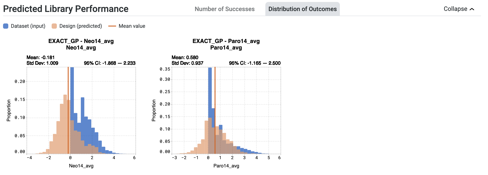

For example, in the case of the model Neo14_avg, the model predicted a mean
property value of -0.181. Calculations indicate that 16.3% of sequences from the
entire library are expected to achieve a value between -0.641 and -0.320.

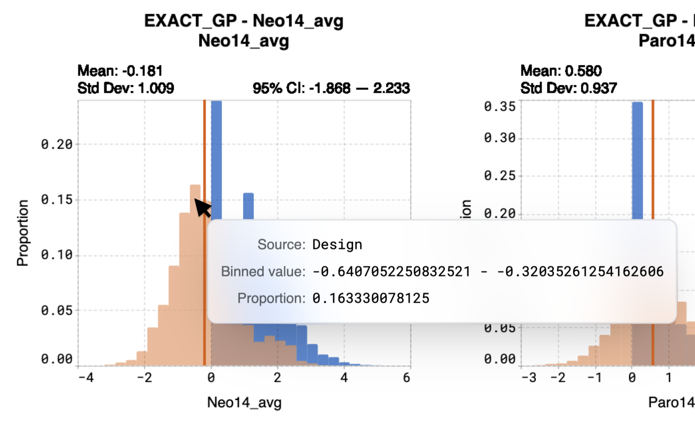

### Troubleshooting your predicted designs

You may receive a notification stating **The probability of success is less than
2% for at least one design criterion. Please refer to our documentation for more
details.**

This indicates that OpenProtein.AI models predict a less than 2% chance of at
least one sequence in the library achieving a design criterion. In the example
below, this statement applies to the design criterion associated with EXACT_GP -
Ami14_avg, shown in red.

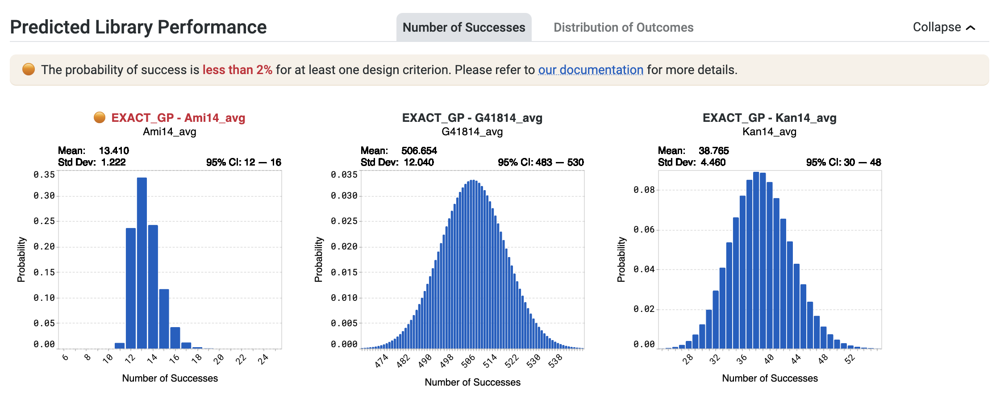

If you receive this notification, select **Generate more sequences** to continue running the design algorithm. 

If no improved sequences are discovered:

- Increase the library size.
- Conduct multiple design rounds, starting with target values that align more closely with your dataset, then incrementally increase the targets to more ambitious values in subsequent rounds.

Please note that these strategies may require the use of more experimental
resources to meet the design objective. 

You may also see the notification **Heads up! The probability of success exceeds
98% for at least one design criterion. While not an error, consider creating stricter design criteria. Learn more here.**

This highlights a high number of successes for your design library, with a
greater than 98% chance of at least one sequence in the library achieving a
design criterion. You may wish to review your design criteria. In the example
below, this statement applies to the design criterion associated with EXACT_GP -
Ami14_avg indicated in blue.

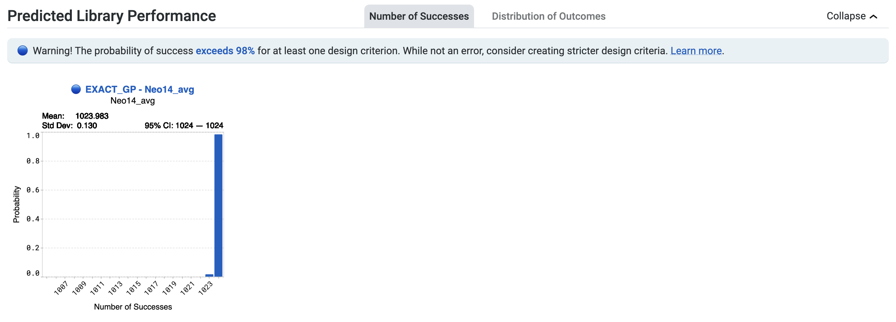

The high expected success rate suggests two possibilities. The first is that your design criteria may be misspecified. Make sure your target values and direction are set correctly for your design criteria. 

The second possibility is that the algorithm has found a large number of candidates expected to achieve your design criteria with high probability. 

If you are pursuing more specific outcomes, increase the aggressiveness of your design criteria to find further optimized sequences. Review and adjust your target values away from current criteria, ensuring the default is adjusted to ensure your designed library reflects your desired outcomes. Additionally, uncheck any criteria for which you do not want predictions.

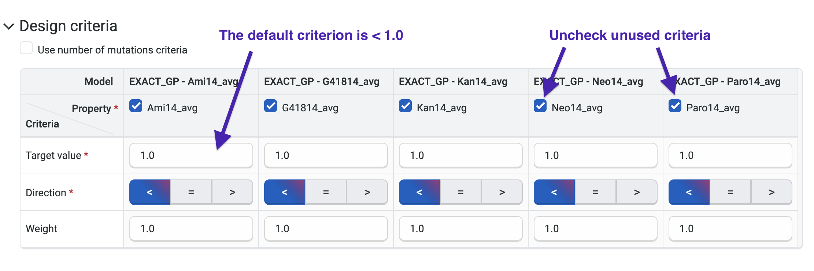

### Design results

The **Design Results** section will display a UMAP, a histogram, a joint plot, and a design result table. 

Variant sequences generated by the design process are overlaid on the Uniform Manifold Approximation and Projection (UMAP). Hover over a point in the UMAP to view the sequence and score.

Your designed sequences are colored by their predicted property, and you can adjust the display in several ways.

- Use the color options panel to adjust the color settings and change which property the new points are colored by.
- Highlight specific sequences by clicking on individual points, or hold **Shift** while dragging your cursor to select multiple points.
- Select the eye icon to the left of sequences in the table to toggle the visibility of a sequence on and off in the UMAP.

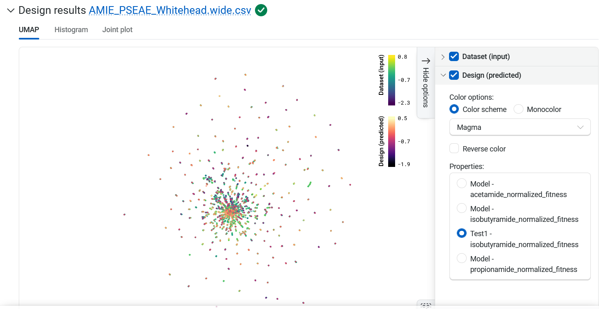

The **Histogram** tab compares the expected property distributions for the designs against your original library and joint plots for all of the properties. Hover over the graph to view the property, source, binned value, and frequency.

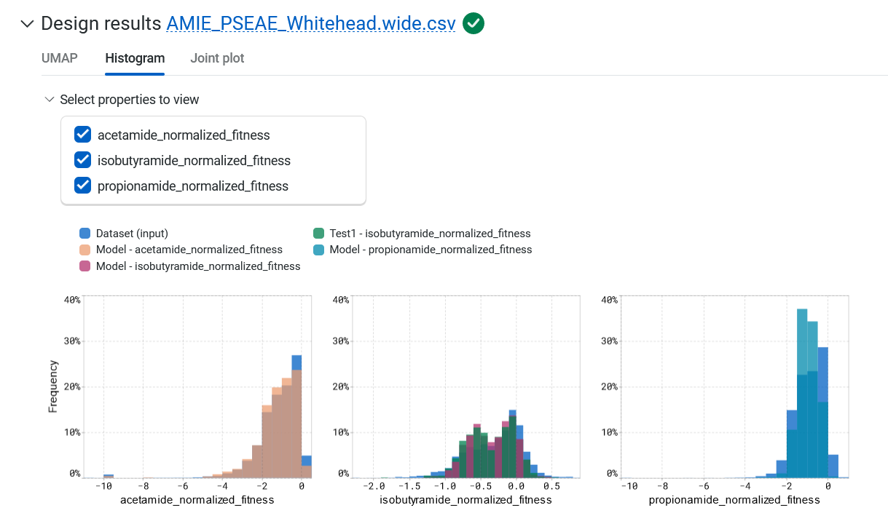

The **Joint plot** tab provides a visual representation of the distribution of individuals of each variable and helps in understanding the relationship between two variables.

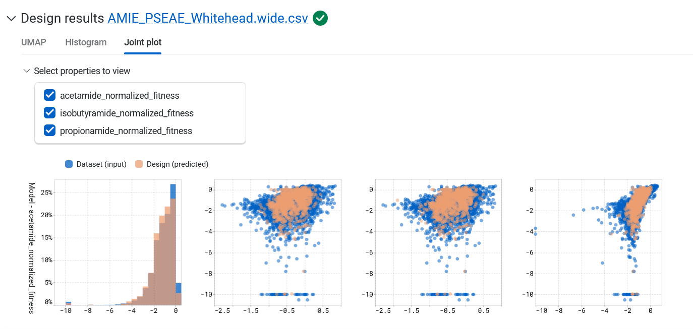

The **Design result table** displays all designed and input sequences. If you want to compare your generated results against a benchmark, select **Add a reference sequence** , enter a parent sequence or sequence of interest, and select **Add**. You can update or delete reference sequences by selecting **Edit reference sequence,** choosing your desired action, then selecting **Update**. Using a reference sequence lets you view mutation sites to better understand specific substitutions present in your sequence libraries and designs.

Select **Advanced filters** to only display unique sequences.

You can also sort the table by the predicted property or log-likelihood score. Use the filter icon to set simple filters for each column.

Use the **Generate more sequences** at the bottom of your design results page to generate more candidate sequences.

## Saving your sequences

Save your results as a library within your project by selecting **Save as library**. Add a library name and description, then select **Save**. Access your libraries from the left hand navigation panel.

You can also export your results as a CSV file by selecting **Export** , then selecting which rows to include.

## Refining your designs

Sometimes your produced sequences are high diversity, bear little resemblance to the input data, or have predicted property values far from what you're looking for. This can happen if you set ambitious design objectives, for example with target values far from sequences in your dataset. If the model cannot find any sequences that are predicted to achieve your design objectives, it will explore sequences with maximum uncertainty since those are more likely to achieve the design objective broadly.

Reducing the design target can help the system find sequences that are likely to be incremental improvements, and will produce designs that will be closer to your target values.

## Using your designed sequences

Explore your sequence's 3D structure with the [Structure Prediction](../structure-prediction/using-structure-prediction.md) tool, or use [Substitution Analysis](./sub-analysis.md) to evaluate the single substitution variants of your sequence.
