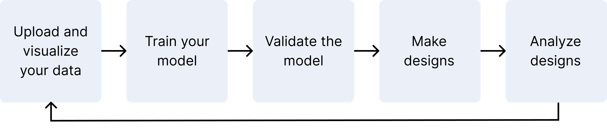

Our OP Models tool allows you to use our protein large language models to learn then predict sequence-to-function relationships from your experimental data. Use your functional measurements to train machine learning models, then use these custom models to design and visualize sequences within your specified constraints.

  

Our models provide a quantitative score that a given sequence will achieve your design objective. They also output a mean expected value of the property and a standard deviation value to indicate the confidence in that prediction. This lets you make data-driven decisions about your library selection and optimize for performance despite cost and workflow constraints.

You can optimize for multiple properties in a single design cycle, as well as train models iteratively across multiple experimental cycles. Add more data at any time to further optimize your designs.

After you have designed libraries that meet your criteria, refine your variants by predicting the effect of each mutating site in your experimental context.

## Learn more and get started with our tutorials
General tutorials

:::: {.columns}

::: {.column width="45%"}
* [Uploading your data](./uploading-your-data.md)
* [Navigating your projects](./navigating-your-projects.md)
:::

::: {.column width="10%"}
<!-- empty column to create gap -->
:::

::: {.column width="45%"}
* [Visualizing your data](./visualization.md)
:::

::::

Using the web application

:::: {.columns}

::: {.column width="45%"}
* [Model training and evaluation](./model-train-evaluate.md)
* [Designing sequences](./design.md)
:::

::: {.column width="10%"}
<!-- empty column to create gap -->
:::

::: {.column width="45%"}
* [Substitution analysis with OP Models](./sub-analysis.md)
:::

::::

Using the Python client API

:::: {.columns}

::: {.column width="45%"}
* [Sequence-based learning](https://docs.openprotein.ai/api-python/demos/core_demo.html){target="_blank"}
* [Protein language models and embeddings](https://docs.openprotein.ai/api-python/embedding_workflow.html){target="_blank"}
:::

::: {.column width="10%"}
<!-- empty column to create gap -->
:::

::: {.column width="45%"}
* [Quantitative decision making for library design](#)
:::

::::