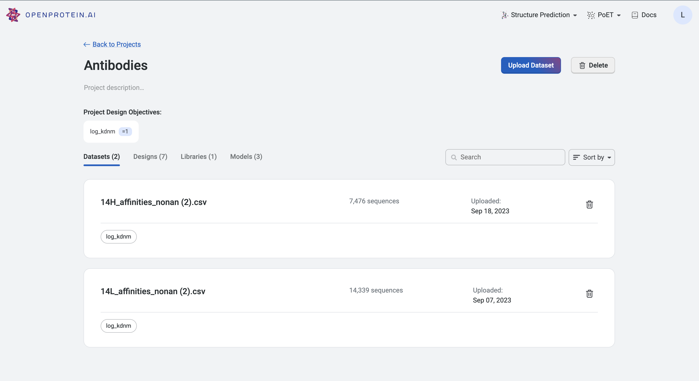
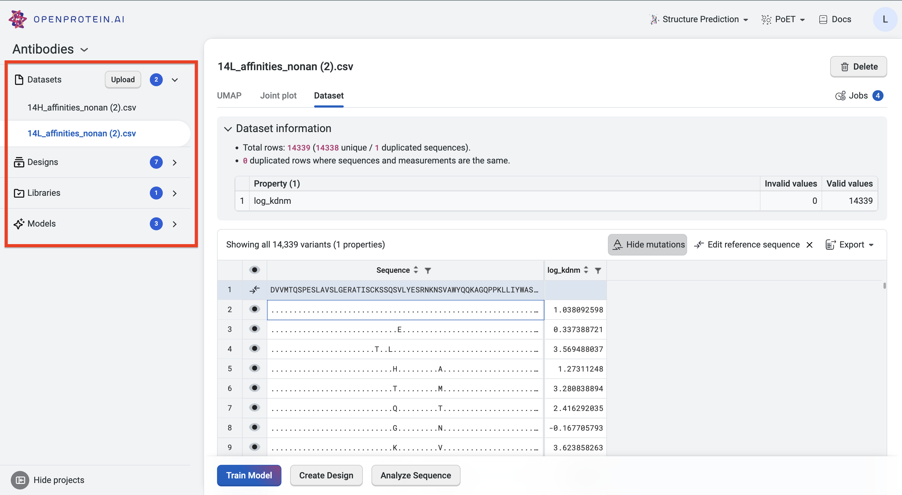

Your project components are located on the main page of the application and in the navigation panel on the left of your project home screen.

**Datasets** contains your uploaded datasets. Select **Upload** to add a new dataset.

**Designs** contains the sequences which were designed using your chosen objectives. You can visualize your results as well as generate new sequences.

**Libraries** is a repository for your designed sequence variants, and allows you to easily reference previously created variants.

**Models** contains models that you have trained. Select a model to view the model details, training curve, and cross-validation graph.