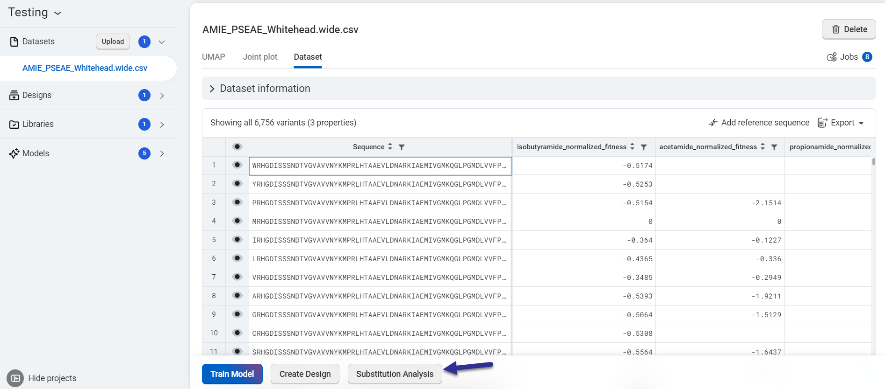
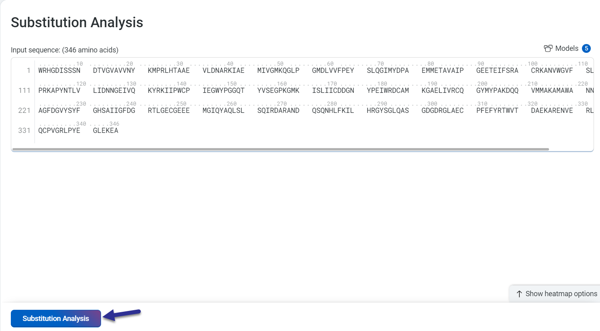
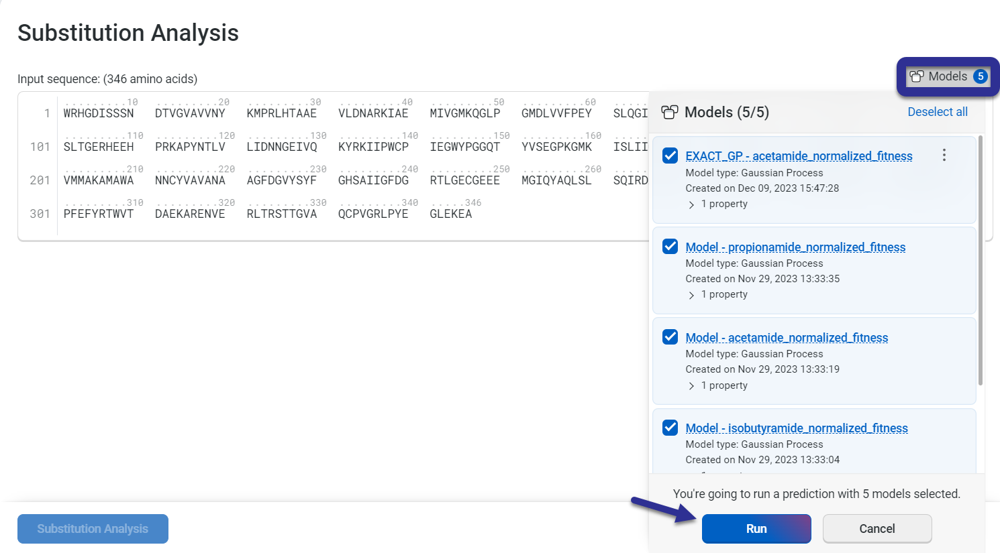
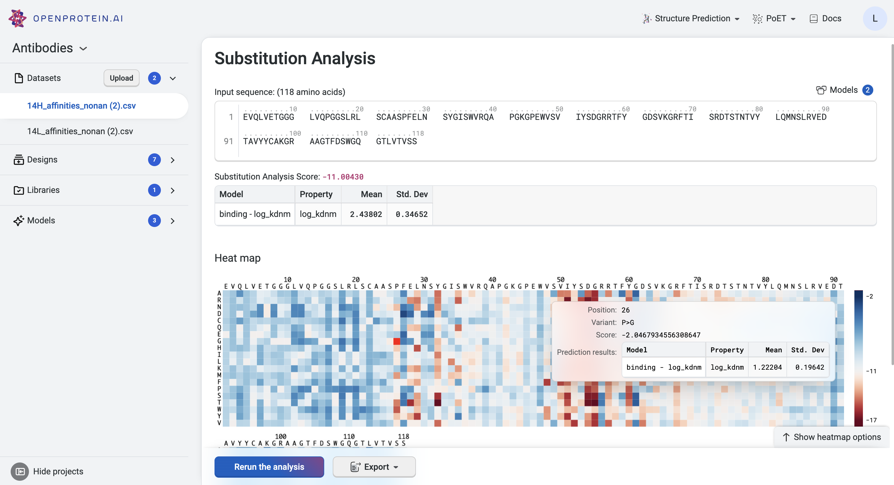
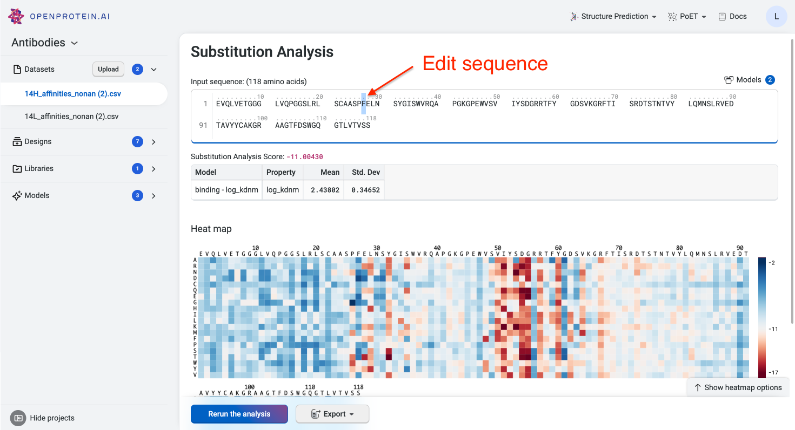

This tutorial teaches you how to use OpenProtein.AI’s Core Workflow Substitution analysis tool to evaluate all single substitution variants of a given sequence. Use this as a starting point to design single mutant or combinatorial variant libraries, and predict the strength of protein activity. 

## What you need before starting

This tool requires experimental data. If you don't yet have experimental data, use [PoET's Substitution analysis](../poet/substitution-analysis.md) tool. For help with uploading your data, see [Uploading your data](./uploading-your-data.md).

Visit [OP models scoring and log-likelihood](./scoring-log-likelihood.md) to learn about the scoring system.

If you run into any challenges or have questions while getting started, please contact [OpenProtein.AI support](https://www.openprotein.ai/contact){target="_blank"}.

## Score single substitution variants

Access this tool from your project's **Dataset** tab. Select your starting sequence, then select **Substitution Analysis**.

You can also right click a sequence in the variants table and select **Run substitution analysis on this sequence**.

A new window will open, showing your input sequence. Select **Substitution Analysis** to start the job.

In the **Models** tab, select at least one model to run the prediction. Then select **Run**.

## Interpreting your results

Your results display a table and a heatmap. The table shows predicted property values and standard deviations.

Hover over points on the heatmap to view the log-likelihood score for each substitution site. The higher the log-likelihood score is, the more fit the variant.

- A positive number indicates an improvement in fitness.
- 0 indicates equivalent fitness.
- A negative number indicates less fitness.

Use the heatmap to view the highest ranking sequences, and explore alternative design objectives by adjusting the scoring criteria.

You can change the sequences in the sequence text box, and re-run

Substitution analysis to find higher order variants by selecting **Rerun the analysis**.

Select **Export** to download the single-site predictions as a CSV table.

## Using your sequences

Use the [Structure Prediction](../structure-prediction/using-structure-prediction.md) tool to visualize and explore your sequence of interest.