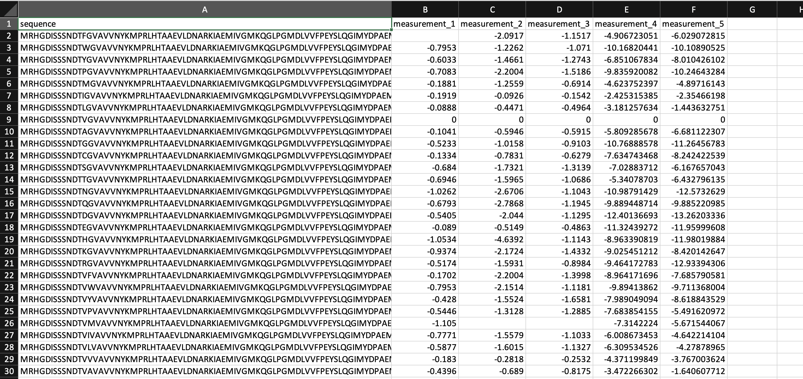
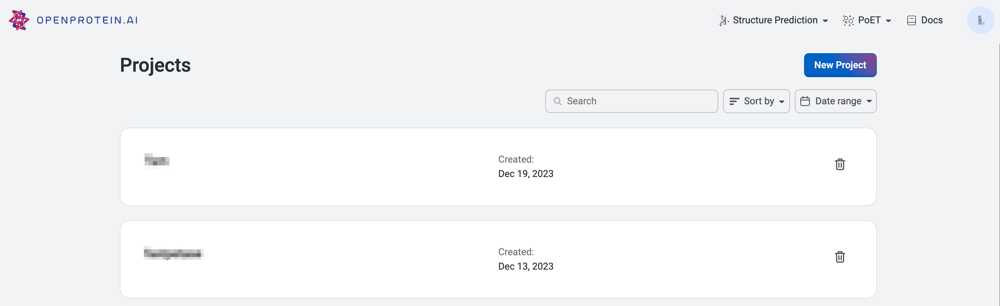
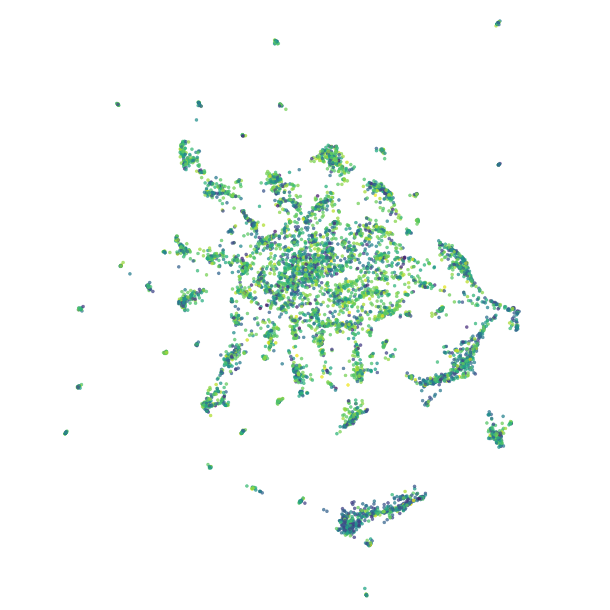
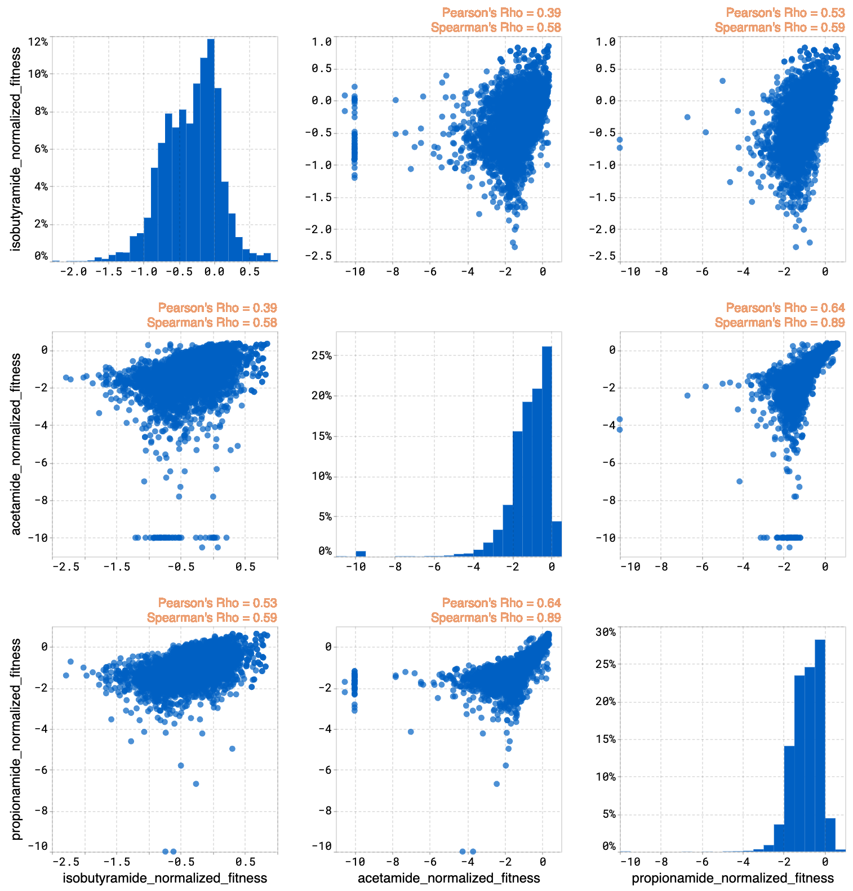

This tutorial teaches you how to format and upload a dataset. With an uploaded dataset, OpenProtein.AI can visualize your data and train models to optimize your designs.

## Format your dataset

Before uploading, format your dataset as a CSV table with columns containing the full sequence of each variant and their measurement values. Missing measurements are acceptable.

## Create a project and upload your data

To create a project if you are signing in for the first time, follow the prompt on your screen. You can also select **New Project** on the main project page.

Name your project. You also have the option to include a description.

Upload your dataset by selecting **Upload dataset** and navigating to your CSV file in the file explorer. You can enter a new name for the dataset, or use the default file name. You can also include a description of the dataset, or select a different file using the **Change** button.

After selecting **Open** , the application automatically detects your sequence's columns based on the column name. If the column cannot be found, you can manually input column type for each column.

In the **Parent sequence** field, include the wildtype sequence of your protein. The platform will enumerate the full sequence of each variant.

If the column types are not automatically filled, you can input them manually using the dropdown menus in the **Column type** column.

- identifier: user assigned names for each sequence (this is subjective, and dependent on what the user decides to name the sequence)
- Property: measurements corresponding to the property that user wish to optimize. 1 property should be 1 column
- Sequence: the sequences of your variants
- Mutant: Mutation codes. If you use mutation codes, you will be required to input the parent sequence.
- Ignored: sequences will not be uploaded.

Select **Upload** when you are ready to upload your dataset.

## Visualize your data

Each point in the **UMAP** visualization represents a single sequence variant.

## 

The **joint plot** displays the pairwise relationships between properties from your dataset. You can visually explore your data by selecting properties and viewing the distribution of individuals of each variable.

Your **Dataset** page shows the properties of your dataset, along with a table that you can filter and sort. If you want to compare your generated results against a benchmark, select **Add a reference sequence** , enter a parent sequence or sequence of interest, and select **Add**. You can update or delete reference sequences by selecting **Edit reference sequence,** choosing your desired action, then selecting **Update**. Using a reference sequence lets you view mutation sites to better understand specific substitutions present in your sequence libraries and designs.

Find more information about OpenProtein.AI's visualization options in [Visualizing your data](./visualization.md).