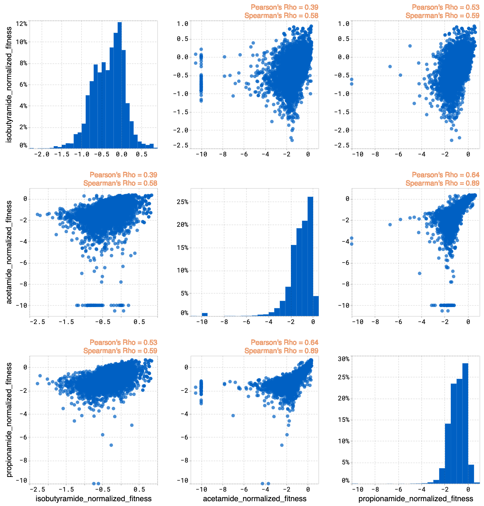

OpenProtein.AI visualizes your results using a series of tools:

- Uniform Manifold Approximation and Projection (UMAP)
- Joint plots
- Histograms
- Result tables

## About UMAP

OpenProtein.AI uses UMAP to visualize sequence datasets and reveal clusters in selected and sequenced screening or mutagenesis libraries. The UMAP creates a 2D visualization of the manifold of your sequence variants, using a low-dimensional embedding technique to represent each variant sequence in two dimensions based on their similarities in the high-dimensional feature space. Each point in the visualization represents a single sequence variant. It can also color by property to visualize relationships between sequence clusters and properties.

The UMAP options allow you to adjust color options and properties.

Drag your cursor across an area to select a cluster. The corresponding sequences will be highlighted in your dataset table.

### Why use UMAP over PCA

PCA is a linear mapping used to capture global structure. UMAP is a non-linear method that balances preserving local and global structure, and allows for general dimensionality reduction and exploration based on similarities.

## About joint plots

The joint plot displays the pairwise relationships between properties and shows the distribution of each individual property from your dataset. You can visually explore your data by selecting properties and viewing the distribution of individuals of each variable.

## About histograms

The histogram compares the expected property distributions for the designs against your original library and joint plots for all of the properties.

## About design result tables

The design result table displays all input and generated sequences. Filter the table to only show unique sequences using the **Advanced filters** option. You can sort the sequences by predicted property and the log-likelihood score assigned to each according to your design criteria.