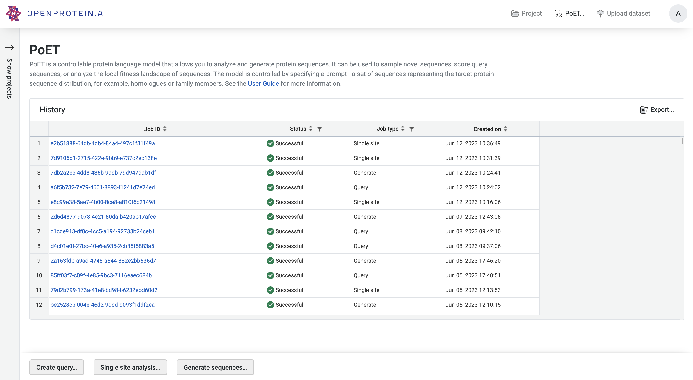
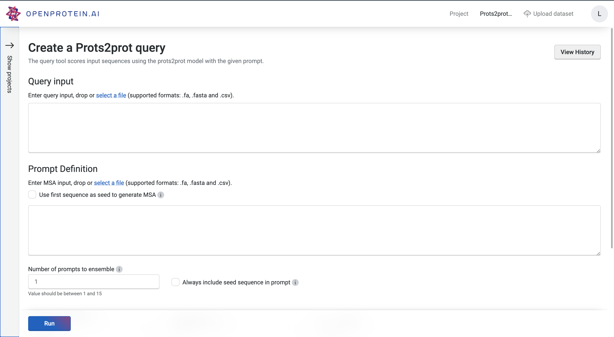
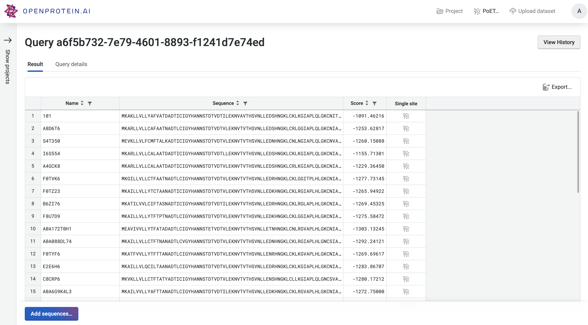

## Defining the prompt

The prompt defines the target sequence distribution. It provides the PoET model with information about sequence constraints, local fitness landscape, and co-evolutionary patterns, from which PoET will infer a generative model over protein sequences. The prompt definition tools allow you to specify and control what sequences are used to define this generative context.

The primary way to define a prompt is to provide a seed sequence, which could be your parent sequence, or some other sequence representing the space of proteins within which you would like to sample or explore. 

To use this option, check the “Use first sequence as seed to generate MSA” box. The seed sequence will then be used to build out a multiple sequence alignment of naturally occurring homologous sequences from which the prompt sequences will be randomly selected. You may also provide your own set of homologous sequences as an MSA, from which the prompt will be created. 

*Note:* if you provide your own MSA, the system will consider the first sequence as the seed sequence.

This sampling process is controlled by the sampling strategy, homology level, and maximum and minimum similarity parameters. These are set to reasonable values by default, which we have found to perform well across a wide range of protein families. These can be tuned, however, to control the diversity of sequences that will be modeled by PoET.

::: {.callout-tip title="Descriptions"}
*Sampling strategy* - this parameter defines the sampling strategy used for selecting prompt sequences from the homologues found by homology search, or from the provided MSA. We recommend using the default “Neighbors” method.

*Homology level* - this parameter controls the identity level at which two sequences are considered “neighbors” - that is, redundant - in the MSA. This is equivalent to the homology level used to calculate the number of effective sequences in protein families.

*Maximum similarity* -  the maximum similarity to the seed sequence allowed when selecting sequences for the prompt. No sequence with identity greater than this to the seed will be included.

*Minimum similarity* - the minimum similarity to the seed sequence allowed when selecting sequences for the prompt. No sequence with identity less than this to the seed will be included. This is useful for creating prompts that are highly focused on the local sequence space around the seed.

:::

If your protein comes from a highly diverse family or you wish to explore a large and diverse set of variants, then adjusting the homology level to be lower will select higher diversity prompt sequences and thus generate higher diversity sequence distributions. On the other hand, if you wish to have more focused generation, then using a higher homology level and setting a minimum similarity threshold can help to ensure that the prompt focuses on the local sequence landscape around your seed. 

*Ensembling* - instead of using a single prompt, multiple randomly sampled prompts can be used together by ensembling. We’ve found that this consistently improves performance when predicting variant effects by a small amount, but it will also make predictions and sampling take more time. To build an ensemble prompt, set the number of prompts to ensemble to a number >1. Three to five are generally enough, but we allow up to 15 prompts to be ensemble. There are diminishing returns to adding more prompts to the ensemble.

## History

The PoET history page allows you to view and access past jobs, sorted by created date, job type, and status. Clicking the job ID will take you to the results page for that job. It also provides quick access to the specific PoET tools in the bottom bar:
* Create query
* single site analysis
* generate sequences.

## Scoring sequences with PoET

Click “Create query” to go to the query tool. This tool allows you to score arbitrary sequences defined in a fasta or CSV file. It will calculate the log-likelihood of each sequence conditioned on the sequence context defined by the prompt.

This tool is useful if you want to score, prioritize, or rank specific sequence variants of interest. For example, you could score homologous sequences mined from a database, perform a synthetic alanine scan or deletion scan, or enumerate combinatorial mutations at specific sites.

Clicking “run” will start the job. This could take a few minutes depending on how busy the service is, how long your sequences are, and how many sequences you want to score.

The results are presented as a table, which can be sorted and downloaded. You can further explore the local fitness landscape of each sequence by using the quick links to the Single site analysis page. This will run single site analysis for the specified sequence with your prompt. You can also add new sequences to the job using the “Add sequences” button.
