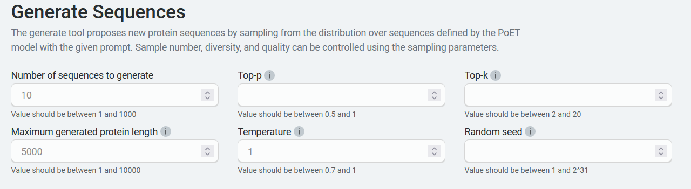
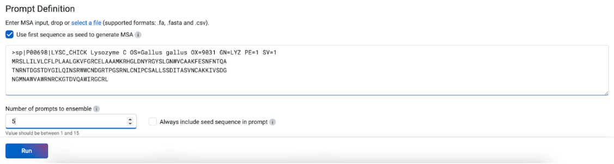
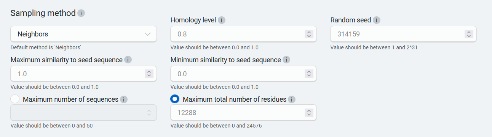
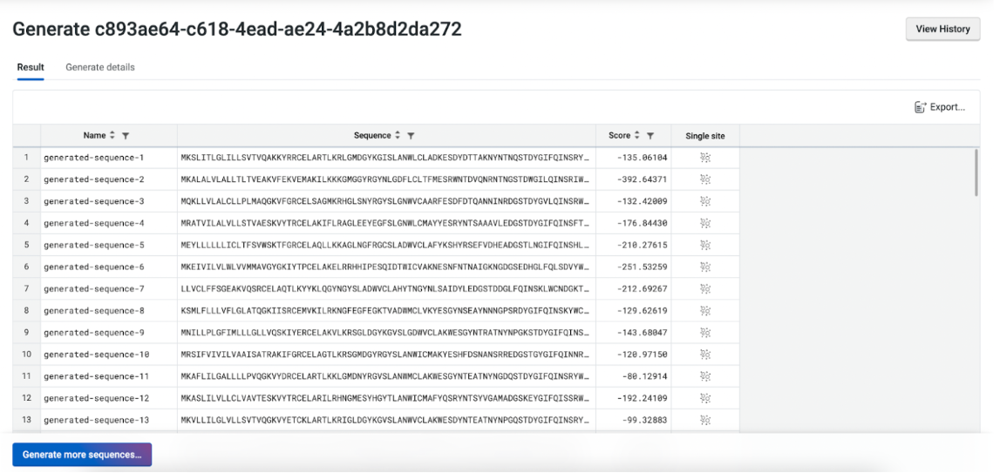

This tutorial teaches you how to generate functional sequences conditioned on the sequence context provided by a prompt. Use this as a starting point for applications such as generating a diverse library without existing experimental data. You will learn how to generate a sequence, then interpret and fine-tune the results.

If you run into any challenges or have questions while getting started, please reach to us via [email](mailto: support@openprotein.ai).

## What you need before starting

This tool requires a multiple sequence alignment (MSA), from which it builds a prompt. You can upload your own MSA or have the OpenProtein model generate one for you. If you aren't already familiar with prompts, we recommend learning more about OpenProtein.AI's [prompts and prompt sampling methods](../prompts.md){target="_blank"} before diving in.

You also need to know about sampling parameters, which are settings that regulate randomness. These include temperature, top-p, and top-k.

- _Top-p_ limits sampling to amino acids with sum likelihoods which do not exceed the specified value.The lower the top-p, the less random the output will be.

- _Top-k_ limits sampling to a shortlist of amino acids, where the top-k parameter sets the size of the shortlist. For example, setting top-k to 5 means the model samples from the 5 likeliest amino acids. The smaller the k, the less random the output will be.

- _Temperature_: Temperature is a number used to tune the degree of randomness. A lower temperature means less randomness; a temperature of 0 will always yield the same output.

A note on the _Random seed_ setting: this determines the state of the random number generator for random sampling. If it is set to a specific number, the algorithm will sample the same set of sequences each time. We recommend not defining this seed unless you are reproducing a job.

## Generating a sequence

Navigate to the tool by opening the **PoET** dropdown menu, then selecting **Generate sequences.**

Set your parameters to control sampling behavior. In particular, **temperature** , **top-p** , and **top-k** provide the ability to focus sampling around highly likely sequences. We recommend that you use either top-p or top-k on a given job, not both.



Add your custom MSA to the **Prompt Definition** field **.** You can input the sequence(s) directly, or upload an existing .fa, .fasta, or .csv file.

If you do not have an existing MSA, input your target protein and select **Use first sequence as seed to generate MSA.** OpenProtein will generate an MSA using a homology search against Uniref using mmseqs2 with default settings from ColabFold, then use the MSA to create a prompt. Please note that if you check **Use first sequence as seed to generate MSA** when multiple sequences are entered, sequences after the first are ignored.

Choose the number of prompts to ensemble. Select 1 to sample a single prompt, or increase the diversity of generated outputs by ensembling over 2-15 prompts. We suggest using 3-5 prompts.



Set sampling method fields. We suggest you start with the default settings, then adjust subsequent jobs based on your results.



You're ready to generate a custom sequence! Select **Run.** The job may take a few minutes depending on how busy the service is, how long your sequences are, and how many sequences you want to score.

A 400 (Bad request) error code may be due to the following:

```{=html}
<table>
  <thead>
    <tr>
      <th>Issue description</th>
      <th>Solution</th>
    </tr>
  </thead>
  <tbody>
    <tr>
      <td>Invalid PoET Job or Parent</td>
      <td>Re-enter prompt and try again.</td>
    </tr>
    <tr>
      <td>Invalid prompt in PoET service</td>
      <td>
        Reupload prompt and try again. Refer to the article about <a href="./prompts.md">prompts</a>.<br>
        Ensure minimum and maximum similarity parameters are not filtering out all sequences in prompt.
      </td>
    </tr>
    <tr>
      <td>Invalid user input in align service </td>
      <td>
        Ensure you don’t have
        <ul>
          <li>a top_p>1</li>
          <li>a non-valid amino acid</li>
          <li>Maximum similarity < minimum similarity</li>
        </ul>
        If necessary, refer to the article on [sampling parameters](./prompts.md#prompt-sampling-definitions).

      </td>
    </tr>
    <tr>
      <td>Invalid MSA (not aligned, etc)</td>
      <td>
        - Make sure your MSAs are aligned and rebuild MSA if necessary. <br>
        - If you have uploaded pre-computed MSA , confirm that formatting is correct and sequences are of equal length (use gap tokens “-”).<br>
        - If you are building from a seed sequence, try rebuilding the MSA
        </ul>
      </td>
    </tr>
  </tbody>
</table>
```

Please contact [OpenProtein.AI support](https://www.openprotein.ai/contact){target="_blank"} if the suggested solutions don't resolve the issue.

## Interpreting your results

Your results are presented as a table, with each generated sequence being assigned a log-likelihood score. This score indicates the fitness of the generated sequence compared to the prompt. The higher the log-likelihood score, the more fit the sequence:

- A positive number indicates an improvement in fitness.
- A negative number indicates a reduction in fitness.
- 0 indicates equivalent fitness.



Access local fitness landscapes using the substitution analysis buttons for each sequence. You can sort your results and download them using the **Export** button.

Note: The PoET history page allows you to view and access past jobs, sorted by created date, job type, and status. Clicking the job ID will take you to the results page for that job.

## Fine-tuning your results

Improve your results by adding more sequences with your desired properties to your MSA, or by adjusting the **prompt sampling method**. You can also adjust the **Maximum similarity to seed sequence** and **Minimum similarity to seed sequence** fields.

If your results are too diverse, try adjusting **temperature** downwards to decrease the diversity of the sampling.

To improve scores, increase the number of the **ensemble** setting. This will result in higher scoring sequences, but will take longer to complete.

## Next steps

Now that you can generate custom sequences, use the [Structure Prediction](../structure-prediction/using-structure-prediction.md) tool on high scoring sequences to visualize their structural implication or use [Substitution Analysis](./substitution-analysis.md) to view possible improvements to a sequence.