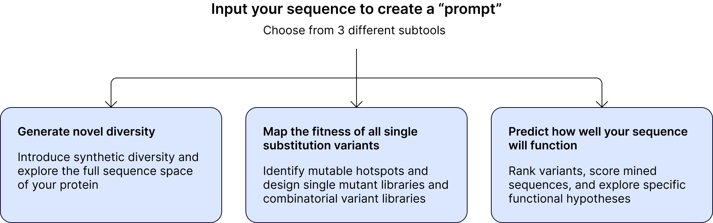
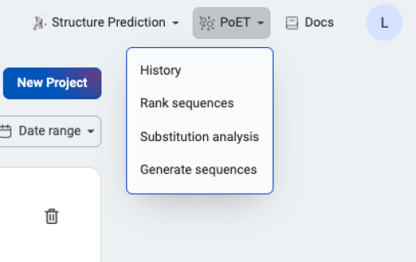

Protein Evolutionary Transformer (PoET) allows you to design sequences or score sequences and predict variant effects without any starting data or structural information. PoET is a generative protein language model and learns to generate sets of related proteins using evolutionary patterns from natural sequence databases. 

  

Like large language models (LLMs) make high quality predictions for natural language pocessing based on a user prompt, protein LLMs can predict amino acid sequence information in the same way. Here, a prompt is a set of sequences capturing insights about the local fitness landscape and co-evolutionary patterns for your protein. PoET uses this information to predict the local fitness landscape and calculate the likelihood of observing a specific sequence based on the inferred evolutionary proceass. You can make your own prompts or PoET can do this for you using multiple sequence alignment.

## Accessing PoET

  

PoET tools can be found in the “PoET…” dropdown menu in the header bar of the OpenProtein.AI web app.

## Learn more and get started with our tutorials
Using the web application

:::: {.columns}

::: {.column width="40%"}
* [Prompts](./prompts.md)
* [Scoring](./scoring-log-likelihood.md)
* [Ensembling](./ensembling.md)
:::

::: {.column width="10%"}
<!-- empty column to create gap -->
:::

::: {.column width="40%"}
* [Rank sequences](./rank-sequences.md)
* [Generate sequence](./generate-sequences.md)
* [Substitution analysis](./substitution-analysis.md)
:::

::::

Using the Python client API

:::: {.columns}

::: {.column width="40%"}
* [Designing new chorismate mutase enzymes with PoET](https://docs.openprotein.ai/api-python/demos/chorismate.html)
* [Screening insertion location with PoET](https://docs.openprotein.ai/api-python/demos/AMIE_substitution_deletion_analysis_poet.html#Single-deletion-screen)
:::

::: {.column width="10%"}
<!-- empty column to create gap -->
:::

::: {.column width="40%"}
* [Aliphatic amidase sequence analysis (substitution and deletions)](https://docs.openprotein.ai/api-python/demos/AMIE_substitution_deletion_analysis_poet.html)
:::

::::

Learn more about what makes PoET state-of-the-art in machine learning for protein engineering in
our [NeurIPS 2023 paper](https://arxiv.org/abs/2306.06156){target="_blank"}, including:

* PoET can be used as a retrieval-augmented protein language model by conditioning the model on sequences from any family of interest. This also allows PoET to be used with any sequence database and to incorporate new sequence information without retraining.
* PoET is a fully autoregressive generative model, able to generate and score novel indels in addition to substitutions, and does not depend on MSAs of the input family, removing problems caused by long insertions, gappy regions, and alignment errors.
* By learning across protein families, PoET is able to extrapolate from short context lengths allowing it to generalize well even for small protein families.
* PoET can be sampled from and can be used to calculate the likelihood of any sequence efficiently.
