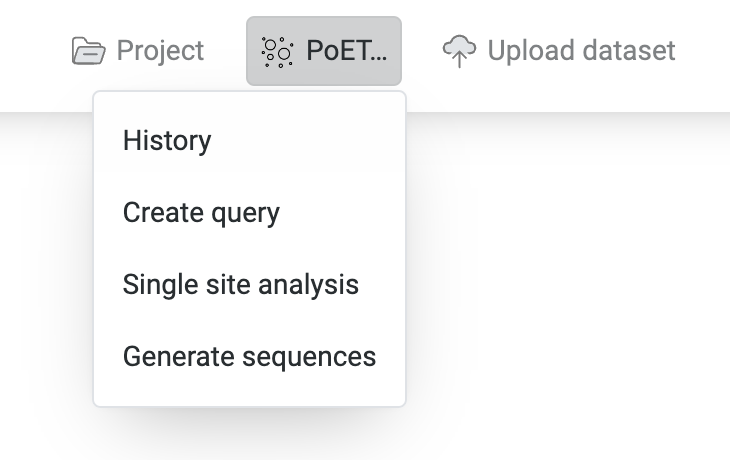

PoET is a generative protein language model that allows controllable design of protein sequences and variant effect prediction. This model is controlled by providing it with a prompt, a set of sequences that represent homologues, family members, or some other grouping of related sequences that represent your protein of interest. We provide tools for creating these prompts from multiple sequence alignments (MSAs) and for using homology search to build MSAs from a seed sequence.

Given a *prompt*, you can

* Score arbitrary sequences you provide to predict sequence fitness and rank variants. This works for substitutions and indels and allows high order variants.

* Map the fitness of all single substitution variants. This is useful for designing single mutant libraries, but also for identifying mutable hotspots and designing combinatorial variant libraries.

* Generate novel, bespoke, high order variants by sampling from the model. This is especially useful for synthetic diversification and exploring the full and potentially diverse sequence space of your protein.

## Accessing PoET

  

PoET tools can be found in the “PoET…” dropdown menu in the header bar of the OpenProtein.AI web app.