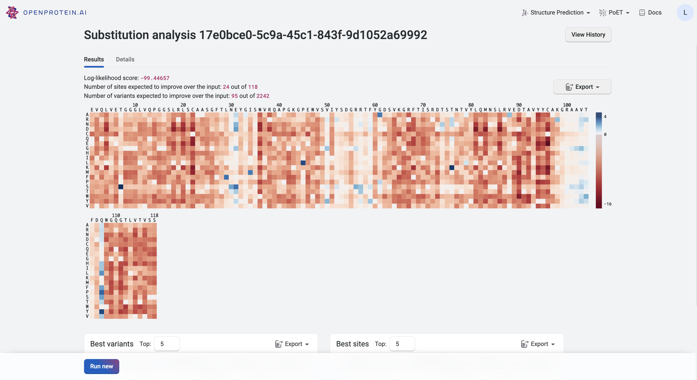

This tutorial teaches you how to use PoET's Substitution analysis tool to score all single substitution variants of an input sequence with the given prompt. Use this as a starting point to design single mutant or combinatorial variant libraries, and predict the strength of protein activity.

If you run into any challenges or have questions while getting started, please contact [OpenProtein.AI support](https://www.openprotein.ai/contact){target="_blank"}.

## What you need before starting

You need a sequence and/or a multiple sequence alignment, which OpenProtein.AI uses to build a prompt. Upload your own MSA or have the OpenProtein.AI model generate one for you. If you aren't already familiar with prompts, we recommend learning more about [prompts and prompt sampling methods](./prompts.md){target="_blank"} before diving in.

## Score single substitution variants

Navigate to the tool by opening the **PoET** dropdown menu, then selecting **Substitution analysis.**

In the first field, enter the sequence you would like to analyze.

Add your custom MSA to the **Prompt Definition** field **.** Enter the sequence(s) directly, or upload an existing .fa, .fasta, or .csv file.

If you do not have an existing MSA, enter your target protein and select **Use first sequence as seed to generate MSA.** OpenProtein will generate an MSA by doing a homology search against Uniref using mmseqs2 with default settings from ColabFold, then use the MSA to create a prompt. Please note that if you check **Use first sequence as seed to generate MSA** when multiple sequences are entered, sequences after the first are ignored.

Choose the number of prompts to ensemble. Select 1 to sample a single prompt, or increase the diversity of generated outputs by ensembling over 2-15 prompts. We suggest using 3-5 prompts.

Set sampling method fields. We suggest starting with the default settings, then adjusting based on your results.

You're ready to analyze your variants! Select **Run.** The job may take a few minutes depending on how busy the service is, how long your sequences are, and how many sequences you want to score.

A 400 (Bad request) error code may be due to the following:

```{=html}
<table>
  <thead>
    <tr>
      <th>Issue description</th>
      <th>Solution</th>
    </tr>
  </thead>
  <tbody>
    <tr>
      <td>Invalid PoET Job or Parent</td>
      <td>Re-enter prompt and try again.</td>
    </tr>
    <tr>
      <td>Invalid prompt in PoET service</td>
      <td>
        Reupload prompt and try again. Refer to the article about <a href="./prompts.md">prompts</a>.<br>
        Ensure minimum and maximum similarity parameters are not filtering out all sequences in prompt.
      </td>
    </tr>
    <tr>
      <td>Invalid user input in align service </td>
      <td>
        Ensure you don’t have
        <ul>
          <li>a top_p>1</li>
          <li>a non-valid amino acid</li>
          <li>Maximum similarity < minimum similarity</li>
        </ul>
        If necessary, refer to the article on [sampling parameters](./prompts.md#prompt-sampling-definitions).

      </td>
    </tr>
    <tr>
      <td>Invalid MSA (not aligned, etc)</td>
      <td>
        - Make sure your MSAs are aligned and rebuild MSA if necessary. <br>
        - If you have uploaded pre-computed MSA , confirm that formatting is correct and sequences are of equal length (use gap tokens “-”).<br>
        - If you are building from a seed sequence, try rebuilding the MSA
        </ul>
      </td>
    </tr>
  </tbody>
</table>
```

Please contact [OpenProtein.AI support](https://www.openprotein.ai/contact){target="_blank"} if the suggested solutions don't resolve the issue.

## Interpreting your results

Your results are presented as a heatmap, where each site has a relative log-likelihood score. This score indicates increased or decreased fitness relative to the wildtype. Hover over a site on the heatmap to view the relative log-likelihood score. A positive number indicates an improvement in fitness, a negative number indicates a reduction in fitness, and 0 indicates equivalent fitness.

The heatmap colors indicate how a mutation at that site would impact the function of a variant:

- Deep blue indicates improved function.
- Red indicates reduced function.

A site which is all blue indicates that a mutation at that site would not impact function.

If you want to run a substitution analysis on one of these variants as the parent sequence against your original prompt, click on the variant in the heatmap to open the **Run new** drawer, then select **Run new**.

You can also enter an arbitrary sequence in the **Run new** drawer to run single site analysis for other sequences without respecifying the prompt.

Your highest scoring variants and sites are also displayed in tables below the heatmap for quick reference. Download results as a table using the **Export** button.



Refer to the **Single site details** tab to see the parameters you used to run the substitution analysis.

## Fine-tuning your results

If your heatmap is inconclusive, meaning that the log-likelihood scores are very close, adjust your sampling methods or **Maximum similarity to seed sequence** and **Minimum similarity to seed sequence** fields.

You can also improve your prompt by adding sequences or constructing a better MSA.

## Next steps

Now that you have a list of promising variants, use [Structure Prediction](../structure-prediction/using-structure-prediction.md){target="_blank"} to visualize their structural implications or start a project using our [OP models](../opmodels/index.md){target="_blank"} after acquiring data from your designs.