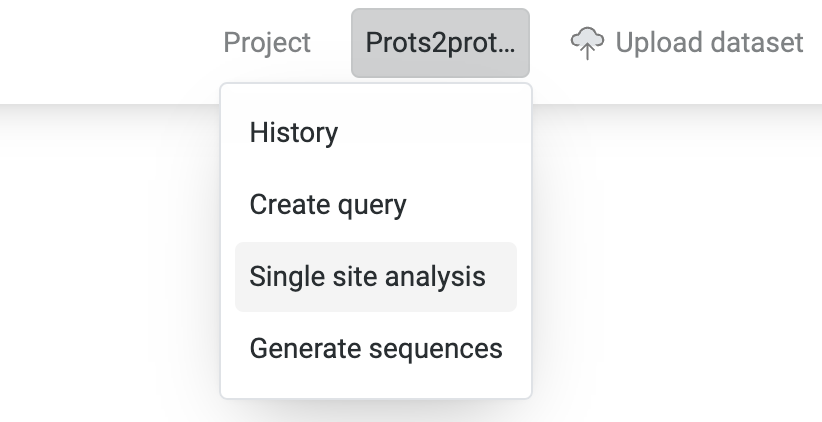
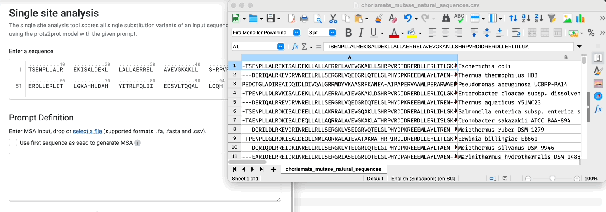
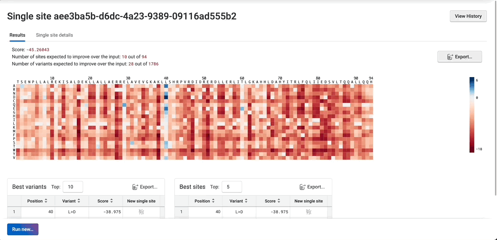
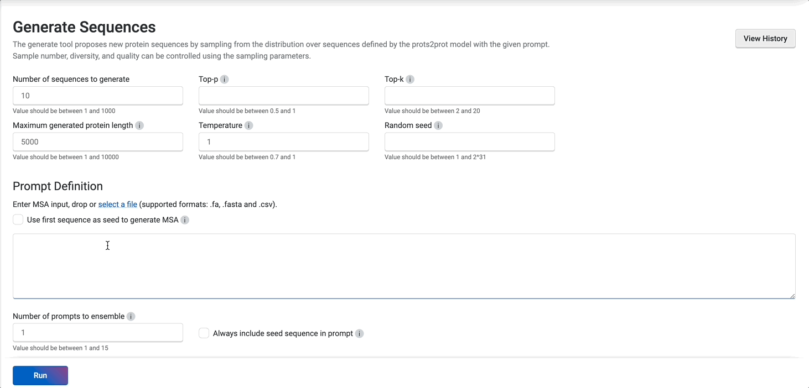
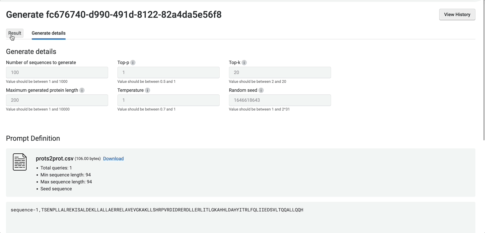
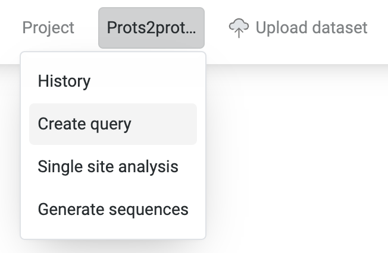

# Tutorial: Designing *de novo* variant libraries using Prots2prot

Prots2prot is a generative protein language model that allows you to design protein sequences *de novo*, without functional measurements of your protein of interest. This means that you can use the model to generate single substitution, combinatorial variant libraries, or a bespoke high-diversity library, **prior to making any measurements**. 

Prots2prot controls sequence generation via a **prompt**, which is defined as a set of sequences that encodes information about the local fitness landscape and co-evolutionary patterns of your given protein of interest. One way to build this prompt is by using a multiple sequence alignment (MSA) of your protein of interest using sequences across evolutionary lineages. Because these sequences share an evolutionary relationship, they contain information about the local fitness landscape of the protein. Prots2prot is able to infer the evolutionary process driving the generation of these sequences, and hence not only sample new sequences, but also score the likelihood of seeing a given sequence under this process. 

Chorismate mutase is a important enzyme involved in the biosynthesis of aromatic amino acids. Specifically, it catalyzes the conversion of chorismate to prephenate. In this tutorial, we will use Prots2prot to generate a prospective *de novo* variant library for chorismate mutase.

## Generating single-substitution libraries

To generate single-substitution libraries, we can use the **Single site analysis** prediction tool. This tool generates and scores all single-substitution variants of the given query sequence. 

First, define the query sequence for which we wish to generate all single substutions. 

Next, define the prompt. Recall that this is a set of sequences that implicitly describe the local fitness landscape of your protein of interest. The easiest way to do this is to paste the same query sequence and simply ask the tool to automatically generate the MSA from it. Here, our query sequence is the sequence encoding chorismate mutase in *E. coli*. 

Alternatively, if you already have an MSA or some other set of sequences that you wish to use as the prompt, you can also drop or select your own file. 

And that's all we need for the analysis! Click `Run` at the bottom of the page to generate and score all single site variant libraries. There are several other advanced options that we may want to play with after our initial run. However, the default options have been tuned to generate a reasonable starter library. 

When the run is complete, navigate to the Results tab to inspect the output of the run. At the top of the page is a summary detailing the score for the query sequence, as well as the number of sites and number of variants expected to improve over the input. The full results are presented as a heatmap, which you can mouse over for more detail. For convenience, the tables at the bottom of the page list the top 5 variants and sites. 

:bulb: The score assigned by Prots2prot is the log likelihood of the sequence under the model. This means that the larger (less negative) the score, the higher the probability of observing the sequence given the model. 

As we can see, position 40 seems like a promising candidate for mutagenesis, with many mutations such as `L>D`, `L>E` and `L>A` all improving over the query sequence. 

The full results are available for export either as a csv or as a png. To do so, you can use the export button located at the top right hand corner of the page. Alternatively, you can also start a new single-site run against the same prompt either by selecting a particular variant sequence in the heatmap or in the table. Then, start a new single site analysis using `Run new...`. 

Congratulations! :tada: You have now created your first *de novo* variant library using Prots2prot! 

## Generating combinatorial variant libraries

TODO

## Generating high-diversity libraries

**Why should we care about generating high-diversity libraries?** The typical strategy in protein engineering is to search the local sequence space near a known sequence by generating single and combinatorial variant libraries. However, this may not be the best strategy for several reasons: 

- You may not have a good starting sequence. In this case, you will want to cast your net as wide as possible by sampling a variety of stable and functional proteins. However, you still don't want to be generating biologically impossible proteins.  

- You started with an ok sequence, but are stuck in a local optima. This means that there may be distant sequences that have even higher activity. However, these either cannot be found via a simple greedy optimization strategy, or may take an unreasonable number of steps to reach it. 

<figure align = "center">
  
  <figcaption><i>This greedy algorithm is going in the direction of the best local improvement but is actually moving further away from the global peak.</i></figcaption>
</figure>

- You want to hedge your bets. Unfortunately, similar sequences are likely to share other possibly unwanted, but correlated properties. For example, a set of similar sequences may all have high activity but may also all be unstable or poorly expressed. Just as with investing, it is good to diversity your portfolio. 

To generate high-diversity libraries, we can use the **Generate sequences** tool. 

As in the single-site analysis tool, we have to specify the prompt. We will again use the sequence for chorismate mutase in *E. coli*. to seed the MSA. Since chorismate mutase is a relatively short protein, we will set the maximum generated protein length to 200. We also set the number of sequences to generate to 100. Hitting run then dispatches the generate job. 

The results of the tool are returned in the Results tab as a table. Recall that the larger (less negative) the score, the higher the likelihood of the sequence under the model. We can use the table widget to filter our sequences to have some minimum score, and then export them for further analysis. 

However, looking at the table, we can already observe that only 1 sequence has a score higher than the original query sequence that we input in the original analysis. To generate more highly-scoring sequences, we might want to lower Top-p, which reduces the randomness of the sampling by only sampling from the top most likely amino acids up to the specified cumulative frequency. We can also lower the temperature, which emphasizes higher probability amino acids during sampling by raising the probability to the power of the temperature. 

Let's try setting Top-p to 0.9! Here we can see that there are a lot more high-scoring sequences. 

:bulb: Hover the tooltips to learn about how the different parameters affect the results! Although we have set reasonable defaults for many of these parameters, we recommend that you also try playing around with them to customize your libraries. 

## How good are my libraries? 

To evaluate Prot2prot, we can take a look at how well Prot2prot's scores predict actual activity measurements. If Prot2prot's scores are predictive, this gives us confidence that the model has learned the underlying generative process and will be able to generate a good library. 

:bulb: **How is it that Prots2prot scores can be predictive of function despite having never seen functional measurements?** An excellent question! Well, it turns out that evolution has already done a lot of the work for us, and that there is a lot to learn from naturally occurring sequences. In fact, our experiments show that even though Prots2prot does not use any measurement information, Prots2prot scores correlate with functional measurements across diverse tasks in a wide variety of datasets. You can read more about these experiments in our upcoming preprint. 

Let's evaluate Prot2prot's scores against actual activity measurements for a high diversity variant library of chorismate mutase! 

To evaluate query sequences against a given MSA, we can use the **Create query** tool. 

## Prioritizing variants in an existing library

We can also use Prot2prot to prioritize variants in an existing library. 