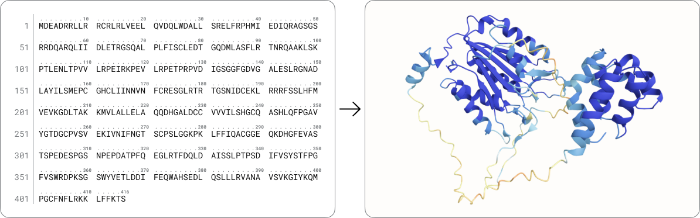

Using open source models like ESMfold, @Lin2023-cw, our structure prediction tool leverages the ESM2 protein language model to derive meaningful representations from your protein sequence. The ESMFold structure prediction neural network then uses these representations to directly forecast the 3D coordinates of your protein’s constituent atoms.

For detailed information about the model, please refer [here](https://www.science.org/doi/10.1126/science.ade2574){target="_blank"}.

## Learn more and get started with our tutorials

Using the web application

* [Using the Structure Prediction tool](./using-structure-prediction.md)
