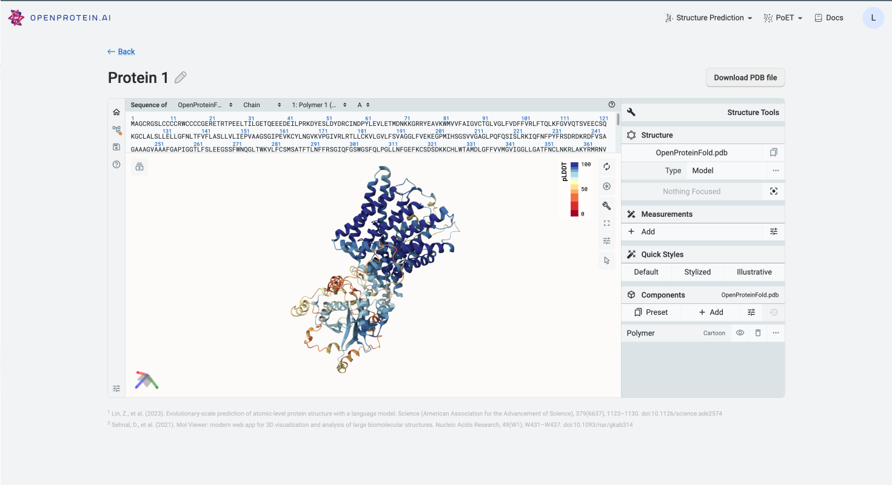

Using the Structure Prediction Tool
====================================

This tutorial teaches you how to use OpenProtein.AI's Structure Prediction tool to visualize the 3D structures of your protein sequences.

The ESMfold model this tool uses can also be accessed via REST APIs or our python client.

Visualize your sequence
-----------------------

Select the **Structure Prediction** tool, then input your sequence using one of the following methods:

- Type or paste the sequence.
- Select a file using the file explorer.
- Upload a .fasta file.

When you're ready to visualize your sequence, select **Predict**.

Once the model is finished training, it displays a 3D visualization of the protein structure. Explore your structure with the tools to zoom, rotate, and pan through the 3D structure. Edit your sequence name by selecting the title box or the pencil icon.

Select **Download PDB file** to export the 3D structure as a .pdb file.

View previously visualized structures by selecting **History** in the **Structure Prediction** tool menu.

