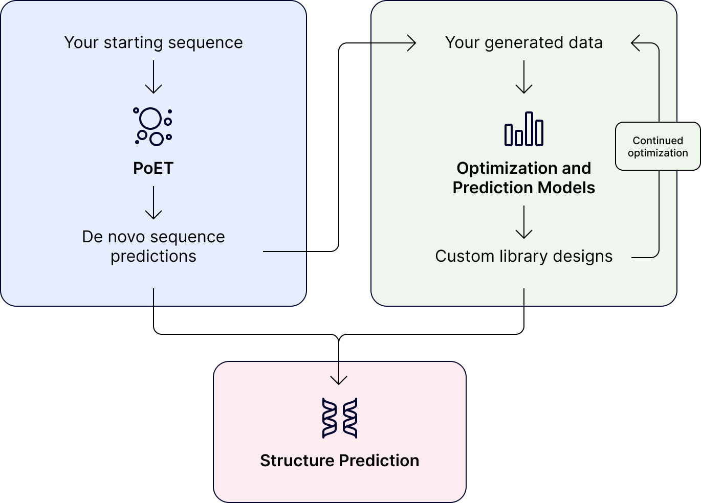

<br/>
<p align="center">
  
</p>

Our tools are standalone or can be used together at any point in your project

:::: {.columns}

::: {.column width="30%"}
### PoET
Predict variant effects and create initial library designs guided by evolution

**Requires:** sequence of interest <br/>
**Output:**  library designs and predictions <br/>

::: {.callout-tip}
## Highlights

* Introduce diversity
* Predict mutagenesis hotspots
* Identify high probability variants
* Shuffle domains
:::
[Learn more](../poet/index.md)
:::

::: {.column width="5%"}
<!-- empty column to create gap -->
:::

::: {.column width="30%"}
### Optimization and Prediction Models (OP Models)
Design optimized variant libraries using ML models trained on your data

**Requires:** data and design goals <br/>
**Output:** library designs and predictions <br/>

::: {.callout-tip}
## Highlights

* Design single site and combinatorial libraries
* Create informative visuals (UMAPs, joint plots, histograms)
* Get embeddings for sequence-to-function learning
* Inform design tradeoff based on quantitative analyses
:::
[Learn more](../opmodels/index.md)
:::

::: {.column width="5%"}
<!-- empty column to create gap -->
:::

::: {.column width="30%"}
### Structure Prediction
View and download high quality structure predictions

**Requires:** sequence of interest <br/>
**Output:** web based visuals and .pdb files <br/>

::: {.callout-tip}
## Highlights

* Validate designs
* Predict multi-chain structures
:::
[Learn more](../structure-prediction/using-structure-prediction.md)
:::

::::
<br/>
```{=html}  
<div class="getting-started-container">
    <span style="color:white;font-weight:700">See our tools in action by visiting our Walkthroughs page</span>
    <div class="learn-more">
        <a href="../walkthroughs/index.md">Learn more</a>
    </div>
</div>
```
