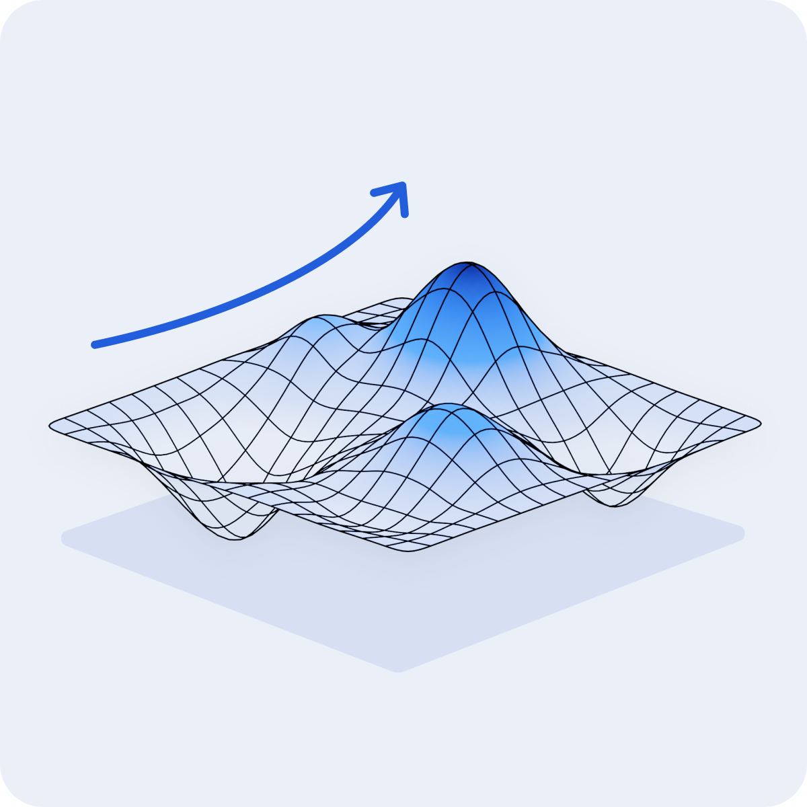
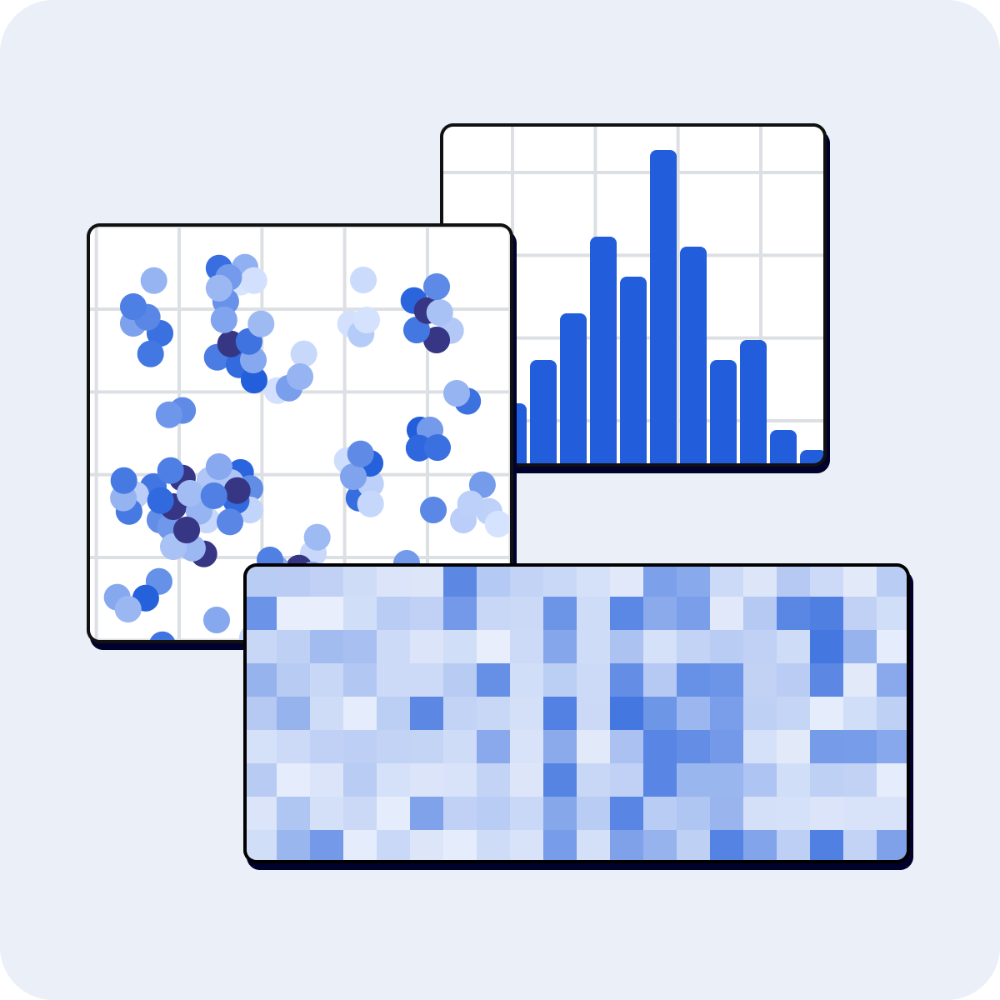
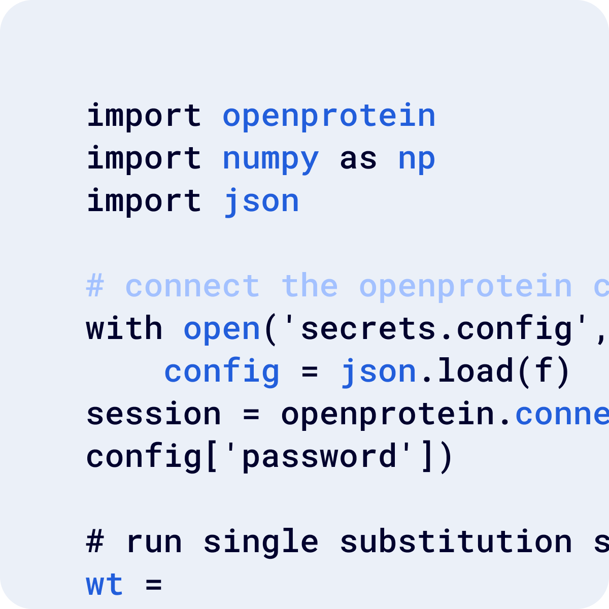
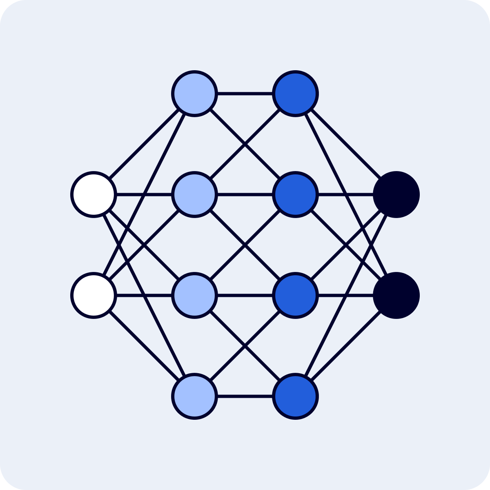
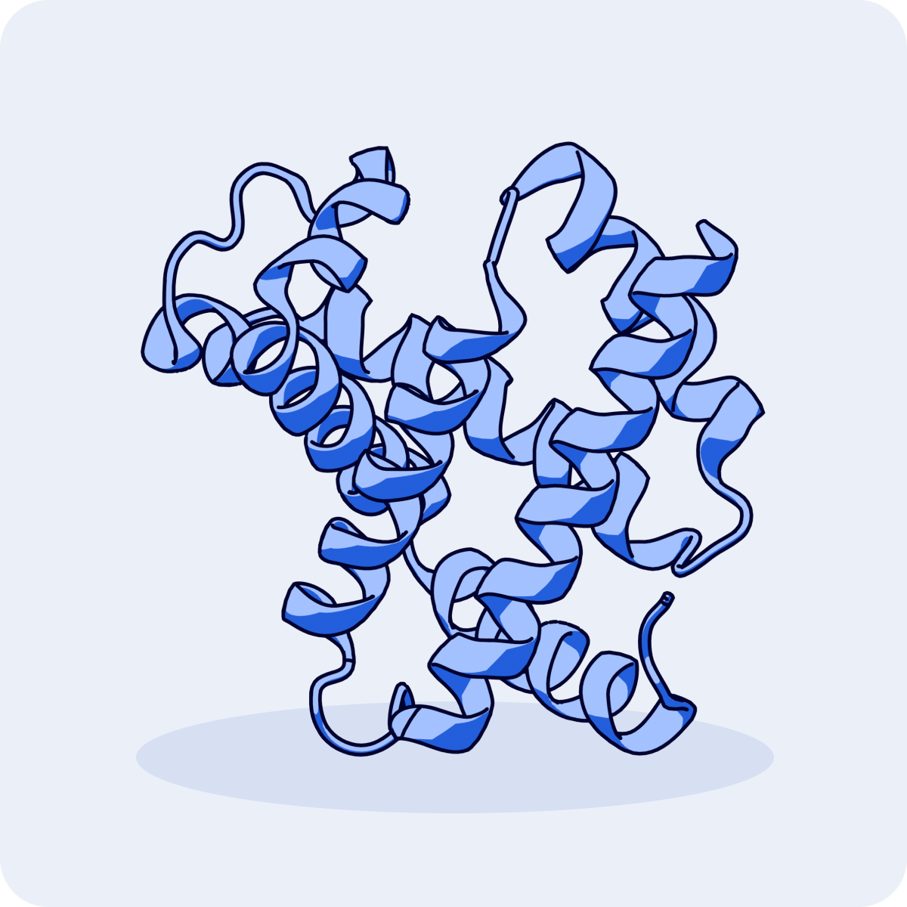
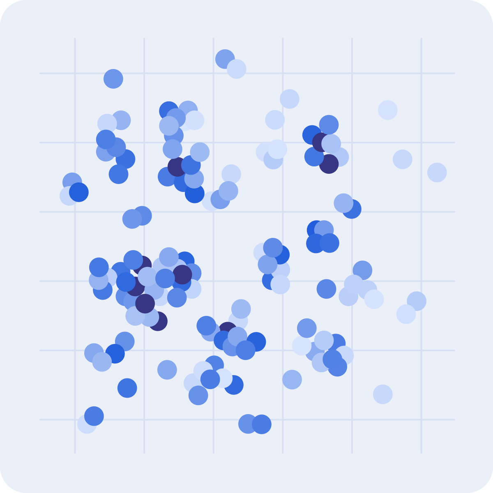

<!-- poet -->
:::: {.columns}

::: {.column width="20%"}

   

:::

::: {.column width="5%"}
<!-- empty column to create gap -->
:::

::: {.column width="75%"}
## De novo variant effect prediction and library generation
:::: {.columns}

::: {.column width="45%"}
### Using the web application

**Tutorials**

[Prompt And Prompt Sampling Methods](../poet/prompts.md) 
[PoET Scoring And Log-likelihood](../poet/scoring-log-likelihood.md) 
[Ensembling](../poet/ensembling.md) 
[Using The Rank Sequences Tool](../poet/rank-sequences.md)  
[Using The Generate Sequences Tool](../poet/generate-sequences.md) 
[Using The PoET Substitution Analysis Tool](../poet/substitution-analysis.md)
:::

::: {.column width="5%"}
<!-- empty column to create gap -->
:::

::: {.column width="45%"}
### Using the Python API

**Tutorials** 

[Designing new chorismate mutase enzymes with PoET](https://docs.openprotein.ai/api-python/demos/chorismate.html) 
[Aliphatic amidase sequence analysis (substitution and deletions)](https://docs.openprotein.ai/api-python/demos/AMIE_substitution_deletion_analysis_poet.html) 
[Screening insertion location with PoET](https://docs.openprotein.ai/api-python/demos/AMIE_substitution_deletion_analysis_poet.html#Analyze-deletion-variants-of-AMIE_PSEAE) 
:::

### Walkthrough

[Finding mutational hotspots and designing one-shot variant libraries with 
just a sequence](../walkthroughs/enzyme-engineering.md)
::::
:::
::::

 

<!-- design -->
:::: {.columns}

::: {.column width="20%"}

   

:::

::: {.column width="5%"}
<!-- empty column to create gap -->
:::

::: {.column width="75%"}
## Library design from your data
:::: {.columns}

::: {.column width="45%"}
### Using the web application

**Tutorials**

[Uploading Your Data](../opmodels/uploading-your-data.md)  
[Visualizing Your Data](../opmodels/visualization.md) 
[Designing Sequences](../opmodels/design.md) 
[OP Models Scoring And Log-likelihood](../opmodels/scoring-log-likelihood.md) 
[Substitution Analysis With OP Models](../opmodels/sub-analysis.md)
:::

::: {.column width="5%"}
<!-- empty column to create gap -->
:::

::: {.column width="45%"}
### Using the Python API

**Tutorials** 

[Getting started with sequence based learning](https://docs.openprotein.ai/api-python/demos/core_demo.html) 
[Get started with embeddings](https://docs.openprotein.ai/api-python/demos/embedding_demo.html) 
[Quantitative decision making for library design](../opmodels/quantitative-decision-making-for-library-design.md) 
:::

### Walkthrough

[Lead optimization for monoclonal antibody using machine learning to guide variant design to meet target product profile](../walkthroughs/anitbody-engineering.md)
::::
:::
::::

 

<!-- data -->
:::: {.columns}

::: {.column width="20%"}

   

:::

::: {.column width="5%"}
<!-- empty column to create gap -->
:::

::: {.column width="75%"}
## Analyzing your data

**Tutorials**

[Uploading Your Data](../opmodels/uploading-your-data.md)  
[Visualizing Your Data](../opmodels/visualization.md) 
:::
::::

 

<!-- api -->
:::: {.columns}

::: {.column width="20%"}

   

:::

::: {.column width="5%"}
<!-- empty column to create gap -->
:::

::: {.column width="75%"}
## Get familiar with our API
:::: {.columns}

::: {.column width="45%"}

**Tutorials**

[Python API](https://docs.openprotein.ai/api-python/) 
:::

::: {.column width="5%"}
<!-- empty column to create gap -->
:::

::: {.column width="45%"}

**Docs** 

[Python API](https://docs.openprotein.ai/api-python/) 
:::

::::
:::
::::

 

<!-- nav -->
:::: {.columns}

::: {.column width="20%"}

   

:::

::: {.column width="5%"}
<!-- empty column to create gap -->
:::

::: {.column width="75%"}
## Navigating your projects tutorials should sit under "Tutorials"
:::: {.columns}

::: {.column width="45%"}

**Tutorials**

[PoET History](../poet/history.md) 
[Navigating Your Projects](../opmodels/navigating-your-projects.md) 
:::

::: {.column width="5%"}
<!-- empty column to create gap -->
:::

::: {.column width="45%"}

:::

::::
:::
::::

 

<!-- ML -->
:::: {.columns}

::: {.column width="20%"}

   

:::

::: {.column width="5%"}
<!-- empty column to create gap -->
:::

::: {.column width="75%"}
## ML primer

**Tutorials**

[Prompt And Prompt Sampling Methods](../poet/prompts.md) 
[Ensembling](../poet/ensembling.md) 
:::
::::

 

<!-- structure prediction -->
:::: {.columns}

::: {.column width="20%"}

   

:::

::: {.column width="5%"}
<!-- empty column to create gap -->
:::

::: {.column width="75%"}
## Structure prediction

**Tutorials**

[Using The Structure Prediction Tool](../structure-prediction/using-structure-prediction.md) 
:::
::::

 

<!-- embeddings -->
:::: {.columns}

::: {.column width="20%"}

   

:::

::: {.column width="5%"}
<!-- empty column to create gap -->
:::

::: {.column width="75%"}
## Embeddings
:::: {.columns}

::: {.column width="45%"}

**Tutorials**

[Getting started with embeddings](https://docs.openprotein.ai/api-python/demos/embedding_demo.html) 
:::

::: {.column width="5%"}
<!-- empty column to create gap -->
:::

::: {.column width="45%"}

**Docs** 

[Python API](https://docs.openprotein.ai/api-python) 
:::

::::
:::
::::

