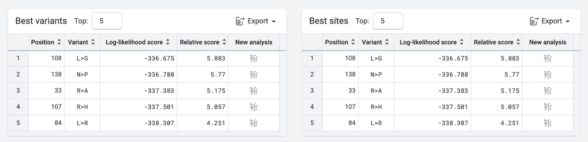
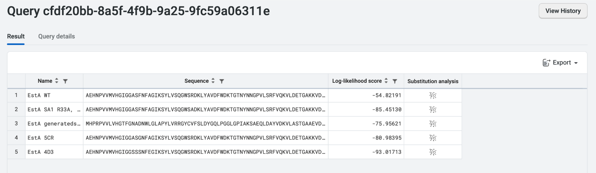
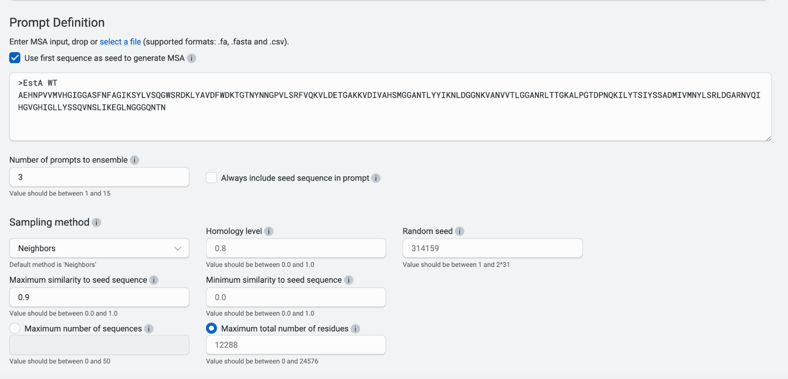
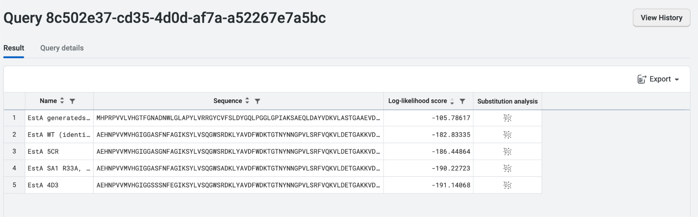
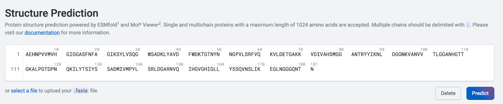

## Introduction

Protein engineering is used to improve the existing properties of
current enzymes as well as to develop new functions. Typically, the enzyme is tuned for improved solubility, improved catalytic efficiency (k cat / Km), increased stability at higher or lower temperatures, and increased tolerance for pH changes. This is typically achieved by multiple rounds of directed evolution to achieve the desired property.

By using *in silico* prediction, substitution analysis, and one-shot library design, OpenProtein.AI streamlines the design-build-test-learn model into needing fewer iterations. For example, OpenProtein.AI's PoET tool can create libraries of variants from a single protein sequence of interest with no pre-existing experimental data.

## Considerations

PoET relies on multiple sequence alignments (MSA) to generate potential mutation hotspots and design variants. You can provide your own MSA, or the OpenProtein.AI PoET platform can generate an MSA directly by using your protein of interest as a seed sequence.

Generally, we want to explore a diverse library before down-selecting areas of interest for optimization. When using PoET to design variant libraries, it's important to consider the target library size. Consider targeting at least 10 to 30 designs as an initial library to serve as proof of concept for experimental validation. The data generated from the library can then be used to further enhance the enzyme using Optimization and Prediction Models.

## Demoing OpenProtein.AI's PoET tool with *B. subtilis* Lipase EstA

In this walkthrough, we'll start by examining Lipase A from *Bacillus subtilis*. Common uses for lipases include food processing, cosmetics, and personal care products. There have been engineering efforts to both improve its thermostability as well as improve its catalytic efficiency at low temperatures. However, these engineering goals can be at odds with one another and require different solutions in the evolutionary landscape, making them difficult to pursue with traditional engineering
techniques. OpenProtein.AI's PoET and OP Models tools support rapid design of variants to address very different design criteria. We'll use EstA for our example.

The sequence for EstA was taken from PDB 1I6W as shown below. This sequence does not contain the secretion tag.
```python
\>1I6W_1\|Chains A, B\|LIPASE A\|Bacillus subtilis (1423)

AEHNPVVMVHGIGGASFNFAGIKSYLVSQGWSRDKLYAVDFWDKTGTNYNNGPVLSRFVQKVLDETGAKKVDIVAHSMGGANTLYYIKNLDGGNKVANVVTLGGANRLTTGKALPGTDPNQKILYTSIYSSADMIVMNYLSRLDGARNVQIHGVGHIGLLYSSQVNSLIKEGLNGGGQNTN
```
## Substitution Analysis of EstA

We'll start by running **Substitution Analysis** on the wild-type
sequence to understand where the potential mutational hotspots are, then design or pick substitutions manually based on the log-likelihood score.

In this instance, we'll set a homology level of 0.8 and a maximum number of 20 sequences before clicking **Run** with the default parameters.


Clicking **Run** will generate a heatmap like the one shown below. As the heatmap shows, the different positions along EstA have very different potential mutational hotspots, represented by log-likelihood scores. The blue regions may better tolerate mutations, while the red regions may be more conserved and less tolerant of mutations. Depending on our desired outcome, we can choose to focus on the dark blue or dark red area.


You can also export the heatmap analysis either as a CSV file or a PNG file for visualization purposes, whether for a really cool lab presentation slide or a figure in a publication.

The PoET tool will also suggest **Best variants** and **Best sites** to mutate. The data can be exported as a CSV file, and the number of sites altered as necessary. In the case of EstA, we could consider designing variant libraries around positions 108, 33, 138, 107 and 84 to better understand their mutability. PoET will also suggest the best amino acid to consider for each position.



As the active site is key for EstA functionality, we will do a quick check and confirm that none of the Best sites for mutation contain the active site, located at positions 77, 133, and 156 in the wild-type sequence. In the case here, none of the best sites are part of the catalytic triad.

## Generate Sequence for EstA

Next, we'll use **Generate Sequences** to create more broadly diverse variants that aren't limited to just a single site substitution. This allows us to generate one-shot variant libraries that can survey a bigger area of the fitness landscape.

Note that some of the variants designed using the **Generate Sequences** tool may not retain the catalytic site or important residues, making this design tool a higher risk to use when designing libraries. Given this higher-risk approach, we will design a library of 20 variants, which is small enough for rapid screening. In PoET, each criteria has a range that can be adjusted to achieve different outcomes. For EstA, we'll generate a suitable library using the following parameters: **Top-p**: 0.5, **Temperature**: 0.8. These values lie in the middle of
the possible range. You can read more about these parameters in the [PoET prompts and prompt sampling
parameters](../poet/prompts.md) tutorial.

Given that this lipase owes its popularity partly to its compact size, we'll restrict the **Maximum generated protein length** to 250 amino acids. To minimize the time taken for this demonstration while still generating viable results, we'll set the **Number of prompts to ensemble** to 3. For this walkthrough, we will set the **Random seed** as 123456789 to replicate the results we see here.

You can read more about setting the number of prompts to ensemble in the [Ensembling](../poet/ensembling.md) tutorial.


Once the run is complete, you can export the data from PoET by selecting **Export**. This will create a file that you can send off to your favorite gene synthesis company, and also use to start testing the enzyme for improved properties.


We can now sort this library by log-likelihood score to have a look at the top variants by clicking on the **Log-likelihood score** column. Generated-sequence-5 and 19 stand out from the rest of the other sequences. We will be taking a closer look at generated-sequence-5 later in the walkthrough.


The log-likelihood score is a measurement of fitness of each variant based on the PoET model constructed by the prompt (in this case the evolutionary landscape for EstA). The higher a score, the more fit the variant would be. As the model is not trained on measured properties, this fitness may not be directly related to one property but rather a mix of properties ranging from catalytic efficiency to protein stability.

## Rank Sequences

Now that we have generated some new variants using PoET tools, we'll need to compare their relative fitness to each other. We can't directly compare the log-likelihood score across different prompts, so we'll use PoET's **Rank Sequences** tool. We'll also look at how these newly designed variants perform against known variants from literature.

We'll evaluate 2 variants using the suggested mutation codes from the sections above:

- The quintuple variant with top 5 sites from **Substitution Analysis** (R33A, L84R, R107H, L108G, N138P) - let's call this SA1.
- Generated-sequence-5 (highest log-likelihood score from **Generate Sequence**).

We'll also include 2 existing variants from the literature:

- 5CR, a variant engineered for activity at low temperature from Engineering lipase A from mesophilic Bacillus subtilis for activity at low temperatures.([[https://doi.org/10.1093/protein/gzt064]{.underline}](https://doi.org/10.1093/protein/gzt064))

   - Isolated from an original pool of 16,000 clones and has 5 mutations - F17G, A132G, M134G, M137G, G155D

 - 4D3, a thermostable variant from Thermostable Bacillus subtilis: In Vitro Evolution and Structural Insight [https://doi:10.1016/j.jmb.2008.05.063]{.underline}(https://doi:10.1016/j.jmb.2008.05.063){target="_blank"}

   - Took 4 rounds of mutagenesis to achieve and has 9 mutations - A15S, F17S, A20E, N89Y, G111D, L114P, A132D, I157M and N166Y

```python

>EstA WT (identical to above)

AEHNPVVMVHGIGGASFNFAGIKSYLVSQGWSRDKLYAVDFWDKTGTNYNNGPVLSRFVQKVLDETGAKKVDIVAHSMGGANTLYYIKNLDGGNKVANVVTLGGANRLTTGKALPGTDPNQKILYTSIYSSADMIVMNYLSRLDGARNVQIHGVGHIGLLYSSQVNSLIKEGLNGGGQNTN
```

```python
>EstA SA1 R33A, L84R, R107H, L108G, N138P

AEHNPVVMVHGIGGASFNFAGIKSYLVSQGWSADKLYAVDFWDKTGTNYNNGPVLSRFVQKVLDETGAKKVDIVAHSMGGANTRYYIKNLDGGNKVANVVTLGGANHGTTGKALPGTDPNQKILYTSIYSSADMIVMPYLSRLDGARNVQIHGVGHIGLLYSSQVNSLIKEGLNGGGQNTN
```
  
```python
>EstA generated-sequence-5

MHPRPVVLVHGTFGNADNWLGLAPYLVRRGYCVFSLDYGQLPGGLGPIAKSAEQLDAYVDKVLASTGAAEVDIVGHSQGGMMPRHYLKFLGGADKVNALVGLAPDNHGASLMGLEGGDTVPGVRYTVIATKYDQVATPYRSNFPGVRNVLLQDLEHVAILFSRIAFHEVANALD
```

```python
>EstA 5CR

AEHNPVVMVHGIGGASGNFAGIKSYLVSQGWSRDKLYAVDFWDKTGTNYNNGPVLSRFVQKVLDETGAKKVDIVAHSMGGANTLYYIKNLDGGNKVANVVTLGGANRLTTGKALPGTDPNQKILYTSIYSSGDGIVGNYLSRLDGARNVQIHGVDHIGLLYSSQVNSLIKEGLNGGGQNTN
```

```python
>EstA 4D3

AEHNPVVMVHGIGGSSSNFEGIKSYLVSQGWSRDKLYAVDFWDKTGTNYNNGPVLSRFVQKVLDETGAKKVDIVAHSMGGANTLYYIKYLDGGNKVANVVTLGGANRLTTDKAPPGTDPNQKILYTSIYSSDDMIVMNYLSRLDGARNVQIHGVGHMGLLYSSQVYSLIKEGLNGGGQNTN
```
Our next step is to assess the perceived fitness of each variant against the prompt defined by homology to wild-type EstA. As mentioned earlier, the fitness as measured from PoET only looks at natural variants that have evolved in the wild which can have parameters that we are not necessarily optimizing for. As such, the log-likelihood score may capture fitness as measured by parameters that may not be relevant outside of the enzyme native environment such as specificity in the case of EstA.

We’ll copy and paste all of the sequences into the **Input sequence** field while only including wild-type EstA under **Prompt definition**. We will then select **Use first sequence as seed to generate MSA**, set **Number of prompts to ensemble** to 3, leave the default prompt sampling parameters, and then select **Run**.


Using the **Rank Sequences** tool, we will also determine the
log-likelihood score of the quintuple mutation variant that we designed using **Substitution Analysis** above.



The log-likelihood score for EstA generate-sequence-5 from **Rank Sequences** shown here differs from the **Generate Sequences** tool output. This is due to the scores being calculated slightly differently for computational efficiency. Note that the relative scoring has not changed and the relative ranking of the sequences remains unchanged.
We can see that the wild-type EstA has the highest log-likelihood score which may be a result of the conservative nature of lipases found naturally. The result could indicate the fitness captured by the log-likelihood score may be an amalgamation of properties such as substrate specificity, specific activity, maximal activity at 30oC, low activity outside optimal temperature and more.

In this case, we would be perform basic prompt engineering to better score our variants here. To do so, we will change **Maximum similarity to seed sequence** to 0.9 to exclude overrepresentation of highly conserved wild type orthologs in generating the MSA. More prompt engineering methods would be explored in a later walkthrough.



With the new prompt, we can see that EstA generate-sequence-5 has the highest log-likelihood score and has a score that is much further away from the rest of the variants. The other four variants have log-likelihood scores that are within +/- 10 or each other. This shows how **Generate Sequences** can create variants that are highly distinct from wild type and thus allowing us to explore variants that are further apart on the evolutionary landscape. The edit distance from these variants are vastly greater than variants one can generate using traditional protein engineering library generation techniques.Of note, the EstA SA1 has a very similar score to EstA 4D3 and thus could have similar properties.



We recommend using PoET to generate initial targeted libraries and choosing a spread in log-likelihood score to test. By having both measurements that are further and nearer to the desired target in the design criteria, we can then create more robust custom models in OP Models. Using OP Models on the initial PoET-designed library can form part of your overall protein engineering workflow without the need for generating large iterative libraries.

## Structural Prediction of newly designed variants

Let's copy the engineered sequence (EstA SA1) from above, then select **Predict**.



Within a few minutes, OpenProtein.AI generates a predicted structure for our newly designed EstA SA1. We'll name the structure "EstA SA1" by selecting the pencil icon.

As we can see below, the overall structure is preserved with the middle beta sheet flanked by the alpha-helical bundle. The overall active site is also kept in a similar orientation to the wild-type.

If we want to further analyze our structure, we can select the
**Download PDB file** button. The resulting file can be used with
molecular visualization programs like Chimera X or PyMol, which allow us to overlap any predicted protein structure with the wild-type EstA.


Next, we'll explore the structure of generated-sequence-5, which is vastly different in sequence to EstA. We can rename the structure as above to "generated-sequence-5".

There are two ways that this can be done. First, we can copy and paste the sequence into **Structure Prediction**. Second, we can right click on the sequence in the result table of **Generate Sequence** and select **Fold this sequence** as shown below.


## Summary and next steps

In this walkthrough, we used both PoET and Structure Prediction to guide library design.

Once we test our new libraries and measure the desired parameters, we'll be able to upload the resulting data onto OP Models. This will let us train custom models against the properties of our choice, allowing for the design of better variants and further enhancements to the performance of our engineered protein.
