## Introduction

Protein engineering is used to improve the existing properties of current enzymes as well as to develop new functions. Often enzymes are tuned for improved solubility, improved catalytic efficiency (k cat / Km), increased stability at higher or lower temperatures, and increased tolerance for pH changes. This usually requires multiple rounds of directed evolution to achieve the desired property.

OpenProtein.AI uses *in silico* prediction, substitution analysis, and zero-shot library design to streamline the design-build-test-learn cycle, allowing you to accomplish your engineering goal with fewer iterations. 

In this walkthrough, we’ll use PoET, @Truong2023, OpenProtein.AI’s generative protein language model,  and other tools in the platform to analyze a protein of interest to:

- identify potential variants with improved fitness

- explore the structure of one of these variants

- determine mutational hotspots in the protein sequence

- create libraries of variants predicted for improved fitness

PoET will do this using just a protein sequence, without pre-existing experimental data.

## Using PoET to analyze de novo design library of enzyme variants

We’ll start by examining the enzyme, Lipase A from *Bacillus subtilis*. Common uses for lipases include food processing, cosmetics, and personal care products. There have been engineering efforts to improve both its thermostability and its catalytic efficiency at low temperatures. These engineering goals can be at odds with one another and require different solutions in the evolutionary landscape, making them difficult to pursue with traditional engineering techniques. OpenProtein.AI’s PoET and OP Models tools support rapid design of variants to address very different design criteria. We’ll use EstA for our example.

The sequence for EstA was taken from PDB 1I6W as shown below. This sequence does not contain the secretion tag.

```bash
>1I6W_1|Chains A, B|LIPASE A|Bacillus subtilis (1423)

AEHNPVVMVHGIGGASFNFAGIKSYLVSQGWSRDKLYAVDFWDKTGTNYNNGPVLSRFVQKVLDETGAKKVDIVAHSMGGANTLYYIKNLDGGNKVANVVTLGGANRLTTGKALPGTDPNQKILYTSIYSSADMIVMNYLSRLDGARNVQIHGVGHIGLLYSSQVNSLIKEGLNGGGQNTN

```

### Substitution Analysis of EstA

We’ll start by running **Substitution Analysis** on the wild-type sequence to understand where the potential mutational hotspots are, then design or pick substitutions manually based on the log-likelihood score. The log-likelihood score gives a measure of predicted fitness under the EstA evolutionary landscape. Higher scores correspond to higher fitness, which indicates that these sequences are likely to have high stability and activity.

In this instance, we’ll set the **Number of prompts to ensemble** at 3 and a maximum number of 20 sequences before selecting **Run**, keeping the default parameters.


PoET will generate a heatmap like the one shown below.  As indicated on the heatmap, different positions along EstA have very different tolerance for mutations, represented by a range of log-likelihood scores. The blue regions are likely to better tolerate mutations, while the red regions may be more conserved and are less likely to tolerate mutations.

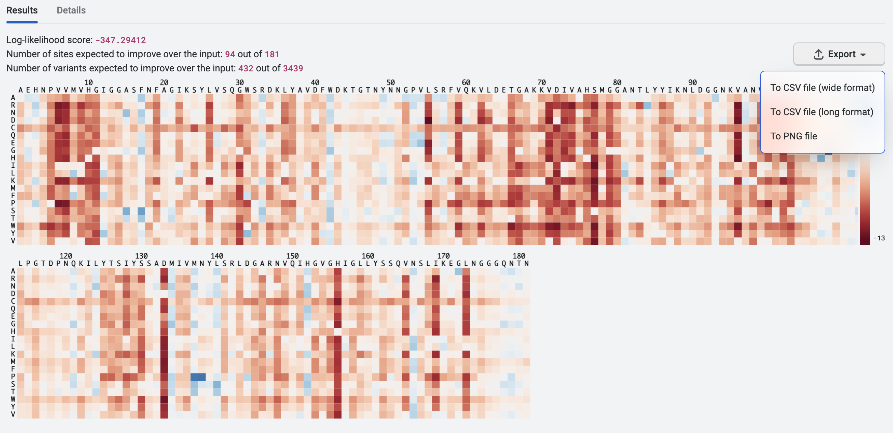

We can export the heatmap analysis as a CSV file in both wide format and long format. We’ll use this for further analysis later in this walkthrough, so we’ll select **Export** then **To CSV file (wide format)**. You can also export this as a PNG file for visualization purposes such as use as a lab presentation slide or a figure in a publication.

PoET will also suggest **Best variants** and **Best sites** to mutate. The data can be exported as a CSV file, and the number of sites altered as necessary. In the case of EstA, we could consider designing variant libraries around positions 108, 33, 138, 107 and 84 to better understand their mutability. PoET will also suggest the best amino acid to consider for each position.

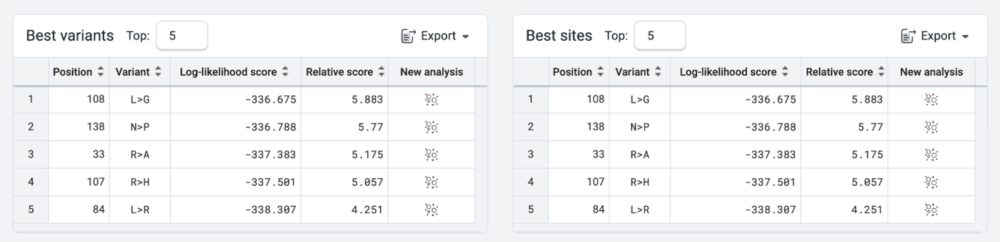

We usually avoid altering the active site, unless our goal is to alter substrate specificity or activity on a different substrate. In this example, the active site is key for EstA functionality. None of the best sites that PoET suggested for mutation contain the active site, which is located at positions 77, 133, and 156 in the wild-type sequence. Because the suggested best sites are not part of the catalytic triad, they are unlikely to alter the enzyme main catalytic activity.

### Structural Prediction of newly designed variant

We’ve combined the top 5 best variants into a single variant and named it EstA SA1. We’ll now use the **Structure Prediction** tool to predict the structure of this newly designed variant using ESMfold, @Science2023.

Let’s copy the engineered sequence (EstA SA1) below and paste it into the sequence box under **Structure Prediction**, then select **Predict**.

```bash
>EstA SA1 R33A, L84R, R107H, L108G, N138P

AEHNPVVMVHGIGGASFNFAGIKSYLVSQGWSADKLYAVDFWDKTGTNYNNGPVLSRFVQKVLDETGAKKVDIVAHSMGGANTRYYIKNLDGGNKVANVVTLGGANHGTTGKALPGTDPNQKILYTSIYSSADMIVMPYLSRLDGARNVQIHGVGHIGLLYSSQVNSLIKEGLNGGGQNTN
```

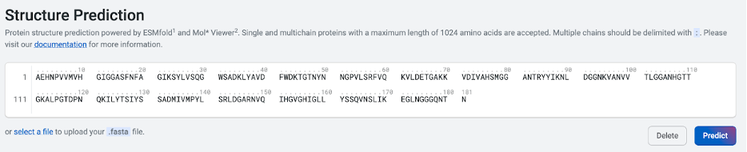

Within a few minutes, OpenProtein.AI generates a predicted structure for our newly designed EstA SA1. We’ll name the structure “EstA SA1” by selecting the pencil icon.

As we can see below, the overall structure is preserved with the middle beta sheet flanked by the alpha-helical bundle and the overall active site is preserved in EstA SA1.

If we want to further analyze our structure, we can select the **Download PDB file** button. The resulting file can be used with molecular visualization
programs like Chimera X or PyMol, which allow us to overlap any predicted
protein structure with the wild-type EstA. 

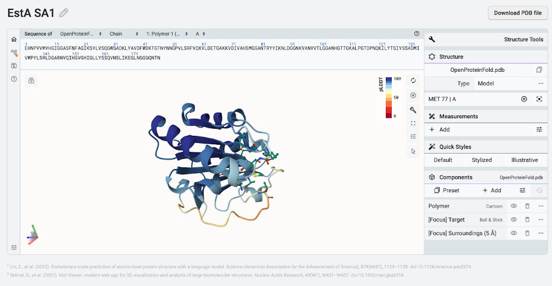

### Exploring the fitness landscape of EstA

While **Substitution Analysis** finds the best individual sites to mutate, we'd like to identify additional sites amenable to mutation as well as other possible substitutions at the top sites identified earlier (e.g., alanine instead of glycine at position 108). We’ll do this by using the exported file of the substitution analysis previously performed on EstA. Now that we have the log-likelihood fitness of each amino acid in each position, we can look for mutational hotspots with higher entropy levels or sites that are less amenable to mutation with lower entropy level. We’ll then use PoET’s output as a position-specific scoring matrix (PSSM) and use the PSSM to generate a combinatorial library of choice.

To get started, we must convert the log-likelihood score of each amino acid at a given position in the exported file into a relative frequency. You can download the working excel file [here for reference](https://docs.google.com/spreadsheets/d/1EvY1plz0HtuInf2L4ketH7x3Rft6CzT_/edit?usp=drive_link).

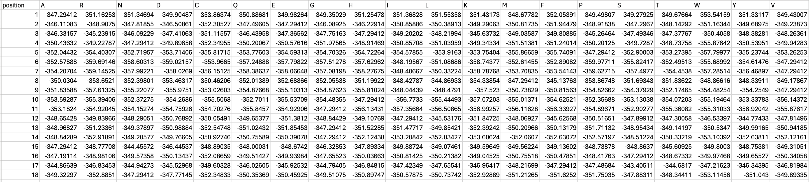

To calculate the relative frequency of each amino acid position, we will take the exp(PoET score) divided by sum(exp(PoET score)). E.g. =EXP(B2 - MAX($B2:$U2)) / SUM(EXP($B2:$U2 - MAX($B2:$U2)))

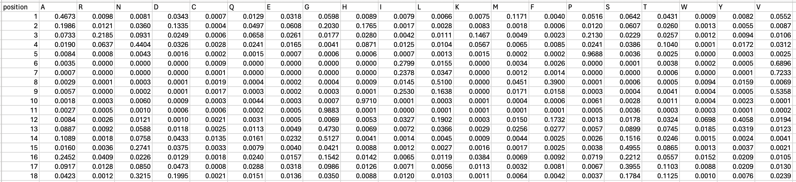

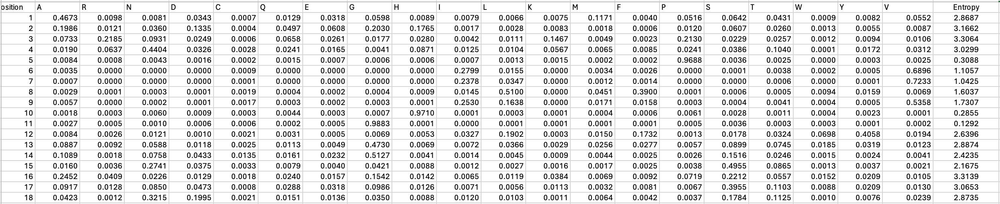

Entropy is a measure of amino acid conservation at each site. High entropy corresponds to flexible sites with low conservation while low entropy indicates strongly conserved positions. From the graph below showing the distribution of the Shannon entropy across EstA, we can see certain regions are more tolerant of mutations.

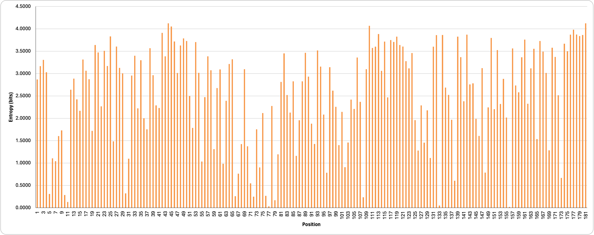

Here, we’re measuring entropy in bits. The highest entropy possible for 20 amino acids, 4.32 bits, means that all amino acids are likely to be equally tolerated. We can also pull out the top and bottom ten positions with the highest and lowest entropy (as seen in the table below). As expected, the catalytic residues, 77, 133 and 156, have the lowest entropy, supporting the need to preserve these specific residues.

| Ten least restricted positions (highest entropy) |  |
|---|---|
| Position | Entropy |
| 181 | 4.1241 |
| 44 | 4.1228 |
| 110 | 4.0692 |
| 45 | 4.0530 |
| 177 | 3.9808 |
| 42 | 3.9114 |
| 113 | 3.8844 |
| 178 | 3.8730 |
| 176 | 3.8721 |
| 142 | 3.8717 |

| Ten most restricted positions (lowest entropy) |  |
|---|---|
| Position | Entropy |
| 10 | 0.2855 |
| 76 | 0.2669 |
| 66 | 0.2583 |
| 72 | 0.2495 |
| 108 | 0.2362 |
| 79 | 0.1707 |
| 11 | 0.1292 |
| 133 (catalytic residue) | 0.0525 |
| 77 (catalytic residue) | 0.0316 |
| 156 (catalytic residue) | 0.0209 |

### Designing and ranking a combinatorial variant library

By considering the overall fitness landscape and introducing multiple mutations per variant, we can explore a much larger sequence design space not limited to mutating to one amino acid per position at a time. In this section, we will create a library of combinatorial variants using the PSSM generated above in Exploring the Fitness Landscape of EstA, where variants can have more than one amino acid substitution per position as well as multiple substitutions per variant. The PSSM derived from our PoET substitution scores provides the frequencies of each amino acid at each position that can be randomly combined to create a large combinatorial variant library.

Although the PSSM is an additive model, we can explore potential epistatic interactions between residues and to design specific combinatorial variants that are likely to be fitter than the wild-type. To do this, we can sample sequences from our PSSM and score these full combinatorial variants using the **Rank Sequences** tool. By comparing the full PoET scores with the additive scores, we can find variants with positive or negative epistasis and prioritize specific combinatorial variants based on their fitness relative to the WT sequence.

First, we’ll sample a large number of candidate combinatorial variants from the PSSM with the following Python script. You can download the py file [here](https://drive.google.com/file/d/1h6a066f5Y0MGDrIcdQ41m3S8GdQRmESA/view?usp=drive_link).


```python
import numpy as np
import pandas as pd
from scipy.special import softmax, log_softmax

import argparse
import sys

parser = argparse.ArgumentParser('Load PSSM, sample sequences, and report their additive scores.')
parser.add_argument('pssm', help='Path to the PSSM file as a CSV with log probabilities')
parser.add_argument('-n', '--num-samples', type=int, default=10_000, help='Number of sequences to sample (default: 10,000)')
parser.add_argument('-r', '--random-seed', type=int, default=None, help='Set the random seed if desired (default: unset)')

args = parser.parse_args()

table = pd.read_csv(args.pssm, index_col=0) # use the position column as the index
print(f'# Parsed PSSM with {len(table)} sites', file=sys.stderr)
assert table.shape[1] == 20, f'PSSM should have 20 columns for 20 amino acids, but found {table.shape[1]}'

amino_acids = table.columns
amino_acids = amino_acids.to_numpy()
log_pssm = log_softmax(table.values, axis=1)
pssm = np.exp(log_pssm)

# sample and score
random = np.random
if args.random_seed is not None:
    random = np.random.RandomState(args.random_seed)

n = args.num_samples
print(f'# Sampling {n} sequences from the PSSM...', file=sys.stderr)

samples = np.zeros((n, len(pssm)), dtype=np.int16) - 1
scores = np.zeros(n)
for i in range(len(pssm)):
    # we sample position-wise to use numpy random choice
    col = random.choice(len(amino_acids), p=pssm[i], size=n, replace=True)
    samples[:, i] = col
    scores += log_pssm[i, col]

assert np.all(samples >= 0)

# dump the samples as a CSV
print('Name', 'Score', 'Sequence', sep=',')
for i in range(len(samples)):
    s = samples[i]
    s = ''.join(amino_acids[s])
    print(f'pssm_sample_{i+1}', f'{scores[i]:.5f}', s, sep=',')

```

This Python code generates a CSV file with the scores column and header removed, and can be found [here](https://drive.google.com/file/d/16QxerujZD-EhSHfOArbcLIHSs5CxYrQL/view?usp=drive_link) for your reference. We’ll upload this [CSV file](https://drive.google.com/file/d/1cWRI8eG_Yhjt-p0m95oCfIgH007lkqt_/view?usp=drive_link) by clicking on **select a file**. In the **Prompt Definition** field, we’ll use the wild-type sequence shown below. Then, we’ll run **Rank Sequences** with **Number of prompts to ensemble** set to 3 and the default parameters. Note that the CSV file should only have 2 columns containing the name and sequence, without headers.
  
  ```bash
>1I6W_1|Chains A, B|LIPASE A|Bacillus subtilis (1423)

AEHNPVVMVHGIGGASFNFAGIKSYLVSQGWSRDKLYAVDFWDKTGTNYNNGPVLSRFVQKVLDETGAKKVDIVAHSMGGANTLYYIKNLDGGNKVANVVTLGGANRLTTGKALPGTDPNQKILYTSIYSSADMIVMNYLSRLDGARNVQIHGVGHIGLLYSSQVNSLIKEGLNGGGQNTN
```

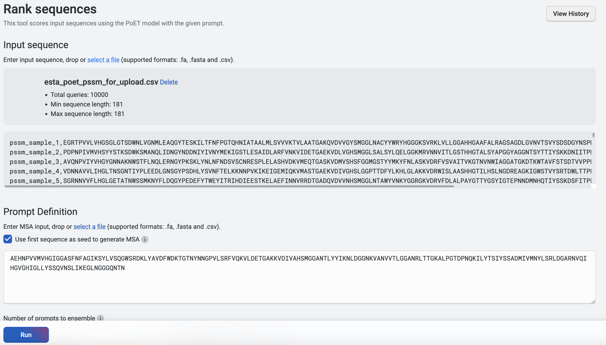

We will then **Export** the results, which are shown here sorted by their log-likelihood scores. We can compare the additive log-likelihood scores from the PSSM versus the full PoET log-likelihood scores from **Rank sequences**.

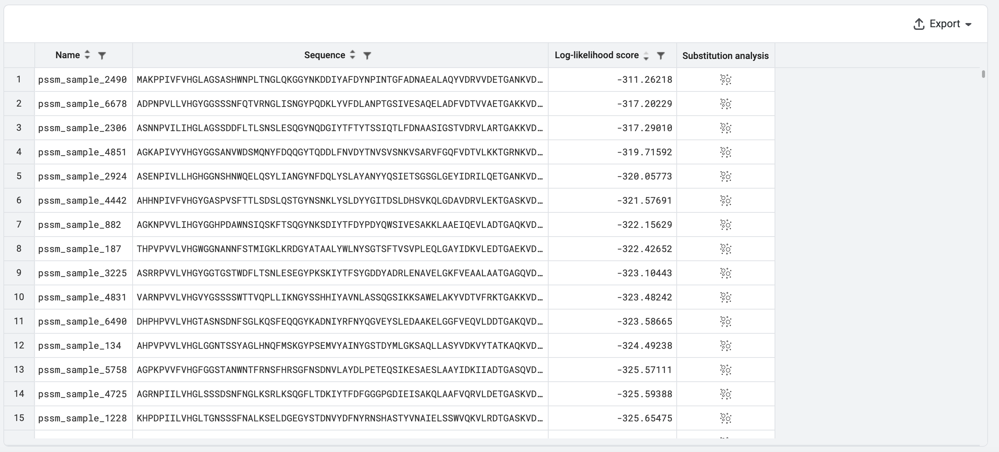

As seen below, from plotting the expected log-likelihood score calculated from the PSSM and the log-likelihood score from PoET **Rank Sequence**, there are differences when considering each position additively (PSSM score) versus the mutations in the context of the full length protein (PoET score). The differences highlight the potential epistatic effects which amino acids at different positions can have on each other, and highlights the importance of running generated variants through PoET’s **Rank Sequence** tool to determine the best combinatorial variants to screen. Certain pairs or groups of amino acids that are in contact may need to be conserved or engineered together.

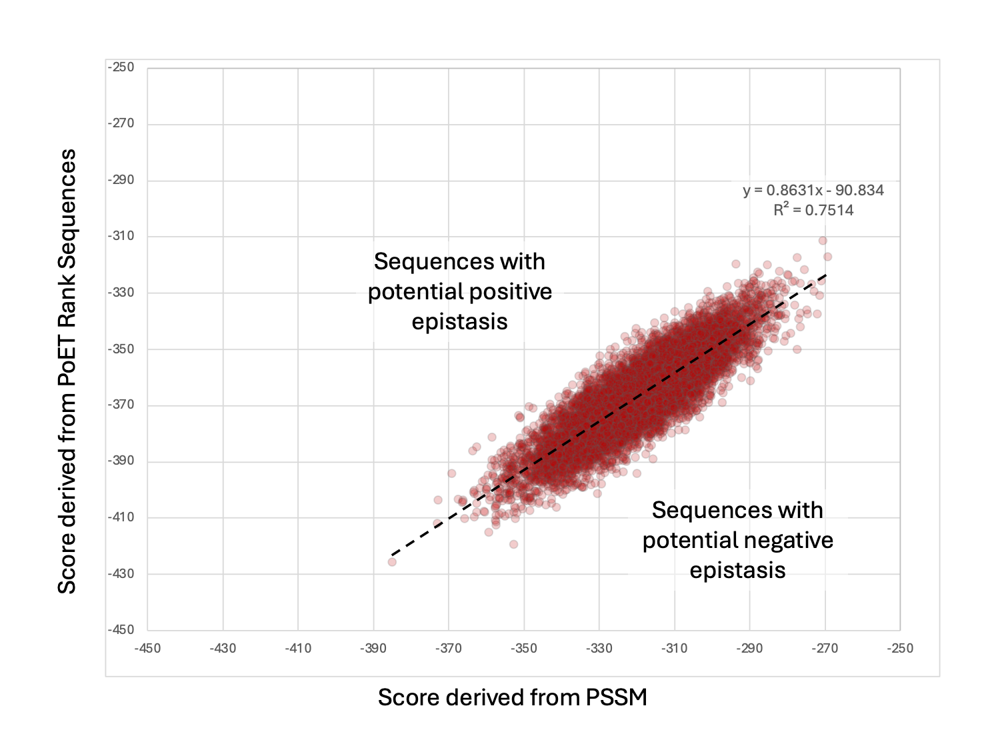

PoET is able to uncover potential epistatic effects because the expected fitness score is not completely additive as calculated using the PSSM. In this example, some variants are higher than expected while some are lower than expected. We can now order as many variants as we like from the designed library to synthesize and assay for the desired activity and property.

## Summary and next steps

In this walkthrough, we used both **PoET** and **Structure Prediction** to guide library design. 

Though not shown here, the **Generate** tool can be used to generate diverse variants in addition to the example shown here using PSSM. If you have your own MSA, you can also choose to specify this in the **Prompt Definition **field.

For further refinement of the prompt, you can look at the tutorial found [here](https://docs.openprotein.ai/poet/prompts.html).

Consider selecting at least 10 to 30 designs designed using PoET as an initial library to serve as proof of concept for experimental validation. The data generated from the library can then be used to further enhance the enzyme using **OP Models** following the tutorial found [here](https://docs.openprotein.ai/opmodels/).

You can also perform **Structure Prediction** on the specific variants, such as those with PoET **Rank Sequence** log-likelihood scores higher than the expected log-likelihood score calculated from the PSSM. This could indicate potential positive epistasis. You can align the sequences to compare or compare the predicted structures to examine if there are specific key residues.

#### Citations

Truong Jr, T., & Bepler, T. (2024). PoET: A generative model of protein families as sequences-of-sequences. Advances in Neural Information Processing Systems, 36. doi:10.48550/arXiv.2306.06156

Lin, Z., et al. (2023). Evolutionary-scale prediction of atomic-level protein structure with a language model. Science (American Association for the Advancement of Science), 379(6637), 1123–1130. doi:10.1126/science.ade2574